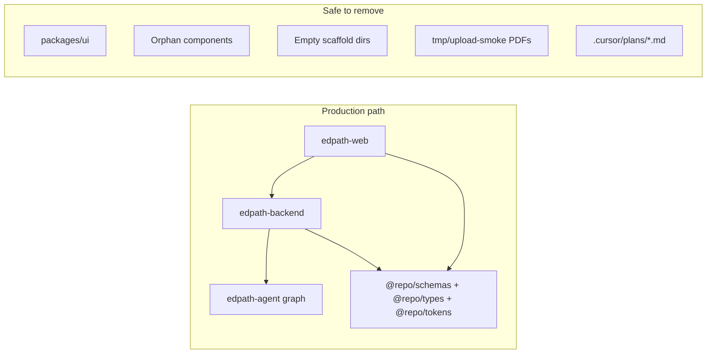

# Codebase cruft cleanup plan

## What we audited

Full read-only scan of the monorepo (~250 files): import tracing, `package.json` workspaces, git tracking, and config references. Production flow is **landing upload → start → lesson CoAgent → quiz → summary**, driven by `edpath-agent` — not the old stubs.



---

## Phase 1 — Safe deletions (zero production impact)

These files/folders are **never imported** and not referenced by build/dev scripts. Deleting them requires no config changes.

### 1. Entire unused Turbo starter package

| Delete | Why |
|--------|-----|
| [`packages/ui/`](packages/ui/) (all 5 files) | Zero `@repo/ui` imports anywhere. Web uses local [`apps/edpath-web/components/ui/*`](apps/edpath-web/components/ui/) instead. |
| [`packages/eslint-config/`](packages/eslint-config/) | Only consumer is `packages/ui`. Apps use `eslint-config-next` directly. |

**Follow-up:** Update [`README.md`](README.md) line ~30 (remove `packages/ui` from stack list). Run `npm install` to refresh lockfile.

### 2. Orphan web components (built but never wired)

| Delete | Why |
|--------|-----|
| [`apps/edpath-web/components/loaders/PlanningLoader.tsx`](apps/edpath-web/components/loaders/PlanningLoader.tsx) | 0 imports; [`LessonRunner`](apps/edpath-web/components/shell/LessonRunner.tsx) uses `GeneratingPanel` |
| [`apps/edpath-web/components/loaders/QuizzingLoader.tsx`](apps/edpath-web/components/loaders/QuizzingLoader.tsx) | Same |
| [`apps/edpath-web/components/ui/LoadingOverlay.tsx`](apps/edpath-web/components/ui/LoadingOverlay.tsx) | Built per plan, never mounted |
| [`apps/edpath-web/components/ui/MediaSlot.tsx`](apps/edpath-web/components/ui/MediaSlot.tsx) | 0 imports (only mentioned in [`design/design-system.md`](design/design-system.md)) |
| [`apps/edpath-web/components/ui/input.tsx`](apps/edpath-web/components/ui/input.tsx) | shadcn scaffold, 0 imports |
| [`apps/edpath-web/components/ui/dialog.tsx`](apps/edpath-web/components/ui/dialog.tsx) | shadcn scaffold, 0 imports |

After deleting both loaders, remove the empty `components/loaders/` folder.

### 3. Unused backend barrel re-exports

| Delete | Why |
|--------|-----|
| [`apps/edpath-backend/src/features/upload/index.ts`](apps/edpath-backend/src/features/upload/index.ts) | 0 imports; [`app.ts`](apps/edpath-backend/src/app.ts) imports `upload.route.js` directly |
| [`apps/edpath-backend/src/features/start/index.ts`](apps/edpath-backend/src/features/start/index.ts) | Same pattern |

### 4. Empty scaffold directories (0 files inside)

**Backend** — [`apps/edpath-backend/src/llm/`](apps/edpath-backend/src/llm/), `pdf/`, `routes/`, `scripts/`, `checkpointer/`

**Web** — [`apps/edpath-web/types/`](apps/edpath-web/types/), [`apps/edpath-web/components/widgets/`](apps/edpath-web/components/widgets/), [`apps/edpath-web/app/api/copilotkit/`](apps/edpath-web/app/api/copilotkit/) (CopilotKit runs via Express backend, not a Next.js API route)

### 5. Default Next.js public assets (unused)

Delete from [`apps/edpath-web/public/`](apps/edpath-web/public/):

- `vercel.svg`, `window.svg`, `next.svg`, `file.svg`, `globe.svg`

**Keep:** `edpath-logo.svg`, `edpath-logo.png`, `app/icon.svg` (used in layout/branding).

### 6. Generated smoke-test PDFs

Delete all 5 files in [`tmp/upload-smoke/`](tmp/upload-smoke/) (regenerated by [`scripts/smoke-upload-fixtures.mjs`](scripts/smoke-upload-fixtures.mjs)).

Add to [`.gitignore`](.gitignore):

```
tmp/
```

These PDFs are currently **git-tracked** — removing them shrinks the repo; scripts can recreate them locally.

### 7. Cursor plan files (your preference: delete)

Delete all 13 tracked files in [`.cursor/plans/`](.cursor/plans/). These are session implementation notes, not runtime dependencies.

**Keep:** [`.cursor/rules/*.mdc`](.cursor/rules/) — active agent guidance.

---

## Phase 2 — Optional removals (safe for production *with* small refactors)

You asked whether these break the product. **Answer: no, not if configured correctly.** Neither is on the production code path today.

### A. Walking-skeleton graph — **safe to remove**

| Current state | Production impact |
|---------------|-------------------|
| [`langgraph.json`](langgraph.json) registers `edpath-walking-skeleton` alongside `edpath-agent` | None — [`.env.example`](apps/edpath-backend/.env.example) sets `EDPATH_LANGGRAPH_GRAPH_ID=edpath-agent` |
| [`runtime.ts`](apps/edpath-backend/src/copilot/runtime.ts) defaults to `EDPATH_AGENT_GRAPH_ID` | CopilotKit always talks to real agent |
| [`vitest.setup.ts`](apps/edpath-backend/vitest.setup.ts) defaults tests to walking-skeleton | Test-only; must be updated |

**Delete:**
- [`apps/edpath-backend/src/agent/walking-skeleton.ts`](apps/edpath-backend/src/agent/walking-skeleton.ts)
- [`apps/edpath-backend/src/agent/walking-skeleton.test.ts`](apps/edpath-backend/src/agent/walking-skeleton.test.ts)

**Update (required):**
- [`langgraph.json`](langgraph.json) — remove `edpath-walking-skeleton` entry
- [`vitest.setup.ts`](apps/edpath-backend/vitest.setup.ts) — change default graph ID to `edpath-agent`
- [`runtime.ts`](apps/edpath-backend/src/copilot/runtime.ts) — remove deprecated `EDPATH_WALKING_SKELETON_GRAPH_ID` export

**Coverage after removal:** Real graph is already tested in [`edpath-graph.test.ts`](apps/edpath-backend/src/agent/edpath-graph.test.ts) and related node tests. You lose only the stub-graph smoke test.

**Recommendation:** Remove it — it was explicitly marked "temporary" in the real-agent plan and creates confusion about which graph is canonical.

### B. Dev-preview stack — **safe to remove**

| Current state | Production impact |
|---------------|-------------------|
| [`LessonRunner`](apps/edpath-web/components/shell/LessonRunner.tsx) renders `DevPreviewControls` only when `NEXT_PUBLIC_EDPATH_DEV_PREVIEW=true` | Default OFF — never shown in normal use |
| [`useLesson`](apps/edpath-web/hooks/useLesson.ts) mock state machine | Only used by dev preview components |
| [`mock-lesson.ts`](apps/edpath-web/lib/mock-lesson.ts) | **Partially production:** `MAX_ATTEMPTS` / `MAX_HELP` imported by [`McqWidget`](apps/edpath-web/components/mcq/McqWidget.tsx) and [`useCoAgentQuiz`](apps/edpath-web/hooks/useCoAgentQuiz.tsx) |

**Delete:**
- [`apps/edpath-web/components/dev/DevPreviewControls.tsx`](apps/edpath-web/components/dev/DevPreviewControls.tsx)
- [`apps/edpath-web/components/dev/DevPhaseSwitcher.tsx`](apps/edpath-web/components/dev/DevPhaseSwitcher.tsx)
- [`apps/edpath-web/hooks/useLesson.ts`](apps/edpath-web/hooks/useLesson.ts)
- Mock data + `getMockCoAgentState()` from `mock-lesson.ts` (or delete entire file after extracting constants)

**Refactor (required before deleting mock-lesson):**
- Extract `MAX_ATTEMPTS` and `MAX_HELP` to a small file, e.g. `apps/edpath-web/lib/quiz-constants.ts`
- Update imports in `McqWidget.tsx` and `useCoAgentQuiz.tsx`
- Remove `DevPreviewControls` import + conditional block from `LessonRunner.tsx`

**Recommendation:** Remove if you no longer use the env-flagged preview panel for local UI iteration. Keep if you still rely on it to demo phases without a live backend.

---

## Phase 3 — Housekeeping (not deletions, but fixes stale cruft)

| Item | Action |
|------|--------|
| [`package-lock.json`](package-lock.json) | Stale entries for removed Turbo apps `apps/docs` and `apps/web` — refresh via `npm install` after Phase 1 |
| [`README.md`](README.md) | Remove `packages/ui` claim; fix `npm test` (root has no test script — use `npm test --workspace=edpath-backend`); fix missing `apps/edpath-web/.env.example` reference |
| [`scripts/verify.sh`](scripts/verify.sh) | Placeholder only ("no checks defined yet") — either wire real commands or delete |
| Smoke scripts [`scripts/smoke-upload-*.mjs`](scripts/) | Keep if you use manual upload testing; not wired to npm scripts |

---

## Do NOT delete (common false positives)

| Path | Why keep |
|------|----------|
| [`packages/schemas`](packages/schemas/), [`packages/types`](packages/types/), [`packages/tokens`](packages/tokens/) | Active shared contracts; tokens imported in [`globals.css`](apps/edpath-web/app/globals.css) |
| `*.contract-test.ts(x)` files | Intentional compile-time guards (`check-types` / type firewall), not dead tests |
| [`apps/edpath-backend/src/agent/test-helpers.ts`](apps/edpath-backend/src/agent/test-helpers.ts), [`test-fixtures.ts`](apps/edpath-backend/src/features/upload/test-fixtures.ts), [`__fixtures__/`](apps/edpath-backend/src/agent/__fixtures__/) | Used by Vitest |
| [`docs/reference/*.md`](docs/reference/) (7 files) | Locked source of truth per [`AGENTS.md`](AGENTS.md) |
| [`docs/handoff/`](docs/handoff/), [`docs/decisions/`](docs/decisions/) | Intentional placeholders for living notes |
| [`AGENTS.md`](AGENTS.md), [`CLAUDE.md`](CLAUDE.md), app-level copies | Thin routers — by design |
| Backend eval suite [`apps/edpath-backend/src/evals/`](apps/edpath-backend/src/evals/) | Used by `npm run eval` |

---

## Verification checklist (run after cleanup)

```bash
npm install
npm run check-types
npm run build
npm test --workspace=edpath-backend
```

Manual smoke (3-process dev): landing PDF upload → start lesson → approve plan → answer MCQ → summary.

---

## Suggested execution order

1. **Phase 1** — all safe deletions + `.gitignore` + README fix + `npm install`
2. **Phase 2A** — walking-skeleton removal + config updates + re-run tests
3. **Phase 2B** — dev-preview removal + constants extraction (only if you want it gone)
4. Commit as 1–3 focused commits (not one giant dump)

Estimated file reduction: **~35–45 paths** in Phase 1 alone; **~8 more** if both Phase 2 options are included.
