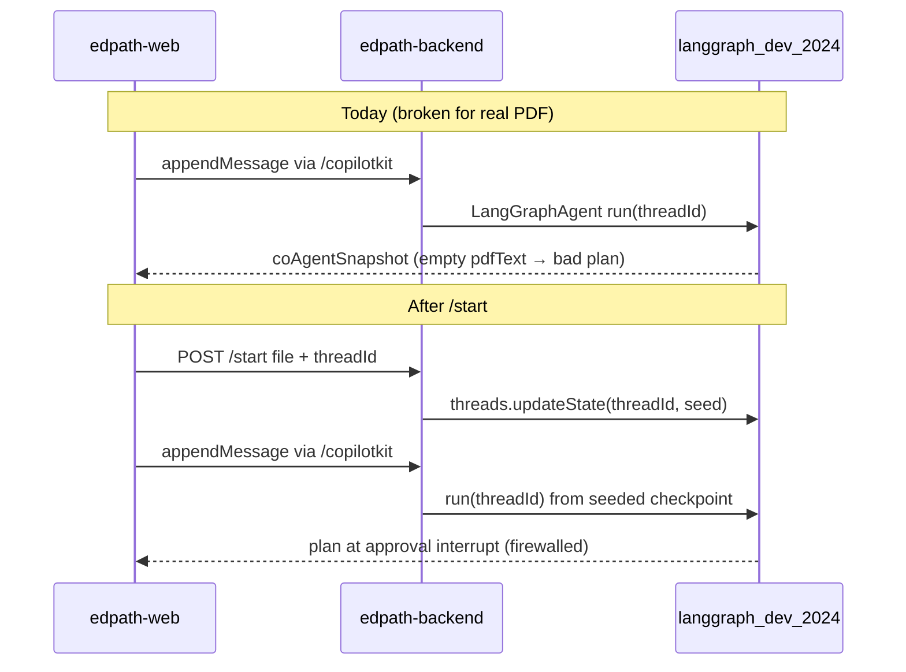

# Combined Upload-and-Start Endpoint

## Design resolution: endpoint + CopilotKit (not either/or)

**Use a dedicated `POST /start` endpoint.** CopilotKit alone cannot satisfy upload-on-start:

| Concern | CopilotKit path today | Why /start is required |
|---|---|---|
| PDF bytes | Never sent to CopilotKit | Must hit Express + `processUpload` |
| `pdfText` | Not in CoAgent mirror; runtime `initialState` is empty ([`initial-coagent-state.ts`](apps/edpath-backend/src/agent/initial-coagent-state.ts)) | Must seed full graph checkpoint server-side |
| `threadId` | Client passes to `CopilotKit` provider | Client also sends to /start so seed targets the same checkpointer key |
| Run execution | `appendMessage` → `/copilotkit` → `LangGraphAgent` → LangGraph dev server | **Unchanged** — /start does not replace CopilotKit |

**How the proven pipe works today** ([`useCoAgentLesson.tsx`](apps/edpath-web/components/shell/useCoAgentLesson.tsx)):



**Seeding mechanism (matches tests):** Reuse the exact input the integration tests pass to `graph.invoke`:

```typescript
seedGraphState(buildInitialEdPathState({ pdfText, pdfMeta }))
```

([`test-helpers.ts`](apps/edpath-backend/src/agent/test-helpers.ts), [`graph-update.ts`](apps/edpath-backend/src/agent/state/graph-update.ts))

Express cannot call in-process `graph.invoke` for production — CopilotKit talks to the **LangGraph dev server** ([`langgraph.json`](langgraph.json) → separate process, own `MemorySaver`). Seeding must go through **`@langchain/langgraph-sdk`** pointed at `env.EDPATH_LANGGRAPH_DEPLOYMENT_URL` (same URL as [`runtime.ts`](apps/edpath-backend/src/copilot/runtime.ts)).

**Recommended seed op:** `client.threads.create({ threadId, ifExists: "do_nothing" })` then `client.threads.updateState(threadId, { values: seed })`.

**Do not** call `runs.wait` inside /start in v1 — it would run N1→N2 before the client connects, and the current UI still auto-`appendMessage` on mount, risking a **second run** that could clobber state. /start = validate + extract + **seed**; CopilotKit = **start run** (single run, compatible with existing frontend).

---

## 1. Endpoint contract

**Route:** `POST /start` mounted in [`app.ts`](apps/edpath-backend/src/app.ts) alongside `/upload`.

**Request:** `multipart/form-data`

| Field | Required | Notes |
|---|---|---|
| `file` | yes | Same field name as `/upload` (`UPLOAD_FIELD_NAME = "file"`) |
| `threadId` | yes | Client-generated UUID (not minted server-side) |

**Validation:**
- Missing `file` → HTTP 400 (same message as upload)
- Missing / non-UUID `threadId` → HTTP 400 (`"A valid threadId is required."`)
- LangGraph dev server unreachable after accepted upload → HTTP 503 (generic transport error; not an `UploadResult` rejection — extraction succeeded but seed failed; client may retry)

**Response:** Existing [`UploadResult`](packages/schemas/src/upload.ts) only — **no new Zod contracts**.

| Outcome | HTTP | Body |
|---|---|---|
| PDF rejected (matrix) | 200 | `{ status: "rejected", reason, message }` — identical to `/upload` |
| PDF accepted + checkpoint seeded | 200 | `{ status: "accepted", pdfMeta }` |
| Multer size limit | 200 | `over_ceiling` rejection (reuse upload error handler pattern) |

**Firewall on response:** Never include `pdfText`, `questions`, `correctIndex`, `plan`, or `coAgentSnapshot`. Only `pdfMeta` on accept (same as `/upload`).

---

## 2. Reuse upload pipeline (no duplication)

New [`start.service.ts`](apps/edpath-backend/src/features/start/start.service.ts) orchestrates; it **calls** existing modules:

```typescript
// Pseudocode — no new rejection logic
const pipeline = await processUpload(fileInput, buildUploadLimits());
if (!pipeline.ok) return pipeline.uploadResult;

const seed = seedGraphState(
  buildInitialEdPathState({ pdfText: pipeline.pdfText, pdfMeta: pipeline.pdfMeta }),
);
await seedLessonThread({ threadId, seed });
return pipeline.uploadResult; // { status: "accepted", pdfMeta }
```

**Refactor (minimal):** Extract shared multer + limits helpers currently inline in [`upload.route.ts`](apps/edpath-backend/src/features/upload/upload.route.ts) into a small shared module (e.g. `upload-middleware.ts`) so `/start` reuses the same size limits and `uploadErrorHandler` mapping — do **not** copy the rejection matrix.

**Keep `POST /upload` unchanged** for landing-page preview validation ([`UploadCard.tsx`](apps/edpath-web/components/landing/UploadCard.tsx)); upload-on-start means the **Start** action re-uploads in one shot (frontend wiring is follow-up, out of this backend task).

---

## 3. Graph seeding + CopilotKit connection

**New module:** [`lib/langgraph/deployment-client.ts`](apps/edpath-backend/src/lib/langgraph/deployment-client.ts)

- Factory: `createLangGraphDeploymentClient()` using `env.EDPATH_LANGGRAPH_DEPLOYMENT_URL`
- `seedLessonThread({ threadId, seed })`:
  1. `threads.create({ threadId, ifExists: "do_nothing" })`
  2. Guard: `threads.getState(threadId)` — if `values.pdfText` already non-empty → throw `ThreadAlreadyStartedError` → route maps to **409** (prevents accidental overwrite on refresh/retry with stale thread)
  3. `threads.updateState(threadId, { values: seed })`

**Why this starts planning:** When CopilotKit’s `LangGraphAgent` runs for that `threadId`, it reads the checkpoint written by the dev server (same checkpointer key as tests’ `configurable.thread_id`). The first run executes `plan_lesson` (N1) with grounded `pdfText`, then pauses at `approval_gate` (N2). `coAgentSnapshot` in checkpoint carries the redacted mirror ([`to-co-agent-state.ts`](apps/edpath-backend/src/agent/state/to-co-agent-state.ts)) — plan visible, `correctIndex`/`pdfText` stripped.

**Dependency:** Add `@langchain/langgraph-sdk` as a direct dependency of `edpath-backend` (currently transitive only).

**Locked decisions touched (flag only — do not change):**
- Upload-on-start: binary extracted at Start, not cached server-side between requests ([`lesson-handoff.ts`](apps/edpath-web/lib/lesson-handoff.ts))
- Client-held `threadId` ([`upload.ts`](packages/schemas/src/upload.ts) comment; db-schema Rejected #3)
- Extract-and-discard binary; `pdfText` in checkpoint only
- Dev-server `MemorySaver` unchanged (Postgres checkpointer deferred per real-agent plan)

---

## 4. threadId + firewall

**threadId:**
- Client generates (`crypto.randomUUID()` — existing [`createThreadId`](apps/edpath-web/lib/lesson-handoff.ts))
- Server validates UUID v4 format; never mints
- 409 if thread already has seeded `pdfText` (idempotency guard)

**Firewall layers:**
1. HTTP `/start` response → `UploadResult` only (no full state)
2. Checkpoint `coAgentSnapshot` → `toCoAgentState()` (existing tests in [`edpath-graph.test.ts`](apps/edpath-backend/src/agent/edpath-graph.test.ts))
3. CopilotKit never receives `pdfText`; assist path unchanged

---

## 5. Verification plan

### Unit tests ([`start.service.test.ts`](apps/edpath-backend/src/features/start/start.service.test.ts))
- Mock `processUpload` + LangGraph client
- Bad PDF → same typed rejection branches as [`upload.service.test.ts`](apps/edpath-backend/src/features/upload/upload.service.test.ts) (spot-check `empty`, `no_text_layer`, `over_ceiling`, `unparseable`)
- Good PDF → `updateState` called with seed containing `pdfText` + `phase: "planning"`; response is `{ status: "accepted", pdfMeta }` with **no** `pdfText` key
- Invalid `threadId` → validation error before upload
- Existing thread with `pdfText` → 409

### Integration / manual (requires `OPENAI_API_KEY` + `npm run langgraph:dev`)
1. Start LangGraph dev + backend dev
2. `curl -F "file=@fixture.pdf" -F "threadId=$(uuidgen)" http://localhost:4000/start` → accepted + `pdfMeta`
3. Confirm checkpoint via SDK: `client.threads.getState(threadId)` has `pdfText` length > 0, `phase: "planning"`, no client exposure
4. Trigger CopilotKit run (lesson page or SDK `runs.wait(threadId, "edpath-agent", { input: null })`) → `plan` populated, paused at approval interrupt; `coAgentSnapshot` passes `assertCoAgentFirewall`
5. Bad PDF (scanned/empty) → HTTP 200 rejected with typed reason

### Optional backend integration test (if dev server up in CI)
Mirror [`edpath-graph.test.ts`](apps/edpath-backend/src/agent/edpath-graph.test.ts): after seed via service helper, `runs.wait(threadId, graphId, { input: null })` with live OpenAI → expect `plan` grounded in fixture text.

---

## File touch list

| File | Change |
|---|---|
| [`apps/edpath-backend/src/features/start/start.route.ts`](apps/edpath-backend/src/features/start/start.route.ts) | New — multipart handler |
| [`apps/edpath-backend/src/features/start/start.service.ts`](apps/edpath-backend/src/features/start/start.service.ts) | New — orchestration |
| [`apps/edpath-backend/src/features/start/start.service.test.ts`](apps/edpath-backend/src/features/start/start.service.test.ts) | New — unit tests |
| [`apps/edpath-backend/src/lib/langgraph/deployment-client.ts`](apps/edpath-backend/src/lib/langgraph/deployment-client.ts) | New — SDK wrapper |
| [`apps/edpath-backend/src/features/upload/upload-middleware.ts`](apps/edpath-backend/src/features/upload/upload-middleware.ts) | Extract shared multer/limits (small refactor) |
| [`apps/edpath-backend/src/features/upload/upload.route.ts`](apps/edpath-backend/src/features/upload/upload.route.ts) | Import shared middleware |
| [`apps/edpath-backend/src/app.ts`](apps/edpath-backend/src/app.ts) | Register `POST /start` |
| [`apps/edpath-backend/package.json`](apps/edpath-backend/package.json) | Add `@langchain/langgraph-sdk` |

**Out of scope (flag for follow-up):** [`UploadCard.tsx`](apps/edpath-web/components/landing/UploadCard.tsx) calling `/start` at Start with `file + threadId`; lesson page passing handoff file — backend-only this session.

---

## Risk note

If product later wants the plan **ready before navigation**, add `runs.wait` in /start **only with** a frontend change to skip auto-`appendMessage` when `phase !== "planning"` or when checkpoint already past N1. Not in v1 backend scope.
