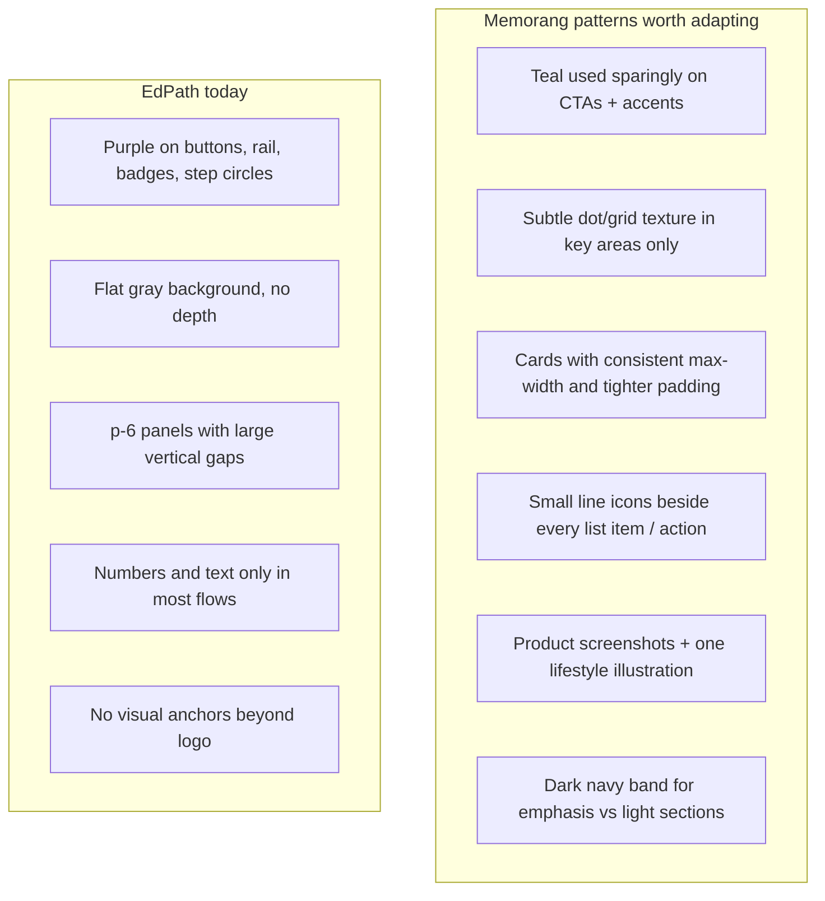
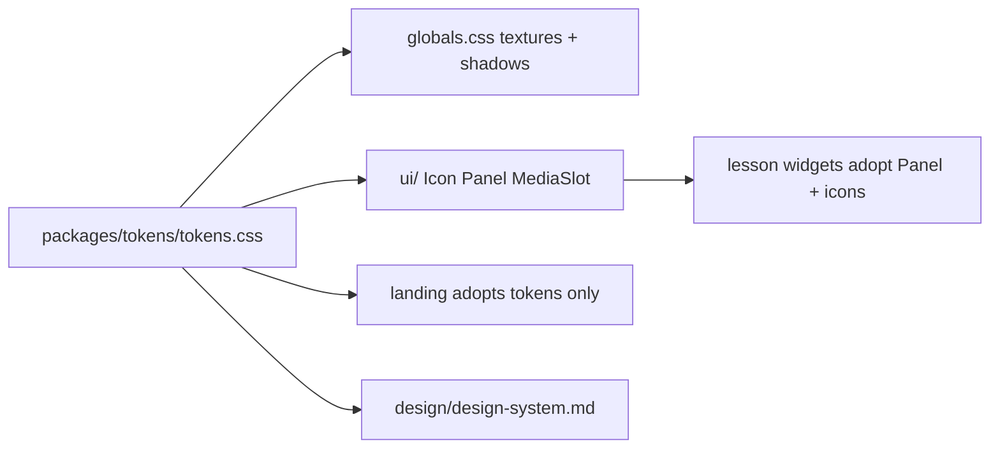

# EdPath Design System Overhaul

**Scope:** Fix the design system foundation only. No new landing page sections, no font changes, no backend changes. After this lands, you can direct the landing page layout separately.

---

## What you asked for vs what exists today

| Your requirement | Current state | Gap |
|---|---|---|
| Primary `#0C9488` (Memorang teal) | `--primary: #4633D9` (indigo) in [`packages/tokens/tokens.css`](packages/tokens/tokens.css) | Wrong brand color everywhere |
| Background `#F9F9F9` | `--paper: #F5F6FA` (cool gray-blue) | Slightly off; feels colder/flatter |
| Quiet icons on every action/thing | Lucide used in ~8 files, ad hoc sizes (`size-3`–`size-5`), many screens have **zero** icons (plan steps, CTAs, rail headers) | No icon system or conventions |
| Cards too big, inconsistent sizing | Lesson widgets use custom `div` with `p-6 space-y-6`; landing uses shadcn `Card`; nested items use `p-4`/`p-5` | No size variants, no shared `Panel` primitive |
| Background texture | Flat `bg-paper` on every screen via [`AppShell`](apps/edpath-web/components/shell/AppShell.tsx) / [`layout.tsx`](apps/edpath-web/app/layout.tsx) | No texture tokens or utilities |
| Images / branded feel | Only `/edpath-logo.svg`; no illustration slots or asset conventions | No image framework |
| Fonts unchanged | Inter + Bricolage + Geist Mono — **keep as-is** | No work needed |

The recent landing layout refresh ([`.cursor/plans/landing_page_ui_refresh_b9f97a06.plan.md`](.cursor/plans/landing_page_ui_refresh_b9f97a06.plan.md)) improved structure but still sits on the old purple token stack and the same flat, oversized primitives.

---

## Memorang reference — what to borrow (not copy)

From your Memorang screenshot, these patterns explain why EdPath feels “AI-generated” by comparison:



**Adapt for EdPath (not replicate Memorang’s full marketing page):**

1. **Strategic teal** — primary color on CTAs, active states, links, focus rings only; not on every circle/badge.
2. **Subtle texture** — very light dot grid on page background (Memorang hero uses this); optional `surface` panels stay clean white.
3. **Compact density** — Memorang cards feel ~30% tighter; EdPath lesson panels should default to `p-5 gap-4`, not `p-6 gap-6`.
4. **Quiet iconography** — 16px line icons, `stroke-[1.5]`, muted color (`text-ink-muted`), never competing with text.
5. **Image slots** — framework for future product mock / step illustrations; placeholders until you supply assets.
6. **Section contrast** — reserve a `--surface-inverse` (navy) token for future emphasis blocks; not used on lesson screens.

**Explicitly out of scope now:** partner logo strips, testimonial bands, multi-section marketing scroll, copying Memorang’s nav structure.

---

## Audit — specific EdPath issues (priority order)

### HIGH — Color & brand identity

**ISSUE 1 — Wrong primary palette**
- **Current:** Indigo `#4633D9` + lavender `--primary-soft: #ECEAFB` ([`tokens.css`](packages/tokens/tokens.css), [`design/design-system.md`](design/design-system.md))
- **Problem:** Doesn’t match Memorang; reads as generic shadcn purple AI scaffold
- **Fix:** Migrate to teal `#0C9488` with derived tokens (see below)

**ISSUE 2 — Teal vs success-green proximity**
- **Current design doc thesis:** brand must avoid green hues so feedback stays distinct
- **Problem:** `#0C9488` (teal) and `#15A05A` (success) are adjacent on the color wheel
- **Fix:** Keep success/error tokens functionally distinct — slightly shift success toward a clearer “answer green” (e.g. `#0F9D58`) and use teal **only** for brand/CTA/navigation. Document this override in `design/design-system.md`.

### HIGH — Card/panel sizing

**ISSUE 3 — Bloated lesson widgets**
- **Current:** [`McqWidget`](apps/edpath-web/components/mcq/McqWidget.tsx), [`PlanWidget`](apps/edpath-web/components/plan/PlanWidget.tsx), [`SummaryView`](apps/edpath-web/components/summary/SummaryView.tsx) all use `p-6 space-y-6 shadow-sm`
- **Problem:** Panels dominate the viewport; no max-height discipline; feels “hell big” on laptop
- **Fix:** Introduce `Panel` primitive with `sm | md` sizes; default lesson UI to `md` (`p-5 gap-4`); cap main column readability with existing `max-w-7xl` but tighten internal spacing

**ISSUE 4 — Two competing card patterns**
- **Current:** shadcn [`Card`](apps/edpath-web/components/ui/card.tsx) (`ring-1 rounded-xl`) vs hand-rolled `rounded-lg border shadow-sm` divs
- **Problem:** Inconsistent radius, border, shadow — unmaintained sizes
- **Fix:** One `Panel` component used by lesson widgets; shadcn `Card` reserved for landing/upload or aliased to `Panel`

### HIGH — Icon system missing

**ISSUE 5 — Icons sparse and inconsistent**
- **Current:** Icons only in upload, MCQ feedback, rail checkmarks; [`PlanObjectiveItem`](apps/edpath-web/components/plan/PlanObjectiveItem.tsx) uses filled purple number circles; [`PlanActions`](apps/edpath-web/components/plan/PlanActions.tsx) / [`WidgetActions`](apps/edpath-web/components/mcq/WidgetActions.tsx) have text-only buttons
- **Problem:** Doesn’t feel intentional or branded; numbers used where semantic icons would be quieter
- **Fix:** Add `Icon` wrapper + semantic icon map; apply across actions and step lists

### MEDIUM — Surface depth & texture

**ISSUE 6 — Flat, textureless background**
- **Current:** Solid `--paper` everywhere
- **Problem:** Reads as unbranded template; Memorang uses subtle grid for depth
- **Fix:** CSS-only dot-grid texture as opt-in page background utility; keep cards on clean `--surface`

**ISSUE 7 — No elevation scale**
- **Current:** Ad hoc `shadow-sm`, `shadow-lg` in components
- **Fix:** Tokenize `--shadow-xs | sm | md` in `tokens.css`

### MEDIUM — Imagery framework

**ISSUE 8 — No image/illustration system**
- **Current:** No slots, no aspect-ratio constants, no placeholder component
- **Fix:** `MediaSlot` primitive with `aspect-video | square | portrait` variants and neutral placeholder; wire into landing hero later when you specify layout

### LOW — Documentation drift

**ISSUE 9 — `design/design-system.md` contradicts your decision**
- Still documents indigo thesis and `#4633D9`
- Must be rewritten after token migration to reflect Memorang-aligned teal + compact/icon/texture rules

---

## Target design system architecture



All changes flow from [`packages/tokens/tokens.css`](packages/tokens/tokens.css) — single source of truth per existing convention.

---

## Token changes (exact values)

Update [`packages/tokens/tokens.css`](packages/tokens/tokens.css):

| Token | New value | Notes |
|---|---|---|
| `--paper` | `#F9F9F9` | Your specified background |
| `--primary` | `#0C9488` | Memorang teal |
| `--primary-strong` | `#0A7D73` | Hover/pressed (~15% darker) |
| `--primary-soft` | `#E7F6F4` | Teal tint for selected/active fills |
| `--border` | `#E5E5E5` | Slightly neutral to pair with warm paper |
| `--success` | `#0F9D58` | Shifted greener to separate from teal brand |
| `--success-soft` | `#E3F5EC` | Retint to match |
| `--shadow-xs` | `0 1px 2px rgba(27,28,42,0.04)` | New |
| `--shadow-sm` | `0 1px 3px rgba(27,28,42,0.06), 0 1px 2px rgba(27,28,42,0.04)` | New |
| `--shadow-md` | `0 4px 12px rgba(27,28,42,0.08)` | New |
| `--surface-inverse` | `#1B2B3A` | Reserved for future dark bands (Memorang navy) |

Shadcn aliases (`--ring`, `--secondary`, `--muted`) auto-derive from updated primary — no separate purple remnants.

**Font tokens:** unchanged (`Inter`, `Bricolage Grotesque`, `Geist Mono`).

---

## New primitives to add

All in [`apps/edpath-web/components/ui/`](apps/edpath-web/components/ui/):

### 1. `Icon.tsx`
- Wraps `lucide-react` with fixed sizes: `xs=14`, `sm=16`, `md=20`, `lg=24`
- Default: `stroke-[1.5] text-ink-muted`
- Variants: `brand` (teal), `success`, `error`, `inverse`
- Ensures icons stay **quieter than text** — never use `size-5` filled icons in body lists

### 2. `Panel.tsx`
- Unified container replacing duplicated `rounded-lg border bg-surface p-6 shadow-sm` pattern
- Props: `size="sm" | "md"`, `variant="default" | "muted" | "inverse"`
- Defaults: `md` → `p-5 gap-4 rounded-[var(--radius-md)] border border-border bg-surface shadow-[var(--shadow-sm)]`
- `sm` → `p-4 gap-3` for sidebars ([`ObjectiveRail`](apps/edpath-web/components/shell/ObjectiveRail.tsx)), nested items

### 3. `MediaSlot.tsx`
- Placeholder for future images: dashed border, aspect ratio, optional caption
- Variants: `product` (16:9), `square` (1:1), `illustration` (4:3)
- Uses `next/image` when `src` provided; gradient placeholder when not
- **No real assets in this phase** — just the slot pattern

### 4. Background texture utility
In [`apps/edpath-web/app/globals.css`](apps/edpath-web/app/globals.css):

```css
.bg-paper-textured {
  background-color: var(--paper);
  background-image: radial-gradient(circle, rgba(12,148,136,0.07) 1px, transparent 1px);
  background-size: 24px 24px;
}
```

Apply on `AppShell` root / `body` — subtle, Memorang-adjacent, not noisy.

---

## Semantic icon map (conventions, not new deps)

| Context | Icon (lucide) | Where |
|---|---|---|
| Upload PDF | `FileUp` | dropzone, step 1 |
| Approve plan | `ListChecks` | plan actions, step 2 |
| Quiz question | `CircleHelp` | MCQ header, step 3 |
| Summary | `GraduationCap` | summary view, step 4 |
| Submit | `Send` | WidgetActions |
| Approve lesson | `Check` | PlanActions |
| Next | `ArrowRight` | advance buttons |
| Help | `MessageCircle` | HelpInput |
| Do / Don't | `Check` / `X` | already in UploadGuidelines — normalize via `Icon` |

Replace filled primary number circles in [`LandingHero`](apps/edpath-web/components/landing/LandingHero.tsx) and [`PlanObjectiveItem`](apps/edpath-web/components/plan/PlanObjectiveItem.tsx) with **muted icon + text** where semantic; keep numbers only in the objective rail (sequence is meaningful there per existing design doc).

---

## Component migration order

**Phase A — Foundation (no visible layout changes beyond color/texture)**
1. Update [`packages/tokens/tokens.css`](packages/tokens/tokens.css)
2. Add shadow + texture to [`globals.css`](apps/edpath-web/app/globals.css)
3. Apply `bg-paper-textured` in [`AppShell`](apps/edpath-web/components/shell/AppShell.tsx)
4. Verify shadcn [`button`](apps/edpath-web/components/ui/button.tsx), [`badge`](apps/edpath-web/components/ui/badge.tsx), [`card`](apps/edpath-web/components/ui/card.tsx) inherit new tokens (no hardcoded purple classes)

**Phase B — Primitives**
5. Add `Icon.tsx`, `Panel.tsx`, `MediaSlot.tsx`
6. Tighten shadcn `Card` default spacing (`size="sm"` as landing default)

**Phase C — Apply across product UI (still not “landing page design”)**
7. Migrate lesson widgets to `Panel`: `McqWidget`, `PlanWidget`, `SummaryView`, loaders, `ObjectiveRail`
8. Add quiet icons to actions: `PlanActions`, `WidgetActions`, `HelpInput`, `RestartCta`
9. Normalize landing components to new tokens + `Icon` wrapper: `LandingHero`, `UploadCard`, `UploadGuidelines`
10. Reduce page vertical padding in [`page.tsx`](apps/edpath-web/app/page.tsx): `py-12 lg:py-16` → `py-8 lg:py-10`

**Phase D — Documentation**
11. Rewrite [`design/design-system.md`](design/design-system.md): teal thesis, icon rules, panel sizes, texture, image slots, teal-vs-success separation

---

## What we are NOT doing in this phase

- Building Memorang-style marketing sections (hero screenshot, logo cloud, testimonial band, footer columns)
- Changing fonts or type scale
- Adding real illustration/image assets (only `MediaSlot` placeholders)
- Touching backend, upload logic, or CopilotKit wiring
- Updating `@repo/ui` (unused boilerplate in this repo)

---

## Verification checklist

After implementation, confirm visually at 1280px and 375px:

- [ ] Primary buttons, focus rings, active rail state are teal `#0C9488`, not purple
- [ ] Page background is `#F9F9F9` with subtle dot texture; cards remain clean white
- [ ] Lesson panels feel noticeably tighter (less empty padding)
- [ ] Every primary action button has a quiet leading icon
- [ ] Green/red MCQ feedback still instantly readable vs teal brand
- [ ] No hardcoded `#4633D9` or `#ECEAFB` left in codebase
- [ ] `/lesson/[threadId]` flow unchanged functionally — only visual pass

---

## Risk note: teal + green feedback

Your explicit color choice overrides the original indigo thesis in [`design/design-system.md`](design/design-system.md). The mitigation is **strict color roles**: teal = brand/navigation only; green/red = grading feedback only; never use `--primary` on correct/incorrect states. If feedback ever feels muddy in practice, adjust `--success` hue — not the brand teal.
