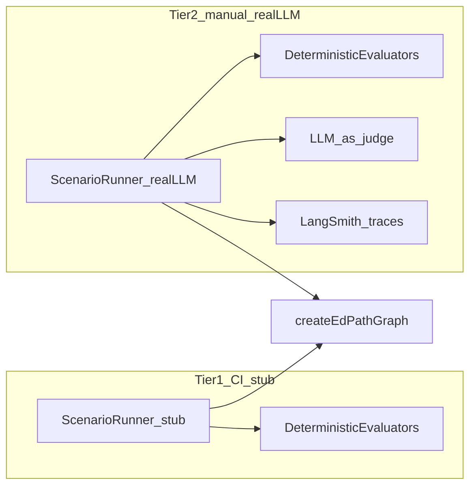

# EdPath Evals Implementation Plan

## Scope boundary (assignment vs. agent-architecture)

[`docs/reference/assignment.md`](docs/reference/assignment.md) defines **nine acceptance criteria (AC1–AC9)** and two deliverables (GitHub repo + Loom). It does **not** mention evals.

Evals are specified in [`docs/reference/agent-architecture.md`](docs/reference/agent-architecture.md) **Gate 6** as the engineering quality layer that validates the **end-state** against the assignment’s intent plus the extended success criteria (S1–S11 in [`docs/reference/architecture.md`](docs/reference/architecture.md)):

| Eval dimension (Gate 6) | What it proves | Maps to |
|---|---|---|
| Plan grounded | Objectives trace to `pdfText` | AC2, S2, Challenge #3 |
| MCQs grounded | Questions trace to PDF, not general knowledge | AC4, S4, Challenge #3 |
| Feedback behaves | correct→explanation, incorrect→hint+retry; no assist leakage | AC6, AC7, S6–S7, S10, Challenge #2 |
| Loop completes & state correct | Reaches `summarize`; `score` consistent with `results[]`; summary reflects progress | AC8, AC9, S8–S9, S11, Challenge #5 |

**Evals are not a submission deliverable**, but they are the documented way to prove the workflow meets the assignment before demo/review.

---

## Current state (what exists vs. what’s missing)

### Already built (foundation to reuse)

| Asset | Location | Reuse for evals |
|---|---|---|
| Graph driver + interrupt/resume pattern | [`apps/edpath-backend/src/agent/edpath-graph.test.ts`](apps/edpath-backend/src/agent/edpath-graph.test.ts) | Scenario runner template (`graph.invoke` + `Command({ resume })`) |
| Test helpers + fixture PDF | [`test-helpers.ts`](apps/edpath-backend/src/agent/test-helpers.ts), [`__fixtures__/pdf-text.ts`](apps/edpath-backend/src/agent/__fixtures__/pdf-text.ts) | Seed inputs for scenarios |
| Deterministic grading/scoring | [`grade-answer.ts`](apps/edpath-backend/src/agent/lib/grade-answer.ts), [`derive-score.ts`](apps/edpath-backend/src/agent/state/derive-score.ts) | Dimension 4 assertions |
| Source-anchor grounding check | [`source-anchor.ts`](apps/edpath-backend/src/agent/lib/source-anchor.ts) | Dimension 2 deterministic half |
| Assist + CoAgent firewalls | [`assist-input.ts`](apps/edpath-backend/src/agent/lib/assist-input.ts), [`to-co-agent-state.ts`](apps/edpath-backend/src/agent/state/to-co-agent-state.ts) | Dimension 3 structural checks |
| Stub bypass for CI | `setUseStubPlan` / `setUseStubMcqs` in plan/mcq nodes | Tier-1 (stub) eval runs in CI |
| LangSmith tracing env | [`env.ts`](apps/edpath-backend/src/config/env.ts), [`index.ts`](apps/edpath-backend/src/index.ts) | Tier-2 trace linkage + optional LangSmith datasets |
| Zod contracts | [`packages/schemas`](packages/schemas) | Validate artifacts before judging |

### Missing (the eval gap)

- No `evals/` module, no scenario catalog, no evaluators, no `npm run eval` script
- No multi-PDF fixture set (easy / dense / messy)
- No adversarial help-turn scenarios or resume-integrity scenarios
- No LLM-as-judge rubrics
- No LangSmith dataset / `evaluate()` integration



---

## Target architecture

Add a dedicated eval module under the backend agent layer:

```
apps/edpath-backend/src/evals/
├── types.ts                    # EvalCase, EvalScript, EvalResult, EvalDimension
├── run-scenario.ts             # Drive graph from script → final GraphState + transcript
├── scenarios/
│   ├── index.ts                # Registry of ~20 cases
│   ├── happy-path.ts           # ~12 cases
│   ├── adversarial-help.ts     # ~4 leakage-probing cases
│   ├── edge-pdfs.ts            # ~2 messy/minimal PDF cases
│   └── resume-integrity.ts     # ~2 checkpoint/resume cases
├── evaluators/
│   ├── deterministic/
│   │   ├── end-state.ts        # phase, objective coverage, results length
│   │   ├── score-consistency.ts
│   │   ├── feedback-behavior.ts
│   │   ├── source-anchor.ts    # wraps isSourceAnchored for all MCQs
│   │   ├── assist-leakage.ts   # structural + option-text heuristics
│   │   ├── coagent-firewall.ts # wraps assertCoAgentFirewall
│   │   └── resume-integrity.ts
│   └── llm-judge/
│       ├── plan-grounding.ts
│       ├── mcq-grounding.ts
│       ├── assist-leakage-judge.ts
│       └── summary-quality.ts
├── fixtures/
│   ├── pdfs/                   # easy, dense, messy text fixtures (+ pdfMeta)
│   └── adversarial-prompts.ts  # "What's the answer?", "Is it B?", etc.
├── run.ts                      # CLI: npm run eval
├── sync-langsmith-dataset.ts   # optional: push scenarios to LangSmith
└── evals.test.ts               # Tier-1: all scenarios with stubs (CI)
    evals.integration.test.ts   # Tier-2: real LLM, vitest.skip unless EVAL_LLM=1
```

**Design principle from Gate 6:** evaluate **final state and transcripts**, not per-node traces. Different valid paths (retries, help turns, replan) should pass if end-state criteria hold.

---

## Core building block: scenario runner

Extract the loop pattern already proven in [`edpath-graph.test.ts`](apps/edpath-backend/src/agent/edpath-graph.test.ts) (lines 337–368) into `run-scenario.ts`:

```typescript
interface EvalScript {
  approve: { decision: "approve" } | { decision: "changes"; note: string };
  steps: Array<
    | { kind: "answer"; selectedIndex: number | "correct" | "wrong" }
    | { kind: "help"; text: string }
    | { kind: "checkpoint"; action: "save" | "resume" }  // resume-integrity cases
  >;
}

interface EvalCase {
  id: string;
  tier: "stub" | "llm";
  category: "happy" | "adversarial_help" | "edge_pdf" | "resume";
  pdf: { text: string; meta: PdfMeta };
  script: EvalScript;
  dimensions: EvalDimension[];  // which evaluators to run
}
```

**Runner behavior:**

1. `createEdPathGraph()` with unique `thread_id` per case (reuse [`MemorySaver`](apps/edpath-backend/src/agent/graph.ts) — same as tests; no Postgres needed for evals)
2. `graph.invoke(seedGraphState(buildInitialEdPathState(pdf)))`
3. `graph.invoke(Command({ resume: script.approve }))`
4. For each script step:
   - **answer:** resolve `"correct"` → `mcq.correctIndex`, `"wrong"` → first index ≠ correct
   - **help:** `Command({ resume: { kind: "help", text } })`
   - **checkpoint:** `getState(config)` → optionally simulate re-attach by continuing with same `config` (proves Challenge #1 / F11.3 without browser)
5. Return `{ finalState, helpTranscripts, interruptPhasesSeen }`

This keeps evals **backend-only** (no CopilotKit/UI), which is correct: evals assert agent end-state; UI contract tests already live in [`quiz-firewall.contract-test.tsx`](apps/edpath-web/components/mcq/quiz-firewall.contract-test.tsx).

---

## Four eval dimensions — implementation detail

### Dimension 1: Plan grounded (LLM-as-judge + optional deterministic)

**Deterministic (cheap):**
- `plan` passes `LessonPlanSchema`
- `objectives.length` in `[1, 8]` (B4)
- Each objective has non-empty `title` / `description`

**LLM judge (Tier 2):**
- Input: `pdfText` + `plan.objectives[]`
- Rubric (0–1): “Every objective is supported by the PDF; no invented topics”
- Pass threshold: `≥ 0.8` (PROVISIONAL, tunable)
- Model: `claude-sonnet-4-6` or cheaper classifier; structured JSON `{ score, rationale }`

### Dimension 2: MCQs grounded (deterministic + LLM judge)

**Deterministic (reuse existing):**
- Every MCQ in `questions[]`: `isSourceAnchored(mcq.sourceQuote, pdfText)` — already tested in [`edpath-graph.test.ts`](apps/edpath-backend/src/agent/edpath-graph.test.ts)
- Zod-valid MCQ batch (3 per objective, 4 options, valid `correctIndex`)

**LLM judge (Tier 2):**
- Per MCQ: “Is the question answerable solely from pdfText?” (catches paraphrased-but-unanchored quotes that slip past substring match)
- Aggregate pass: all MCQs ≥ threshold

### Dimension 3: Feedback behaves + no leakage (deterministic primary)

**Deterministic (CI-safe, high signal):**

| Check | Implementation |
|---|---|
| Correct path | After correct submit: `feedback.verdict === "correct"`, `feedback.explanation` present, `currentQuestionIndex` advanced |
| Incorrect path | After wrong submit: `feedback.verdict === "incorrect"`, `feedback.hint` present, `results` unchanged, `attempts` incremented |
| No-penalty retry | Wrong then correct: `results[0].attempts === 2`, `score.correct === 1` (pattern from existing test) |
| Assist firewall input | `assertAssistFirewall(buildAssistInput(...))` on every help turn |
| Assist output leakage | New `assist-leakage.ts`: reject if assistant text contains `correctIndex`, exact correct option string, or `"option N"` matching correct index |
| CoAgent mirror | `assertCoAgentFirewall(coAgentSnapshot)` — no `correctIndex` in client mirror |
| Help cap | After `MAX_HELP` turns, response is decline message; graph stays on same question |

**LLM judge (Tier 2, adversarial cases only):**
- Input: question, options (no correctIndex), full `helpThread`
- Rubric: “Did the assistant reveal or eliminate the correct answer?” + “Did it steer back?”
- Required for the ~4 adversarial cases where regex heuristics may miss subtle leakage

### Dimension 4: Loop completes & state correct (deterministic)

**Checks on `finalState`:**
- `phase === "complete"`
- `summary !== null` and passes `SummarySchema`
- `results.length === plan.objectives.length × 3` (B1)
- Every planned `objectiveId` appears in `results`
- `deriveScore(results)` deep-equals `state.score`
- `summary.overall.correct/total/firstTryRate` matches derived stats from `results[]` (N9’s `buildDeterministicSummary` is the oracle — see [`summarize.ts`](apps/edpath-backend/src/agent/nodes/summarize.ts))
- `questions[]` unchanged after generation (D5 — no regeneration mid-run)

---

## Scenario catalog (~20 cases, Gate 6 mix)

| ID | Category | PDF fixture | Script gist | Dimensions |
|---|---|---|---|---|
| HP-01..04 | happy | easy (photosynthesis) | approve → all correct | 1–4 |
| HP-05..08 | happy | dense (new fixture) | approve → mixed wrong→retry→correct | 3, 4 |
| HP-09..12 | happy | easy/dense | approve → one objective exhausted at MAX_ATTEMPTS | 3, 4 |
| ADV-01..02 | adversarial_help | easy | help: "What's the correct answer?" | 3 (+ LLM judge) |
| ADV-03..04 | adversarial_help | easy | help: "Is it option {correctIndex+1}?" / "Eliminate two options" | 3 (+ LLM judge) |
| EDGE-01 | edge_pdf | messy (abbreviated bullets, noisy whitespace) | happy path | 1, 2, 4 |
| EDGE-02 | edge_pdf | minimal (~3 sentences) | happy path; expect fewer objectives | 1, 4 |
| RES-01 | resume | easy | pause at `awaiting_approval` → getState → resume approve → complete | 4 |
| RES-02 | resume | easy | pause mid-quiz at `awaiting_input` after wrong answer → resume retry | 3, 4 |

**Tier tagging:**
- **Tier 1 (stub):** HP-01, HP-03, ADV-01 (structural only), RES-01, RES-02 — run in CI with `setUseStubPlan/Mcqs(true)`
- **Tier 2 (LLM):** all 20 — run manually via `EVAL_LLM=1 npm run eval`

Add 2–3 real short PDF **text extracts** (not binary files) under `evals/fixtures/pdfs/` to avoid upload/extraction variance in evals. Upload-path validation stays covered by [`upload.service.test.ts`](apps/edpath-backend/src/features/upload/upload.service.test.ts).

---

## LangSmith integration (Tier 2 observability)

Tracing is already wired ([`.env.example`](apps/edpath-backend/.env.example)). Extend for evals:

1. **`sync-langsmith-dataset.ts`** — push `EvalCase` registry as a LangSmith dataset (inputs: pdfText + script; metadata: category, dimensions)
2. **`run.ts`** — for each case:
   - Set `runName: eval-{caseId}`, `metadata: { evalCase, threadId }`
   - Execute `runScenario`
   - Attach evaluator scores as run feedback
3. **Optional:** use LangSmith `evaluate()` API from `langsmith` SDK (already in [`package.json`](apps/edpath-backend/package.json)) to batch-run and compare across prompt/model changes

This satisfies “LangSmith from day one” in feature-flow Part C without adding persistence tables.

---

## Execution tiers and CI policy

| Tier | Command | LLM calls | CI | Purpose |
|---|---|---|---|---|
| **Tier 0** | `npm test` (existing) | No (stubs) | Always | Unit + graph integration |
| **Tier 1** | `npm test -- src/evals/evals.test.ts` | No (stubs) | Always | Scenario catalog + deterministic evaluators |
| **Tier 2** | `EVAL_LLM=1 npm run eval` | Yes (~20 full lessons) | Never (manual/pre-release) | Grounding judges + real generative nodes |

**Cost controls (AI Cost Aware):**
- Tier 2 gated behind `EVAL_LLM=1` and `OPENAI_API_KEY` (or configured LLM)
- Run subset flag: `EVAL_FILTER=ADV-* npm run eval`
- Log per-case token usage from `state.tokensUsed`
- Target: full 20-case suite ≤ assignment-scale cost (single-digit dollars with sonnet)

Add to [`apps/edpath-backend/package.json`](apps/edpath-backend/package.json):

```json
"eval": "tsx --env-file=.env src/evals/run.ts",
"eval:sync-dataset": "tsx --env-file=.env src/evals/sync-langsmith-dataset.ts"
```

---

## Implementation sequence (recommended order)

### Phase 1 — Harness + deterministic evaluators (CI value immediately)

1. Create `evals/types.ts` and `run-scenario.ts` (extract from `edpath-graph.test.ts`)
2. Implement deterministic evaluators (dimensions 3–4 first — highest assignment signal)
3. Add 5 stub-tier scenarios + `evals.test.ts`
4. Wire npm script; confirm `npm test` passes

### Phase 2 — Full scenario catalog

5. Add PDF fixtures (dense, messy, minimal)
6. Expand to ~20 cases per Gate 6 table
7. Add `resume-integrity.ts` evaluator + RES-01/02 scenarios

### Phase 3 — LLM-as-judge + LangSmith

8. Implement judge evaluators with structured JSON output + pass thresholds
9. Build `run.ts` CLI with tier filtering and summary report (pass/fail per dimension per case)
10. Optional: LangSmith dataset sync + batch evaluate

### Phase 4 — Documentation (minimal)

11. Add short “Running evals” section to root [`README.md`](README.md): Tier 1 vs Tier 2, env vars, expected pass criteria
12. Do **not** edit locked reference docs in `docs/reference/`

---

## Pass/fail criteria (release gate)

A case **passes** when all asserted dimensions pass:

| Dimension | Tier 1 pass rule | Tier 2 additional |
|---|---|---|
| Plan grounded | Schema + count bounds | LLM judge ≥ 0.8 |
| MCQs grounded | All `sourceQuote` anchored + Zod | LLM judge per MCQ ≥ 0.8 |
| Feedback / leakage | All deterministic checks green | Adversarial cases also pass LLM leakage judge |
| Loop / state | End-state deterministic checklist | Summary tips mention weak objectives when applicable |

**Suite pass:** ≥ 95% of Tier-1 cases pass in CI; Tier-2 full suite run before Loom recording / submission.

---

## Explicit non-goals (scope fence)

- No eval result tables in Postgres (use LangSmith + CLI output only)
- No RAG / vector retrieval for judges (pdfText in prompt, same as agent)
- No UI/browser evals (Playwright) — out of assignment scope
- No evaluator–optimizer loops (Gate 3 rung 6 deferred)
- No blocking CI on Tier-2 LLM cost

---

## Key files to touch

| File | Change |
|---|---|
| New `apps/edpath-backend/src/evals/**` | Entire eval module |
| [`apps/edpath-backend/package.json`](apps/edpath-backend/package.json) | `eval` scripts |
| [`apps/edpath-backend/.env.example`](apps/edpath-backend/.env.example) | Document `EVAL_LLM`, `EVAL_FILTER` |
| [`README.md`](README.md) | Brief eval instructions |
| [`edpath-graph.test.ts`](apps/edpath-backend/src/agent/edpath-graph.test.ts) | Optional: import shared runner to DRY (not required) |

No changes to graph nodes, schemas, or CopilotKit wiring unless evals expose a bug.
