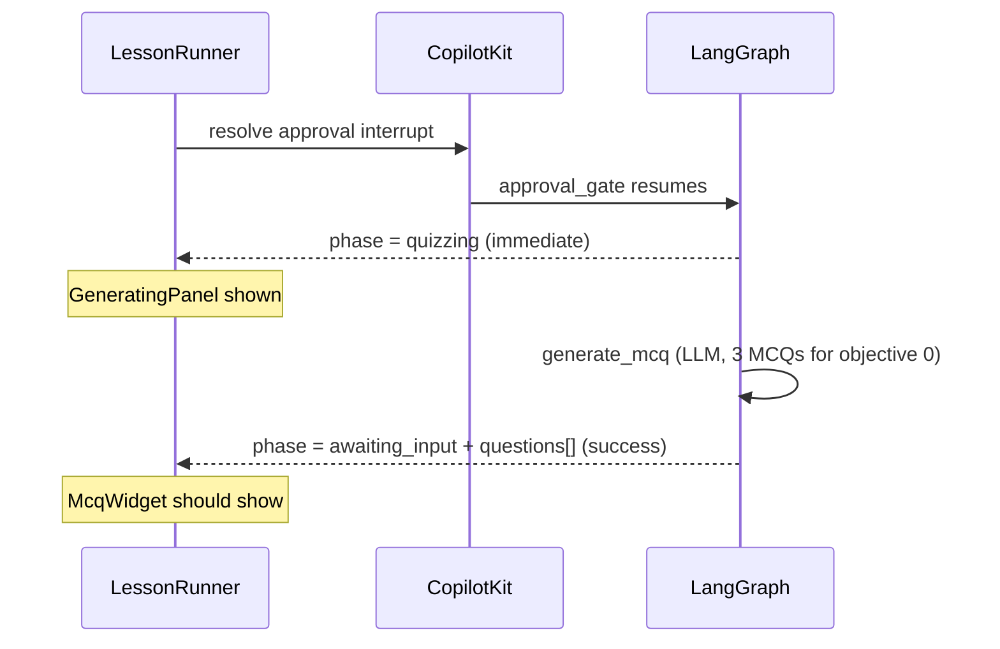

# Fix post-approval quiz generation stall

## Diagnosis (answers to your two hypotheses)

### 1. Is this just a mock loader with nothing happening?

**No — it is phase-driven from real agent state**, but it can *look* stuck because nothing tells you whether work is in progress vs failed.

After you click **Approve lesson path**:

Relevant code:

- [`approval-gate.ts`](apps/edpath-backend/src/agent/nodes/approval-gate.ts) sets `phase: "quizzing"` **immediately** on approve (before MCQs exist).
- [`LessonRunner.tsx`](apps/edpath-web/components/shell/LessonRunner.tsx) + [`phase-ui.ts`](apps/edpath-web/lib/phase-ui.ts) show `GeneratingPanel` while `phase === "quizzing"` (or `awaiting_input` with `questions.length === 0`).
- This is **not** tied to `useLesson` mock timers (those only affect dev preview state).

So the loader means: *the UI believes the agent is in MCQ generation*. Something real should be running—or the graph already failed and left you in a dead-end state.

---

### 2. Are we generating questions for ALL objectives at once?

**No — backend already does lazy, per-objective generation.** Your instinct matches the product design, and it is already implemented.

[`generate-mcq.ts`](apps/edpath-backend/src/agent/nodes/generate-mcq.ts) (lines 64–88):

- Reads **one** objective: `plan.objectives[state.currentObjectiveIndex]`
- Generates exactly **`MCQS_PER_OBJECTIVE` (3)** MCQs for that objective only
- On success: `phase: "awaiting_input"`, `questions: result.data`

[`advance.ts`](apps/edpath-backend/src/agent/nodes/advance.ts) clears `questions: []` and sets `phase: "quizzing"` only when moving to the **next** objective—after the current one is finished.

This matches locked spec [`feature-flow.md`](docs/reference/feature-flow.md) F4.1 (lazy per-objective batch) and [`design-decisions.md`](docs/reference/design-decisions.md) phase mapping.

**Conclusion:** Slowness is not caused by generating all topics upfront. A 6-objective plan still only triggers **3 MCQs for objective #1** on first approve.

---

## Most likely reasons for 1+ minute on the same screen

| Rank | Cause | Evidence |
|------|--------|----------|
| 1 | **Real LLM call still running** | `generate_mcq` sends full `pdfText` + objective JSON to the model (same pattern as planning). Large PDFs can take 60s+. |
| 2 | **`generate_mcq` failed silently in the UI** | On failure, node sets `phase: "quizzing"`, `questions: []`, `lastError: {...}`, graph routes to **END** ([`graph.ts`](apps/edpath-backend/src/agent/graph.ts) `routeAfterGenerateMcq`). UI keeps showing the generating loader forever—**no `lastError` banner exists in the web app**. |
| 3 | **Quiz UI not wired to agent state (mock-swap gap)** | Even when the agent succeeds, [`LessonRunner.tsx`](apps/edpath-web/components/shell/LessonRunner.tsx) renders `McqWidget` from [`useLesson`](apps/edpath-web/hooks/useLesson.ts) (mock cell-biology data), **not** `coAgentLesson.state.questions`. Plan was fixed; quiz was not. |
| 4 | **CopilotKit mirror lag** (less likely) | If checkpoint has questions but client mirror is stale, `resolveLessonPhase` keeps you in `quizzing` until `questions` arrive. |

Backend integration tests **do** pass approve → MCQ → await_input when stubs are enabled ([`edpath-graph.test.ts`](apps/edpath-backend/src/agent/edpath-graph.test.ts) “resumes approval and reaches await_input interrupt”). The graph logic is sound; the gap is real-LLM reliability + frontend wiring/observability.

---

## Recommended fix plan (after you approve)

### Step 0 — Confirm root cause on your thread (5 min, manual)

Before coding, inspect the stuck thread:

1. LangGraph checkpoint / LangSmith trace for your `threadId` after approve.
2. Check: `phase`, `questions.length`, `lastError`, `currentObjectiveIndex`, `coAgentSnapshot`.
3. Interpret:
   - `phase=quizzing`, `questions=[]`, `lastError=null`, run still active → **slow LLM** (wait or optimize prompt)
   - `phase=quizzing`, `questions=[]`, `lastError` set → **failed generation** (UI bug + maybe backend retry)
   - `phase=awaiting_input`, `questions.length=3` → **frontend mock-swap bug** (agent succeeded; UI not showing)

---

### Step 1 — Surface errors instead of infinite loader (frontend)

**Files:** [`LessonRunner.tsx`](apps/edpath-web/components/shell/LessonRunner.tsx), new small `LessonErrorBanner.tsx` or reuse [`UploadStateBanner`](apps/edpath-web/components/landing/UploadStateBanner.tsx) pattern.

- When `coAgentLesson.state.lastError !== null` **and** `questions.length === 0`, show an error banner (not `GeneratingPanel`).
- Copy aligned with feature-flow: “Couldn’t generate questions” + `lastError.detail`.
- Optional retry button (UI-only first; wire to graph retry in step 3).

Update [`phase-ui.ts`](apps/edpath-web/lib/phase-ui.ts) `resolveLessonPhase`:

- Do **not** treat `quizzing + lastError + empty questions` as generating—treat as **error** surface.

---

### Step 2 — Wire quiz widget to real CoAgent state (frontend mock-swap)

**Files:** [`LessonRunner.tsx`](apps/edpath-web/components/shell/LessonRunner.tsx), new `useCoAgentQuiz.ts` hook (or extend `useCoAgentLesson`).

Replace mock `useLesson` for quiz rendering:

| Today (mock) | Target (real) |
|---|---|
| `lesson.currentQuestion` | `coAgentLesson.state.questions[currentQuestionIndex]` |
| `lesson.currentObjective` | `plan.objectives[currentObjectiveIndex]` |
| `lesson.selectOption/submitAnswer/...` | Send intents via CopilotKit / LangGraph interrupt resume (await_input) |

Keep `useLesson` only for **DevPhaseSwitcher** preview until dev tools are updated.

**Exit condition:** After approve, when checkpoint has 3 questions, MCQ card appears with PDF-grounded content within one CopilotKit sync cycle.

---

### Step 3 — Backend hardening for failed MCQ generation (if step 0 shows failures)

**Files:** [`generate-mcq.ts`](apps/edpath-backend/src/agent/nodes/generate-mcq.ts), [`graph.ts`](apps/edpath-backend/src/agent/graph.ts)

Only if traces show `lastError` (common kinds: `schema_drift`, `ungrounded`):

- On failure, set a UI-distinguishable phase or keep `quizzing` but ensure `lastError` is always mirrored (already is).
- Consider a **deterministic retry edge** back to `generate_mcq` (bounded, not agentic)—matches feature-flow MCQErr “Retry”.
- Log MCQ failures to LangSmith with node + kind (already partially there via structured generate).

**Do not** change lazy per-objective scope—that is already correct.

---

### Step 4 — UX polish while waiting (optional, low risk)

- Pass `coAgent.running` (from `useCoAgent`) into generating UI subtext: “Still working…” vs idle error.
- Rail copy during `quizzing`: show current objective title from `plan.objectives[currentObjectiveIndex]` instead of generic “Current progress”.

---

## What we are NOT changing

- **Per-objective lazy generation** — already correct; no “generate all topics on approve” fix needed.
- **Mock plan seeding** — already fixed with empty initial state.
- **Full-page overlay** — keep inline `GeneratingPanel` pattern.

---

## Verification checklist

1. Upload PDF → plan generates → approve.
2. Loader shows briefly; within reasonable time (~30–90s for large PDF), **first MCQ card** appears.
3. If LLM fails, **error banner** appears (not infinite spinner).
4. LangGraph checkpoint: `questions.length === 3`, `currentObjectiveIndex === 0`, `phase === awaiting_input`.
5. Completing objective 1 triggers **new** `quizzing` only when advancing to objective 2—not on first approve.
