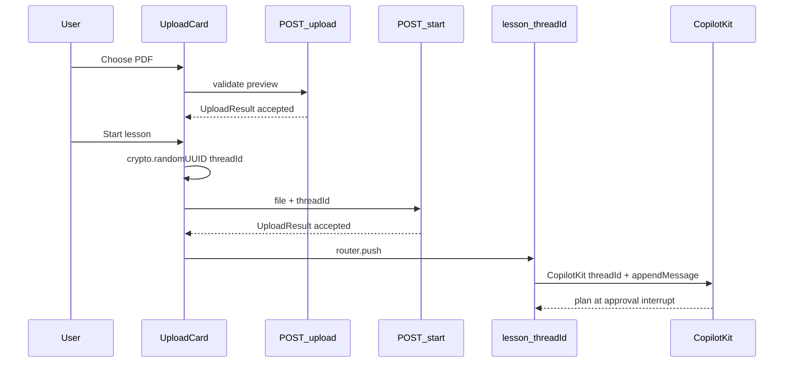

# Frontend: Wire Start to POST /start

## Problem

Today [`UploadCard.tsx`](apps/edpath-web/components/landing/UploadCard.tsx) validates via `POST /upload` on file pick, but **Start only navigates** — it never calls the backend seed endpoint. The `File` is discarded on route change. The lesson page then auto-sends `"Start the EdPath walking skeleton."` via CopilotKit, so the graph runs with **no `pdfText`** in checkpoint.

Backend [`POST /start`](apps/edpath-backend/src/features/start/start.route.ts) is implemented and verified (seeds `pdfText` + `pdfMeta` into LangGraph for the client-supplied `threadId`).

## Target flow



**Invariant:** same `threadId` in `/start`, URL, and `CopilotKit` provider.

## Implementation

### 1. Add `start-api.ts` client

New file: [`apps/edpath-web/lib/start-api.ts`](apps/edpath-web/lib/start-api.ts)

Mirror the pattern in [`upload-api.ts`](apps/edpath-web/lib/upload-api.ts):

- Base URL: `NEXT_PUBLIC_EDPATH_API_URL` + `/start`
- Multipart fields: `file` (reuse `UPLOAD_FIELD_NAME` from upload-api) + `threadId`
- Response: validate with existing `UploadResultSchema` from `@repo/schemas/upload`
- Outcome type: same `{ kind: "success" | "transport_error" }` shape as upload client

**HTTP mapping** (match backend [`start.route.ts`](apps/edpath-backend/src/features/start/start.route.ts)):

| Status | Frontend behavior |
|--------|-------------------|
| 200 + `accepted` | Success — proceed to lesson |
| 200 + `rejected` | Show rejection message (same reasons as `/upload`) |
| 400 | Parse `{ error }` → user-facing message |
| 409 | `"This lesson was already started. Open it from your link or upload a new PDF."` |
| 503 | `"The lesson service is temporarily unavailable. Try again in a moment."` |
| Network / parse failure | Generic transport error (same tone as upload client) |

Export:

```ts
export async function startLessonPdf(
  file: File,
  threadId: string,
): Promise<StartApiOutcome>
```

No new env vars.

### 2. Wire `UploadCard` Start handler

File: [`apps/edpath-web/components/landing/UploadCard.tsx`](apps/edpath-web/components/landing/UploadCard.tsx)

Change `handleStartLesson` from sync navigate to **async seed-then-navigate**:

1. Guard: `selectedFile` + accepted preview result (unchanged)
2. `const threadId = createThreadId()` — import from [`lesson-handoff.ts`](apps/edpath-web/lib/lesson-handoff.ts) (drop `createLessonStartHandoff` wrapper; it only added threadId + held file in memory)
3. `setIsStartingLesson(true)` — banner already shows "Building your lesson path..."
4. `await startLessonPdf(selectedFile, threadId)`
5. **On success (`accepted`):** `rememberThreadId(threadId)` → `router.push(`/lesson/${threadId}`)`
6. **On failure:** reset `isStartingLesson`, surface error via existing `transportError` / `uploadResult` banner patterns; **do not navigate**
7. Remove the fixed `550ms` delay before navigation — wait for `/start` completion instead (loading state covers UX)

Keep preview `POST /upload` on file pick unchanged (per backend plan — landing validation stays separate from seed).

### 3. Update auto-start message (cosmetic but important)

File: [`apps/edpath-web/components/shell/useCoAgentLesson.tsx`](apps/edpath-web/components/shell/useCoAgentLesson.tsx)

Replace stub text:

```ts
content: "Start the EdPath walking skeleton."
```

with a neutral run trigger, e.g. `"Start the lesson."`

This message only kicks off the CopilotKit/LangGraph run; **`pdfText` comes from the `/start` seed**, not from the message. No change to auto-start timing or guard logic.

### 4. Tidy handoff module comments

File: [`apps/edpath-web/lib/lesson-handoff.ts`](apps/edpath-web/lib/lesson-handoff.ts)

- Update the deferred-wiring comment to reflect that `/start` is now called from `UploadCard`
- Remove or simplify `createLessonStartHandoff` / `LessonStartHandoff` if unused after UploadCard refactor (keep `createThreadId`, `rememberThreadId`, `EDPATH_LAST_THREAD_ID_KEY`)

## Out of scope

- Removing preview `/upload` (intentional double-upload: validate on pick, seed on Start)
- Changing CopilotKit provider, approval interrupt UI, or mock quiz layer
- Backend changes (graphId seed + escape model already done)
- Adding vitest to edpath-web (no test infra today) — manual verification only

## Manual verification

1. Start stack: backend (`4000`), LangGraph dev (`2024`), web app
2. Landing: upload topic PDF → preview accepted
3. Click **Start lesson** — network tab shows `POST /start` with `file` + `threadId`, then navigation
4. Before CopilotKit run: `GET localhost:2024/threads/{threadId}/state` → `pdfText` present, `phase: "planning"`
5. Lesson page: agent reaches `awaiting_approval` with topic-specific objectives; `lastError` null; no `schema_drift`
6. Failure paths: stop LangGraph → `/start` returns 503, user stays on landing with error banner

## Files touched

| File | Change |
|------|--------|
| [`apps/edpath-web/lib/start-api.ts`](apps/edpath-web/lib/start-api.ts) | **New** — `/start` client |
| [`apps/edpath-web/components/landing/UploadCard.tsx`](apps/edpath-web/components/landing/UploadCard.tsx) | Start → `/start` then navigate |
| [`apps/edpath-web/lib/lesson-handoff.ts`](apps/edpath-web/lib/lesson-handoff.ts) | Comment cleanup; remove dead handoff helper if unused |
| [`apps/edpath-web/components/shell/useCoAgentLesson.tsx`](apps/edpath-web/components/shell/useCoAgentLesson.tsx) | Replace walking-skeleton message |
