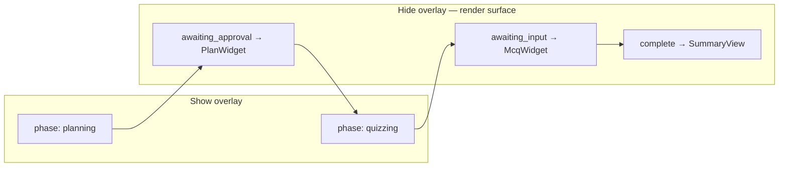

# Global Loading Overlay (phase-driven)

## Problem

[`LessonRunner.tsx`](apps/edpath-web/components/shell/LessonRunner.tsx) currently swaps inline skeleton loaders (`PlanningLoader`, `QuizzingLoader`) for generating phases, but the page still briefly shows **mock/default content** before real agent content arrives. Root cause is hybrid state:

- [`useCoAgentLesson.tsx`](apps/edpath-web/components/shell/useCoAgentLesson.tsx) seeds from [`getMockCoAgentState()`](apps/edpath-web/lib/mock-lesson.ts) (`phase: "awaiting_approval"`, full mock plan).
- [`LessonRunner`](apps/edpath-web/components/shell/LessonRunner.tsx) reads `plan = coAgentLesson.plan ?? lesson.plan`, so the objective rail can render mock objectives even while the agent is working.

The overlay solves the **generating-phase UX** (blur + spinner + message) once `phase` is truthfully `"planning"` or `"quizzing"`. Eliminating the initial mock snap is **out of scope** here — it requires mock-swap (empty initial CoAgent state, no mock plan fallback).



Locked phase semantics ([`design-decisions.md`](docs/reference/design-decisions.md) §2, [`packages/types/src/phase.ts`](packages/types/src/phase.ts)):

| Phase | Overlay | Surface |
|---|---|---|
| `planning` | **Show** | (none — agent generating plan) |
| `awaiting_approval` | Hide | Plan review |
| `quizzing` | **Show** | (none — agent generating MCQs) |
| `awaiting_input` | Hide | MCQ card |
| `complete` | Hide | Summary |

---

## 1. Component API and location

**New file:** [`apps/edpath-web/components/ui/LoadingOverlay.tsx`](apps/edpath-web/components/ui/LoadingOverlay.tsx)

Lives alongside existing EdPath primitives (`Panel`, `Icon`) — not `packages/ui` (that package has no Lucide/tokens wiring).

```tsx
interface LoadingOverlayProps {
  isActive: boolean;
  message: string;
  subtext?: string;
  className?: string; // optional layout override
}
```

**Behavior:**
- `isActive === false` → render `null` (no DOM, no aria noise).
- `isActive === true` → fixed full-viewport layer (`fixed inset-0 z-40`) over page content.
- **Presentational only** — no phase/agent imports, no timers, no storage.

**Visual (tokens-only, match existing patterns):**
- Backdrop: `bg-ink/20 backdrop-blur-sm` (same blur convention as [`AppShell`](apps/edpath-web/components/shell/AppShell.tsx) header and [`dialog.tsx`](apps/edpath-web/components/ui/dialog.tsx) overlay).
- Center card: reuse [`Panel`](apps/edpath-web/components/ui/Panel.tsx) `size="sm"` on `bg-surface`.
- Spinner: `LoaderCircleIcon` via [`Icon`](apps/edpath-web/components/ui/Icon.tsx) + `animate-spin` (same as [`UploadStateBanner`](apps/edpath-web/components/landing/UploadStateBanner.tsx)).
- Typography: `text-sm font-semibold text-ink` (message), `text-xs text-ink-muted` (subtext).
- `pointer-events-auto` on overlay; blocks interaction while active but **does not trap focus** (not a dialog).

**Accessibility:**
- Outer overlay: `role="status"`, `aria-live="polite"`, `aria-busy="true"`.
- Spinner icon: `aria-hidden` (message is the accessible label).
- No `Dialog` / focus trap / `aria-modal`.

---

## 2. Phase → overlay mapping utility

**New file:** [`apps/edpath-web/lib/phase-ui.ts`](apps/edpath-web/lib/phase-ui.ts)

Pure helpers consumed by callers (lesson page, future surfaces):

```ts
import type { Phase } from "@repo/types";

export const GENERATING_PHASES = ["planning", "quizzing"] as const satisfies readonly Phase[];

export function isGeneratingPhase(phase: Phase): boolean;

export function getGeneratingPhaseMessage(phase: Phase): string | undefined;
// planning  → "Building your lesson path…"
// quizzing  → "Generating your questions…"
// other     → undefined (caller supplies fallback if needed)
```

Optional subtext defaults (exported as constants, overridable by caller):
- planning: `"Reading your PDF and drafting objectives."`
- quizzing: `"Creating questions for this objective."`

---

## 3. Usage pattern (documented example)

Add a short **usage block** at the bottom of `phase-ui.ts` (or as JSDoc on `LoadingOverlay`) showing the intended caller wiring — **real CoAgent phase only**:

```tsx
// In LessonRunner (future / optional light wiring — real phase only)
const phase = coAgentLesson.phase; // NOT lesson.phase

<LoadingOverlay
  isActive={isGeneratingPhase(phase)}
  message={getGeneratingPhaseMessage(phase) ?? "Working…"}
  subtext={getGeneratingPhaseSubtext(phase)}
/>

{/* Remove inline PlanningLoader / QuizzingLoader when overlay is active */}
{phase === "awaiting_approval" && <PlanWidget … />}
{phase === "awaiting_input" && <McqWidget … />}
```

**Hard rules for callers:**
- Drive `isActive` from `coAgentLesson.phase` (mirrored agent state), never from `useLesson` mock timers or `setTimeout`.
- Do not use `coAgent.running` / CopilotKit `isLoading` as the overlay gate — those are transport signals, not UI surface selectors.
- Overlay replaces skeleton loaders for generating phases; ready surfaces render only when phase transitions to `awaiting_*` / `complete`.

---

## 4. Scope boundaries (this PR)

**Build:**
- `LoadingOverlay` component
- `phase-ui.ts` helpers + documented usage example

**Do NOT touch:**
- [`useLesson.ts`](apps/edpath-web/hooks/useLesson.ts) or mock timers (`PLAN_DELAY_MS`, `QUIZ_DELAY_MS`)
- [`mock-lesson.ts`](apps/edpath-web/lib/mock-lesson.ts) initial state
- [`useCoAgentLesson.tsx`](apps/edpath-web/components/shell/useCoAgentLesson.tsx) merge logic

**Optional (recommend deferring to review):** wire into [`LessonRunner.tsx`](apps/edpath-web/components/shell/LessonRunner.tsx) now by replacing `PlanningLoader`/`QuizzingLoader` branches with the overlay gated on `coAgentLesson.phase`. Safe for generating phases but **will not fix** the initial mock-plan flash in the rail until mock-swap removes `getMockCoAgentState()` defaults.

**Leave in place for now:** [`PlanningLoader.tsx`](apps/edpath-web/components/loaders/PlanningLoader.tsx) and [`QuizzingLoader.tsx`](apps/edpath-web/components/loaders/QuizzingLoader.tsx) — deprecated once overlay is wired; delete in mock-swap follow-up.

---

## 5. Verification (manual)

1. Import `LoadingOverlay` in a dev-only toggle or Storybook-style inline test with `isActive` toggled via React state — confirm blur, spinner, message/subtext, and `aria-busy`.
2. Confirm overlay unmounts instantly when `isActive` flips false (no fade timer).
3. Run `pnpm --filter edpath-web check-types` (or project equivalent) on new files.

---

## Files

| File | Action |
|---|---|
| [`apps/edpath-web/components/ui/LoadingOverlay.tsx`](apps/edpath-web/components/ui/LoadingOverlay.tsx) | **Create** — presentational overlay |
| [`apps/edpath-web/lib/phase-ui.ts`](apps/edpath-web/lib/phase-ui.ts) | **Create** — phase helpers + usage doc |
| [`apps/edpath-web/components/shell/LessonRunner.tsx`](apps/edpath-web/components/shell/LessonRunner.tsx) | **Defer** — wire after review / with mock-swap |
