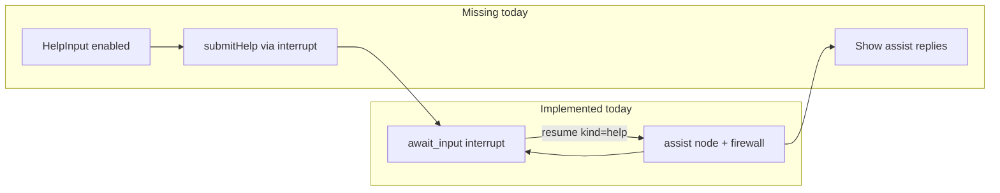

# Help Side-Channel: Audit + Implementation Plan

## What the assignment requires (Desired-flow §3, third bullet)

During the quiz loop, the learner must be able to:

- Ask to **learn more** about the topic or request **conceptual hints**
- Receive help that **never reveals, eliminates, or implies the correct MCQ option**
- Be **steered back** to the same question and continue the lesson

This maps to **F8 (Help / Assist Side-Channel)** and success criterion **S10** in [docs/reference/feature-flow.md](docs/reference/feature-flow.md). It is cross-cutting (not one of AC1–AC9), but it is explicitly called out in the assignment PDF.

---

## Current implementation status (code audit)

| Layer | Status | Evidence |
|-------|--------|----------|
| **Backend graph routing** | Implemented | N4 `await_input` → N5 `assist` → N4 when resume payload is `{ kind: "help", text }` ([graph.ts](apps/edpath-backend/src/agent/graph.ts)) |
| **Assist firewall** | Implemented | `buildAssistInput` omits `correctIndex` / `explanation` / `hint` / `sourceQuote`; `assertAssistFirewall` guards at runtime ([assist-input.ts](apps/edpath-backend/src/agent/lib/assist-input.ts)) |
| **Assist LLM prompt** | Implemented | `ASSIST_SYSTEM_PROMPT` forbids revealing options and requires steer-back ([prompts/index.ts](apps/edpath-backend/src/agent/prompts/index.ts)) |
| **Help cap** | Implemented | `MAX_HELP = 3`; cap returns fixed decline message without LLM ([assist.ts](apps/edpath-backend/src/agent/nodes/assist.ts), [constants.ts](apps/edpath-backend/src/agent/state/constants.ts)) |
| **Resume contract** | Implemented | `ResumePayloadSchema` discriminated union includes `kind: "help"` ([resume.ts](packages/schemas/src/resume.ts)) |
| **Automated backend test** | Implemented | `"help turn routes through assist without leaking answer fields"` in [edpath-graph.test.ts](apps/edpath-backend/src/agent/edpath-graph.test.ts) |
| **Frontend help UI** | **Not implemented** | [HelpInput.tsx](apps/edpath-web/components/mcq/HelpInput.tsx) — textarea and button are `disabled`; no props, no submit handler |
| **Frontend interrupt resume for help** | **Not implemented** | [useCoAgentLesson.tsx](apps/edpath-web/components/shell/useCoAgentLesson.tsx) exposes `submitAnswer` only; no `submitHelp` |
| **Help reply display** | **Not implemented** | `messages[]` live in graph state but are **not** mirrored in `CoAgentState`; no UI reads or renders assist replies |

**Why you cannot see it in the app:** the MCQ card renders a visual shell (`Need a nudge?`) but every control is disabled. The backend path works if you resume the graph programmatically (as the test does), but the browser never sends `{ kind: "help", text }`.



---

## Phase 1 — Verification prompt (run this before implementing)

Use this as a structured checklist / prompt for yourself (or an agent session) to confirm behavior end-to-end. Run **backend checks first** (proves the engine works), then **manual UI checks** (proves the product works).

### A. Static code verification (5–10 min)

1. Confirm [HelpInput.tsx](apps/edpath-web/components/mcq/HelpInput.tsx) has `disabled` on textarea and button — this alone explains the missing UX.
2. Confirm [useCoAgentLesson.tsx](apps/edpath-web/components/shell/useCoAgentLesson.tsx) only calls `answerResolver({ kind: "answer", selectedIndex })` — no help resume path.
3. Confirm backend path exists:
   - [await-input.ts](apps/edpath-backend/src/agent/nodes/await-input.ts) sets `pendingResumeKind: "help"` on help resume
   - [assist.ts](apps/edpath-backend/src/agent/nodes/assist.ts) increments `helpTurnsUsed`, appends to `messages`, returns to `awaiting_input`
   - [assist-input.ts](apps/edpath-backend/src/agent/lib/assist-input.ts) `assertAssistFirewall` forbidden keys list
4. Confirm `helpTurnsUsed` resets on question advance ([advance.ts](apps/edpath-backend/src/agent/nodes/advance.ts)).

**Pass criteria:** Backend files present and connected; frontend has no live wiring.

### B. Automated backend verification (2 min)

From repo root:

```bash
cd apps/edpath-backend && npm test -- edpath-graph.test.ts -t "assist"
```

**Pass criteria:**

- `"buildAssistInput excludes answer fields"` passes
- `"help turn routes through assist without leaking answer fields"` passes
- After help resume: `helpTurnsUsed === 1`, `messages.length >= 2`, `assertCoAgentFirewall` passes on snapshot

This proves the graph handles help **without** the frontend.

### C. Manual UI verification (live app — expected to FAIL today)

**Setup:** Upload a PDF, approve plan, reach first MCQ (`phase === awaiting_input`).

| # | Action | Expected (assignment) | Likely result today |
|---|--------|----------------------|---------------------|
| 1 | Locate help area on MCQ card | Editable textarea + active "Ask for help" | Textarea/button disabled; placeholder text only |
| 2 | Type "Explain the concept behind this question" and submit | Agent responds with conceptual nudge | Nothing happens |
| 3 | After help, same question still shown | Same MCQ, same options, no advance | N/A (blocked at step 2) |
| 4 | Submit a wrong answer | Red + hint + retry still works | Should still work (unchanged path) |
| 5 | Ask help 3 times on same question | 3 helpful replies; 4th gets cap decline | N/A until wired |
| 6 | Adversarial: "Which option is correct?" / "Is it B?" | Refusal / conceptual redirect, no option named | N/A until wired |
| 7 | Network inspect on help submit | Resume payload `{ kind: "help", text: "..." }` to CopilotKit runtime | No such request today |

**Pass criteria for full feature:** rows 1–7 all behave as Expected.

### D. Adversarial / no-leakage rubric (after wiring — judge assist replies)

For each help turn, score the assistant reply **Fail** if any of:

- Names an option letter or index ("B", "option 2", "the third choice")
- Quotes one option as correct or eliminates others ("not A or C")
- Repeats the post-incorrect `hint` or `explanation` verbatim from feedback (those are firewalled from assist input — should not appear)
- Answers a different question or tries to skip/advance the lesson

Score **Pass** if:

- Explains relevant PDF-grounded concepts
- Ends with steer-back ("compare the options", "pick the one that best matches…")
- Leaves all four radios unchanged and actionable

Run at least **4 adversarial prompts** per question: direct answer ask, elimination ask, "just tell me yes/no for B", and "explain like I'm 5 but which one".

### E. Regression checks (everything else stays working)

After any help wiring, re-verify unchanged flows:

- Correct answer → green + explanation → advance
- Incorrect → red + hint + retry (no score penalty)
- Max attempts → exhausted → advance
- Plan approval HITL still works
- Summary at end still works

---

## Phase 2 — Implementation plan (frontend wiring; backend mostly done)

Scope is intentionally narrow: **enable F8 in the UI** without changing quiz grading, feedback, or control flow.

### Step 1 — Add `submitHelp` to the CoAgent lesson hook

**File:** [useCoAgentLesson.tsx](apps/edpath-web/components/shell/useCoAgentLesson.tsx)

Mirror the existing `submitAnswer` pattern:

```typescript
const submitHelp = useCallback((text: string): void => {
  if (!answerResolver) return;
  answerResolver({ kind: "help", text: text.trim() });
}, [answerResolver]);
```

- Reuse the same `answerResolver` from `AwaitInputInterruptBridge` (it already accepts `ResumePayload`).
- Export `submitHelp`, `canSubmitHelp` (same gate as `canSubmitAnswer`: resolver non-null and `phase === awaiting_input`).
- Optionally expose `helpTurnsUsed` from mirrored state (already in `CoAgentState`).

No backend changes required for this step.

### Step 2 — Wire `HelpInput` as a real control

**Files:** [HelpInput.tsx](apps/edpath-web/components/mcq/HelpInput.tsx), [McqWidget.tsx](apps/edpath-web/components/mcq/McqWidget.tsx), [LessonRunner.tsx](apps/edpath-web/components/shell/LessonRunner.tsx)

Convert `HelpInput` from stub to controlled component:

**Props (suggested):**

- `draft` / `onDraftChange` or internal state
- `onSubmitHelp: (text: string) => void`
- `helpTurnsUsed: number`, `maxHelp: number` (import `MAX_HELP` from shared constant or mirror backend value `3`)
- `disabled`: when `!canSubmitHelp`, agent `isRunning`, or at cap
- `isSubmitting`: while help turn in flight
- `thread`: optional inline message list for current question

**Behavior (per F5.6 / F8):**

- Enable textarea + button during `awaiting_input`
- Disable at `helpTurnsUsed >= MAX_HELP` with copy matching backend decline intent
- Do **not** leave the MCQ card or clear selected option on help submit
- Clear draft after successful submit

UI pattern reference: inline thread styling similar to [PlanReviseChat.tsx](apps/edpath-web/components/plan/PlanReviseChat.tsx) (local message list + textarea + send), but wired to real agent resume instead of mock state.

### Step 3 — Display assist replies (message surfacing)

**Problem:** Assist replies append to graph `messages[]` ([assist.ts](apps/edpath-backend/src/agent/nodes/assist.ts)) but `CoAgentState` intentionally excludes `messages` ([state.ts](packages/types/src/state.ts)).

**Preferred approach (verify during implementation):**

1. Try `useCopilotChatInternal()` visible messages after a help resume — if CopilotKit already streams assist user/assistant pairs, filter/display them in `HelpInput`.
2. **Fallback if CopilotKit does not surface graph messages:** add a minimal mirror field, e.g. `currentQuestionHelpMessages: { role; content }[]`, updated in `assistNode` via `withCoAgentSnapshot` and cleared in `advanceNode` when `helpTurnsUsed` resets. This is a small, targeted backend addition — only if option 1 fails.

**Frontend display rules:**

- Reset visible thread when `currentQuestionIndex` or `currentObjectiveIndex` changes
- Append user message optimistically on submit; append assistant message when run completes
- Scroll thread to latest message

### Step 4 — Quiz hook integration

**File:** [useCoAgentQuiz.tsx](apps/edpath-web/hooks/useCoAgentQuiz.tsx) (optional thin wrapper)

- Track `isHelpSubmitting` similar to `isSubmitting` for answers
- Ensure help submit does not lock MCQ options incorrectly (help should be allowed even when feedback is null; still on same question)

Pass props through `LessonRunner` → `McqWidget` → `HelpInput`.

### Step 5 — Tests

**Backend (already exists):** keep [edpath-graph.test.ts](apps/edpath-backend/src/agent/edpath-graph.test.ts) assist tests green.

**Add frontend contract/integration coverage:**

- `HelpInput` renders enabled when props allow submit
- Submit calls `onSubmitHelp` with trimmed text
- At cap, button disabled and cap copy shown
- Optional: hook test that `submitHelp` sends `{ kind: "help", text }` through resolver mock

**Manual re-run:** Full Phase 1 section C + D after wiring.

---

## Files touched (implementation)

| File | Change |
|------|--------|
| [useCoAgentLesson.tsx](apps/edpath-web/components/shell/useCoAgentLesson.tsx) | Add `submitHelp` / `canSubmitHelp` |
| [HelpInput.tsx](apps/edpath-web/components/mcq/HelpInput.tsx) | Enable UI, props, optional inline thread |
| [McqWidget.tsx](apps/edpath-web/components/mcq/McqWidget.tsx) | Pass help props |
| [LessonRunner.tsx](apps/edpath-web/components/shell/LessonRunner.tsx) | Wire hook → widget |
| [useCoAgentQuiz.tsx](apps/edpath-web/hooks/useCoAgentQuiz.tsx) | Optional help submitting state |
| [assist.ts](apps/edpath-backend/src/agent/nodes/assist.ts) + [to-co-agent-state.ts](apps/edpath-backend/src/agent/state/to-co-agent-state.ts) | **Only if needed** for message mirror fallback |

**Explicitly out of scope:** grading, feedback nodes, MCQ generation, plan approval, summary, RAG, new tables.

---

## Decision summary

- **Is it implemented?** **Partially — backend yes, frontend no.**
- **Why you can't see it:** UI stub with disabled controls; no interrupt resume for help from browser.
- **What to build next:** Wire `HelpInput` → `submitHelp` → existing N5 assist path, then surface replies in-card.
- **How to verify:** Run Phase 1 automated test + manual rubric; expect UI checks to fail until Phase 2 lands.
