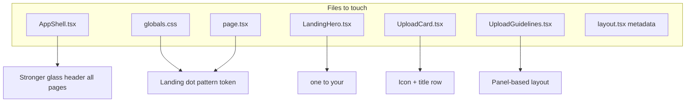

# Landing Page Visual Polish

## Current state (what the code already has)

Your screenshot looks mostly flat white because two effects are **already implemented but too subtle**:

| Request | Already in code | Why it doesn’t read on screen |
|--------|------------------|-------------------------------|
| Blur navbar | [`AppShell.tsx`](apps/edpath-web/components/shell/AppShell.tsx) uses `bg-surface/90 backdrop-blur-sm` | Header is not `sticky`, so nothing scrolls underneath; `backdrop-blur-sm` + 90% opaque white ≈ solid bar |
| Dotted pattern | [`globals.css`](apps/edpath-web/app/globals.css) `.bg-paper-textured` — teal dots at **7% opacity**, 24px grid | Nearly invisible on `#F9F9F9` paper; pattern is global but reads as plain white |

Everything else you flagged is fair game for real UI work:

- **Do/Don’t** — plain `text-xs` two-column list in [`UploadGuidelines.tsx`](apps/edpath-web/components/landing/UploadGuidelines.tsx)
- **Upload PDF heading** — bare `CardTitle` string in [`UploadCard.tsx`](apps/edpath-web/components/landing/UploadCard.tsx)
- **Hero copy** — `"Turn one PDF"` in [`LandingHero.tsx`](apps/edpath-web/components/landing/LandingHero.tsx)



---

## 1. Glass blur navbar — all pages

**File:** [`apps/edpath-web/components/shell/AppShell.tsx`](apps/edpath-web/components/shell/AppShell.tsx)

Upgrade the shared header (used by `/` and `/lesson/[threadId]`):

- Make it **sticky**: `sticky top-0 z-50`
- Stronger frosted glass:
  - `bg-surface/70 backdrop-blur-md supports-backdrop-filter:bg-surface/55`
  - Optional polish: `backdrop-saturate-150`
- Add a **very subtle** bottom edge on landing too: `border-b border-border/40` (currently landing has no border, which makes the bar feel like a solid white strip)

No new component needed — `AppShell` is the single navbar for the whole app today.

Also update the default-variant tagline in the same file: `"Turn one PDF..."` → `"Turn your PDF into a guided lesson"`.

---

## 2. Subtle primary-teal dot pattern — landing page only

**Files:** [`globals.css`](apps/edpath-web/app/globals.css), [`page.tsx`](apps/edpath-web/app/page.tsx)

Keep the existing global `.bg-paper-textured` as the quiet base (lesson pages stay calm). Add a **landing-specific** utility that uses the primary token:

```css
.bg-paper-textured-landing {
  background-color: var(--paper);
  background-image: radial-gradient(
    circle,
    color-mix(in srgb, var(--primary) 11%, transparent) 1px,
    transparent 1px
  );
  background-size: 20px 20px;
}
```

Design intent:
- Color: `--primary` (`#0C9488`) — matches your brand teal
- Opacity: ~10–12% — visible but not noisy
- Grid: 20px — slightly denser than today’s 24px so the pattern reads as texture, not empty space

Apply on the landing main wrapper in [`page.tsx`](apps/edpath-web/app/page.tsx) (e.g. the outer `flex-1` container), **not** on the upload card itself (card stays solid `bg-surface` so text stays readable).

---

## 3. Redesign Do’s / Don’ts (same content, better hierarchy)

**File:** [`UploadGuidelines.tsx`](apps/edpath-web/components/landing/UploadGuidelines.tsx)

Problem today: two bare columns of `text-xs` labels — reads like fine print, not guidance.

**Proposed layout** (reuse existing tokens + [`Panel`](apps/edpath-web/components/ui/Panel.tsx)):

```
┌─────────────────────────┬─────────────────────────┐
│  ✓  Do                  │  ✗  Don't               │
│  bg-success-soft        │  bg-error-soft            │
│  border-border          │  border-border            │
│  • One PDF, under 15 MB │  • Word docs, images…     │
│  • Selectable text…     │  • Scanned PDFs…          │
└─────────────────────────┴─────────────────────────┘
```

Concrete changes:
- Wrap each column in `Panel` (`size="sm"`, custom `className` for `bg-success-soft` / `bg-error-soft`)
- Section title row: small icon + semibold label (`text-success-ink` / `text-error-ink`)
- List items: bump to `text-sm`, slightly more vertical spacing (`space-y-2`)
- Keep all 8 bullet strings exactly as they are today

---

## 4. Improve “Upload PDF” heading with icon

**File:** [`UploadCard.tsx`](apps/edpath-web/components/landing/UploadCard.tsx)

Replace plain `CardTitle` with a horizontal header row:

```
[ FileUpIcon in primary-soft circle ]  Upload PDF
                                       PDF only · one file at a time
```

- Reuse `FileUpIcon` + existing `Icon` component (same pattern as the drop zone)
- Title: keep `font-semibold text-ink`
- Optional one-line subtitle under title: `text-sm text-ink-muted` — short, not redundant with Do/Don’t
- `CardHeader`: `flex flex-row items-center gap-3` instead of title-only block

---

## 5. Hero copy: “one” → “your”

**Files:**
- [`LandingHero.tsx`](apps/edpath-web/components/landing/LandingHero.tsx) — H1: `Turn your PDF into a guided lesson.`
- [`AppShell.tsx`](apps/edpath-web/components/shell/AppShell.tsx) — default header tagline (same wording)
- [`layout.tsx`](apps/edpath-web/app/layout.tsx) — metadata description for consistency

**Leave unchanged:** step 1 still says “Upload **one** PDF with selectable text” — that’s a constraint, not the headline.

---

## Out of scope (per your note)

- Hero step list content (except headline)
- Drop zone, Start lesson button, upload/start logic
- Lesson page layout/widgets
- Backend or schema changes

---

## Verification checklist

1. **`/` landing** — dot pattern visible but subtle; header frosts when page scrolls (or when content sits under sticky bar)
2. **`/lesson/[threadId]`** — same blurred sticky header; background stays the quieter global texture (no landing boost)
3. **Upload card** — icon + title header; Do/Don’t in tinted panels, same 8 rules
4. **Hero** — reads “Turn **your** PDF into a **guided lesson.**”
5. **Responsive** — Do/Don’t stack on mobile (`sm:grid-cols-2` preserved), no horizontal overflow
6. **No logic regressions** — drag/drop, validation banners, Start lesson flow unchanged
