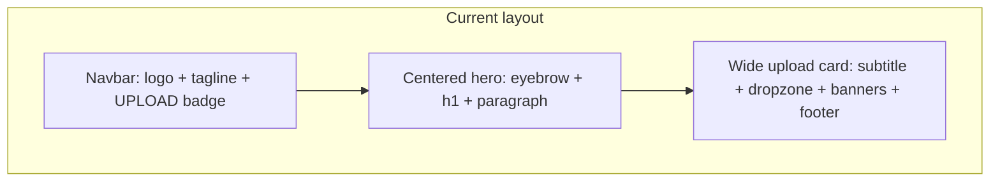
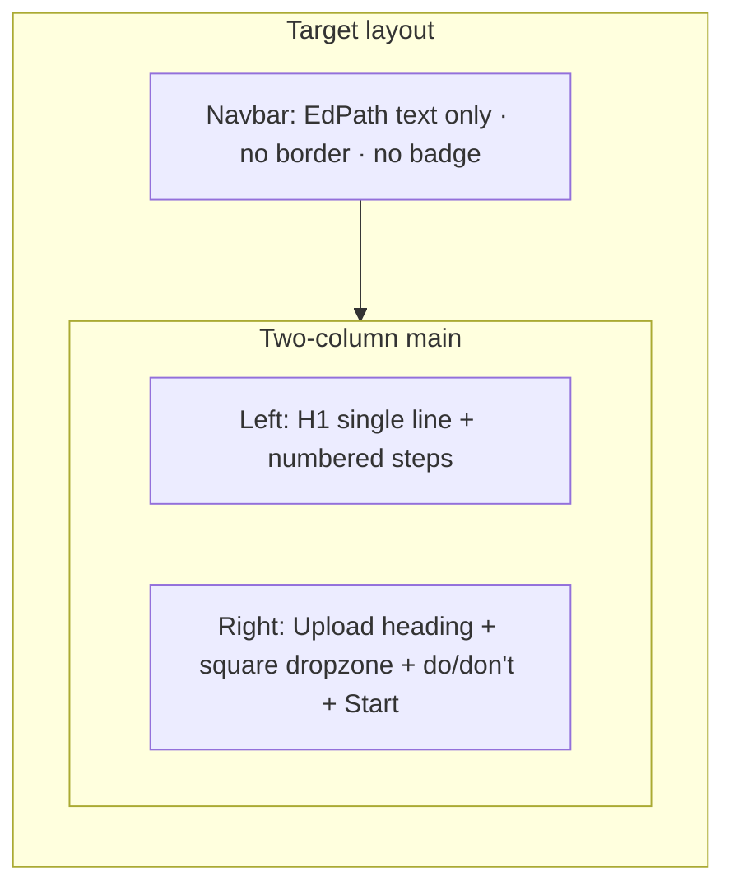

# Landing Page UI/UX Refresh

## Current state (what’s on screen today)

The home page ([`apps/edpath-web/app/page.tsx`](apps/edpath-web/app/page.tsx)) renders three layers vertically:

1. **Header** ([`AppShell.tsx`](apps/edpath-web/components/shell/AppShell.tsx)) — logo ramp SVG, “EdPath” + tagline, bottom border, and a purple **UPLOAD** badge on the right (`modeLabel="Upload"`).
2. **Hero** ([`LandingHero.tsx`](apps/edpath-web/components/landing/LandingHero.tsx)) — centered eyebrow (“Guided PDF lessons”), large heading, and a plain paragraph describing the flow.
3. **Upload card** ([`UploadCard.tsx`](apps/edpath-web/components/landing/UploadCard.tsx)) — wide card (`max-w-3xl`) with verbose subtitle, large drop zone, idle status banner, file preview, footer disclaimer, and **Start lesson** button.

---

## Problems (why it feels “shitty” / cluttered)

| Problem | Where | Why it hurts UX |
|--------|--------|------------------|
| **Triple repetition** | Navbar tagline, hero h1, hero paragraph all say the same thing | User reads the same message 3× before acting; no clear hierarchy |
| **Fake “app chrome”** | UPLOAD badge in navbar | Looks like dev scaffolding, not a product; duplicates the page’s only action |
| **Marketing-page pattern** | Everything centered and stacked | Feels like a landing page brochure, not a focused tool with one job |
| **Eyebrow noise** | “Guided PDF lessons” | Adds visual label without information; you explicitly don’t want it |
| **Heading wraps to 2 lines** | `max-w-2xl` + `text-4xl/5xl` + centered narrow column | Breaks your “single line” requirement on typical laptop widths |
| **Flow buried in prose** | Hero paragraph | Steps are the product story; a paragraph hides the sequence |
| **Upload panel over-explains** | `CardDescription`, drop-zone subtext, idle banner, footer line | 4 separate copy blocks before the user uploads; cognitive load |
| **Constraints hidden** | “PDF only · under 15 MB…” inside drop zone only | Users discover rules after failure instead of upfront |
| **Oversized drop target** | Full-width `py-10` zone in a wide card | Dominates the page; you asked for a **small square** upload area |
| **Heavy header** | Logo + border + badge | Competes with content; navbar should get out of the way |

**What works and should stay (logic untouched):**
- File pick → `POST /upload` validation → **Start lesson** → `POST /start` → navigate — all in [`UploadCard.tsx`](apps/edpath-web/components/landing/UploadCard.tsx) stays as-is.
- Error/success/loading feedback via [`UploadStateBanner.tsx`](apps/edpath-web/components/landing/UploadStateBanner.tsx) — only **when** and **what** we show changes (not the API calls).

---

## Target layout

**Desktop (lg+):** 50/50 or ~55/45 grid, vertically centered in viewport.  
**Mobile:** Stack — steps first, upload panel second (action still reachable without excessive scroll).

---

## Copy & content spec

### Left column — only these two blocks

**Heading (single line on lg+):**
- Text: **Turn one PDF into a guided lesson** (keep the article “a” for natural English; use `whitespace-nowrap` on large screens + slightly smaller `text-3xl lg:text-4xl` if needed to avoid wrap)
- Remove: “Guided PDF lessons” eyebrow entirely

**Numbered steps** (replace hero paragraph):

| Step | Proposed copy (aligned to [`feature-flow.md`](docs/reference/feature-flow.md) Part A) |
|------|--------|
| 1 | Upload one PDF with selectable text |
| 2 | Review and approve your lesson plan |
| 3 | Answer questions one at a time with feedback |
| 4 | Finish with a personalized study summary |

Presentation: ordered list with step numbers (1–4), clear vertical rhythm, `text-ink` for step title + `text-ink-muted` for optional short subline if needed — **no extra paragraphs or marketing fluff**.

### Right column — compact upload panel

**Keep one heading:** “Upload your source PDF”

**Remove entirely:**
- CardDescription (“One bounded document becomes…”)
- Idle `UploadStateBanner` (“Choose one PDF to build…”)
- Footer line (“Your file is used to create one lesson.”)
- Redundant constraint line inside drop zone (move to do’s/don’ts)

**Add: Do’s and Don’ts** (static UI copy mirroring backend gates in [`upload.service.ts`](apps/edpath-backend/src/features/upload/upload.service.ts) — no new API):

**Do**
- One PDF file, under 15 MB
- Text you can select/copy (not a scan)
- Unencrypted, readable document
- Focused length (roughly under 50 pages)

**Don’t**
- Word docs, images, or other file types
- Scanned or image-only PDFs
- Password-protected PDFs
- Empty or extremely short PDFs

Use a compact two-column or stacked list with subtle success/muted styling (existing tokens: `text-success-ink`, `text-ink-muted`) — not loud alert boxes.

**Square upload zone:** ~`aspect-square max-w-xs` (or fixed `size-64`), centered in the panel, minimal inner copy (“Drop PDF” / “Choose file”). File preview + status banner appear **below** the square when relevant (loading, error, success only).

**Start lesson:** Stays on the right panel, full-width below guidelines — still disabled until valid upload; no logic change.

---

## Header changes (landing only)

Extend [`AppShell.tsx`](apps/edpath-web/components/shell/AppShell.tsx) with an optional prop, e.g. `headerVariant="landing" | "default"`:

| | Landing (`/`) | Lesson (`/lesson/[threadId]`) |
|--|--|--|
| Logo ramp SVG | **Removed** | Unchanged (or keep for now — out of scope unless you want global removal) |
| Bottom border | **Removed** | Unchanged |
| Right badge | **Hidden** | Keep “Lesson” badge |
| Left content | **“EdPath” wordmark only** (link home) | Keep current logo + name + tagline |

[`page.tsx`](apps/edpath-web/app/page.tsx): `<AppShell headerVariant="landing">` — drop `modeLabel="Upload"`.

This scopes your navbar feedback to the first page without redesigning the lesson shell in this session.

---

## Files to change (UI only)

| File | Change |
|------|--------|
| [`AppShell.tsx`](apps/edpath-web/components/shell/AppShell.tsx) | Add `headerVariant`; landing = no logo, no border, no badge, text-only brand |
| [`page.tsx`](apps/edpath-web/app/page.tsx) | Replace vertical stack with responsive `grid lg:grid-cols-2`; pass landing header variant |
| [`LandingHero.tsx`](apps/edpath-web/components/landing/LandingHero.tsx) | Refactor to left-aligned intro: h1 + numbered steps; remove eyebrow and paragraph |
| [`UploadCard.tsx`](apps/edpath-web/components/landing/UploadCard.tsx) | Compact right panel layout, square dropzone, trim copy, wire do’s/don’ts |
| **New** `UploadGuidelines.tsx` | Presentational do/don’t lists (keeps `UploadCard` readable) |
| [`UploadStateBanner.tsx`](apps/edpath-web/components/landing/UploadStateBanner.tsx) | Optional: skip render for `tone="idle"` (guidelines replace idle message) |

**Out of scope:** backend, [`start-api.ts`](apps/edpath-web/lib/start-api.ts), [`upload-api.ts`](apps/edpath-web/lib/upload-api.ts), lesson page UI, new env vars.

---

## Visual polish (within existing tokens)

- Use existing `@repo/tokens` colors — no new palette
- Left column: `text-left`, generous `gap-8`, steps with numbered circles or bold numerals
- Right panel: lighter `Card` or plain `surface` container — smaller shadow, tighter padding
- Page background stays `bg-paper`; content `max-w-6xl` centered with balanced whitespace

---

## Verification (manual)

1. Open `/` — navbar: EdPath only, no border, no UPLOAD badge, no ramp icon
2. Heading stays one line at 1280px+ width
3. Steps visible as 1–4 list; no eyebrow, no hero paragraph
4. Right panel: one title, square drop zone, do’s/don’ts visible before upload
5. Upload valid PDF → preview + success banner; **Start lesson** enables and flow still works
6. Upload invalid PDF (e.g. non-PDF) → error banner only; no duplicate idle copy
7. Resize to mobile — readable stack, no horizontal overflow
8. Open `/lesson/[threadId]` — lesson header unchanged
