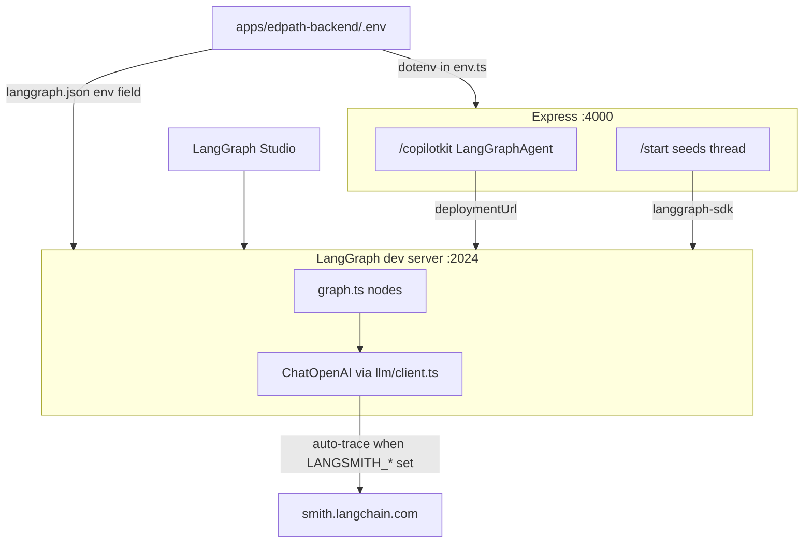

# LangSmith tracing for EdPath

## Step 1 findings — current package + env var names (verified)

**Official docs** ([Trace LangChain JS/TS](https://docs.langchain.com/langsmith/trace-with-langchain), [Trace LangGraph](https://docs.langchain.com/langsmith/trace-with-langgraph), [LangGraph observability](https://docs.langchain.com/oss/javascript/langgraph/observability)) specify the **current** names:

| Variable | Purpose | Required to trace? |
|---|---|---|
| `LANGSMITH_TRACING=true` | Master on/off switch | Yes (when tracing on) |
| `LANGSMITH_API_KEY` | Auth | Yes (when tracing on) |
| `LANGSMITH_PROJECT` | Project grouping in UI | No (defaults to `default` if unset) |
| `LANGSMITH_ENDPOINT` | Regional API URL (EU/APAC/AWS) | No (US default; only if your account is non-US) |
| `LANGSMITH_WORKSPACE_ID` | Multi-workspace keys | No |

**Legacy names still work** (`LANGCHAIN_TRACING_V2`, `LANGCHAIN_API_KEY`, etc.) via `getLangSmithEnvironmentVariable()` in `langsmith@0.7.12`, but we will use **`LANGSMITH_*` only** in docs and `.env.example` — current canonical names.

**Recommended (non-serverless Node):** `LANGCHAIN_CALLBACKS_BACKGROUND=true` — reduces tracing latency in dev; not a rename, still valid per docs.

**Package:** `langsmith` is **already installed transitively** (`0.7.12` in [package-lock.json](package-lock.json) via `@langchain/core` / `@langchain/langgraph`). No extra tracing code is required for LangChain `ChatOpenAI` calls — env vars alone enable auto-tracing. We will add an **explicit** `"langsmith": "^0.7.12"` to [apps/edpath-backend/package.json](apps/edpath-backend/package.json) for clarity/version pinning (observability dep, not a new integration layer). **No root-level install needed** — the dev server does not import a tracing module from root.

---

## Architecture — where traces are actually emitted

Both run paths execute the **same compiled graph on the LangGraph dev server** (`:2024`), not inside Express:



- **Path A — `npm run langgraph:dev`:** CLI loads [langgraph.json](langgraph.json) `"env": "./apps/edpath-backend/.env"` → graph + LLM runs on `:2024` → traces emitted here.
- **Path B — Express + CopilotKit:** [runtime.ts](apps/edpath-backend/src/copilot/runtime.ts) proxies to `EDPATH_LANGGRAPH_DEPLOYMENT_URL` → same graph on `:2024` → traces still emitted on the **LangGraph process**, not Express.

Express only needs LangSmith vars in `.env` for validation/consistency and future use; **tracing for agent runs depends on the LangGraph dev server having the vars loaded**. After editing `.env`, restart **both** `langgraph:dev` and `edpath-backend` dev processes.

---

## Implementation (observability only — 3 files)

### 1. Add explicit dependency

[apps/edpath-backend/package.json](apps/edpath-backend/package.json):

```json
"langsmith": "^0.7.12"
```

Run `npm install` from repo root (workspace hoists to root lockfile). No new imports in agent code required.

### 2. Extend env validation — optional, no boot failure

[apps/edpath-backend/src/config/env.ts](apps/edpath-backend/src/config/env.ts):

Add optional Zod fields (pattern mirrors existing `OPENAI_API_KEY` / `isOpenAiConfigured()`):

```typescript
LANGSMITH_TRACING: z
  .enum(["true", "false"])
  .optional()
  .transform((v) => v === "true"),
LANGSMITH_API_KEY: z.string().min(1).optional(),
LANGSMITH_PROJECT: z.string().min(1).default("edpath"),
LANGSMITH_ENDPOINT: z.string().url().optional(),
LANGCHAIN_CALLBACKS_BACKGROUND: z
  .enum(["true", "false"])
  .optional()
  .transform((v) => v === "true"),
```

Add helper (same file):

```typescript
export function isLangSmithTracingEnabled(): boolean {
  return env.LANGSMITH_TRACING === true && Boolean(env.LANGSMITH_API_KEY);
}
```

**Optional boot diagnostics** (in [index.ts](apps/edpath-backend/src/index.ts) only — not agent logic):
- If `LANGSMITH_TRACING === true` but no API key → `console.warn` (tracing silently off)
- If `isLangSmithTracingEnabled()` → one-line log with project name

Do **not** `process.exit` on missing LangSmith config. Omitting all `LANGSMITH_*` vars keeps current boot behavior unchanged.

**Note on `LANGSMITH_PROJECT` default:** LangSmith reads `process.env` directly, not our `env` object. Put `LANGSMITH_PROJECT=edpath` in `.env.example` so both Express dotenv and LangGraph CLI inject it into `process.env`. The Zod default is for typed access in app code only.

### 3. Document placeholders in `.env.example`

[apps/edpath-backend/.env.example](apps/edpath-backend/.env.example) — new section:

```bash
# LangSmith observability (optional — omit entirely to disable tracing)
LANGSMITH_TRACING=true
LANGSMITH_API_KEY=lsv2_pt_...
LANGSMITH_PROJECT=edpath
# LANGSMITH_ENDPOINT=https://eu.api.smith.langchain.com  # non-US regions only
LANGCHAIN_CALLBACKS_BACKGROUND=true
```

No real keys in committed files.

---

## What you put in your real `.env`

Single file: [apps/edpath-backend/.env](apps/edpath-backend/.env) (already shared by both processes via [langgraph.json](langgraph.json)).

```bash
LANGSMITH_TRACING=true
LANGSMITH_API_KEY=<paste from smith.langchain.com → Settings → API Keys>
LANGSMITH_PROJECT=edpath
LANGCHAIN_CALLBACKS_BACKGROUND=true
```

Add `LANGSMITH_ENDPOINT=...` only if your LangSmith account is in EU/APAC/AWS (docs table in trace-with-langchain).

Then restart:
1. `npm run langgraph:dev` (required — this process runs the graph)
2. `npm run dev` in backend (optional for tracing, needed for CopilotKit UI path)

---

## How to confirm traces appear

1. Trigger a run:
   - **Studio path:** open LangGraph Studio (dev server), invoke `edpath-agent` with seeded `pdfText`, or
   - **App path:** upload PDF → start lesson → interact via CopilotKit widget
2. Open [https://smith.langchain.com](https://smith.langchain.com) → **Projects** → **`edpath`**
3. Expect nested spans: graph run → node spans (`plan_lesson`, `generate_mcq`, etc.) → `ChatOpenAI` child runs with token usage; repair/retry visible as separate LLM spans inside generative nodes

If project is empty but tracing is on, check: API key valid, `langgraph:dev` restarted after `.env` edit, and `LANGSMITH_TRACING` is literally `true` (string).

---

## Verification checklist (post-implementation)

| Check | Command / action |
|---|---|
| Typecheck | `npm run check-types` from repo root |
| Boot with tracing OFF | Remove/comment all `LANGSMITH_*` from `.env`; `npm run dev` in backend + `npm run langgraph:dev` — both start clean |
| Boot with tracing ON | Add vars above; restart langgraph:dev; invoke graph; see trace in LangSmith `edpath` project |
| Tests unchanged | `npm test -w edpath-backend` (env schema stays backward-compatible) |

---

## Env var names used (summary)

| Used | Not used (legacy) |
|---|---|
| `LANGSMITH_TRACING` | `LANGCHAIN_TRACING_V2` |
| `LANGSMITH_API_KEY` | `LANGCHAIN_API_KEY` |
| `LANGSMITH_PROJECT` | `LANGCHAIN_PROJECT` |
| `LANGSMITH_ENDPOINT` (optional, regional) | `LANGCHAIN_ENDPOINT` |
| `LANGCHAIN_CALLBACKS_BACKGROUND` (perf, not a rename) | — |

**Why `LANGSMITH_*`:** Current LangChain/LangSmith docs and `langsmith@0.7.x` prefer these; legacy `LANGCHAIN_*` still work as fallbacks but we standardize on the new names.

**No agent logic changes:** zero edits to [graph.ts](apps/edpath-backend/src/agent/graph.ts), nodes, or [llm/client.ts](apps/edpath-backend/src/agent/lib/llm/client.ts) — `ChatOpenAI.invoke()` is already LangChain-runnable and auto-traces under env config.
