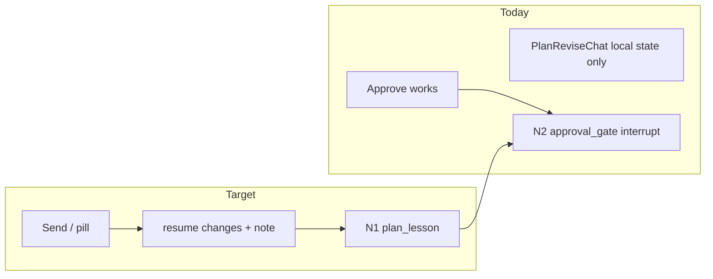

# Plan Revise Chat: Audit + Implementation Plan

## What you asked for

On the plan review screen, **Revise path → Chat about your path** should work: pills and free-text **Send** should actually revise the lesson path, with responsive UX similar to the MCQ help side-channel. You chose **each Send immediately regenerates the plan** from that message (no separate "Apply revision" button). There should be **no max turn limit** — the user can keep revising until satisfied, then **Approve lesson path**.

---

## Audit result

| Layer | Status | Evidence |
|-------|--------|----------|
| **Backend replan (single note)** | Implemented | N2 [`approval-gate.ts`](apps/edpath-backend/src/agent/nodes/approval-gate.ts) accepts `{ decision: "changes", note }`; N1 [`plan.ts`](apps/edpath-backend/src/agent/nodes/plan.ts) re-runs with `User requested changes: ${note}`; graph routes `changes → plan → approval_gate` ([`graph.ts`](apps/edpath-backend/src/agent/graph.ts)) |
| **Backend test** | Implemented | `"approval changes routes back through replan"` in [`edpath-graph.test.ts`](apps/edpath-backend/src/agent/edpath-graph.test.ts) |
| **Frontend approve** | Implemented | [`useCoAgentLesson.tsx`](apps/edpath-web/components/shell/useCoAgentLesson.tsx) `approvePlan()` → `{ decision: "approve" }` via approval interrupt resolver |
| **Frontend revise chat** | **Not implemented** | [`PlanReviseChat.tsx`](apps/edpath-web/components/plan/PlanReviseChat.tsx) only appends to local React state; **never calls the agent** |
| **Submit revision to backend** | **Missing** | No `requestPlanRevision` in hooks; [`PlanActions.tsx`](apps/edpath-web/components/plan/PlanActions.tsx) passes only `onApprove` |
| **Multi-turn consultative AI chat node** | **Not needed for your choice** | You chose Send → immediate replan; no separate plan-assist node required |
| **Streaming** | **Not implemented** | No loading/unlock wiring; UI can feel “stuck” like help did before the recent fix |

**Why it looks broken today:** clicking a pill or Send updates the chat bubble locally, but the LangGraph approval interrupt is never resumed with `{ decision: "changes", note }`, so the plan above never changes and nothing hits the backend.



---

## Locked product rules (from docs)

- **F3.2 / D6:** Plan approval exposes Approve + Chat-to-revise ([`feature-flow.md`](docs/reference/feature-flow.md), [`design-decisions.md`](docs/reference/design-decisions.md) D6).
- **D7:** Changes apply via **full N1 re-plan** using `pdfText + note` (no diff/patch) — already matches your “Send triggers replan” choice.
- **No turn cap** for plan revision (unlike quiz help `MAX_HELP=3`).

---

## Implementation plan

### Phase 1 — Wire approval interrupt for revision (core fix)

**1. Extend [`useCoAgentLesson.tsx`](apps/edpath-web/components/shell/useCoAgentLesson.tsx)**

Mirror the existing `approvePlan` / `submitHelp` pattern on the **same** approval interrupt resolver:

```typescript
const requestPlanRevision = useCallback((note: string): void => {
  if (!approvalResolver) return;
  // Need resolver to accept full ApprovalDecision, not just approve()
  resolveApproval({
    decision: "changes",
    note: note.trim(),
  });
}, [approvalResolver]);
```

Refactor [`ApprovalInterruptBridge`](apps/edpath-web/components/shell/useCoAgentLesson.tsx) so the stored resolver accepts `ApprovalDecision` (approve **or** changes+note), not only `() => void`.

Export:

- `requestPlanRevision(note: string)`
- `canRequestPlanRevision` (approval resolver ready + `phase === "awaiting_approval"`)
- Keep `approvePlan()` unchanged

**2. Thread props through plan UI**

- [`PlanWidget.tsx`](apps/edpath-web/components/plan/PlanWidget.tsx): add revision props
- [`PlanActions.tsx`](apps/edpath-web/components/plan/PlanActions.tsx): pass into [`PlanReviseChat`](apps/edpath-web/components/plan/PlanReviseChat.tsx)
- [`LessonRunner.tsx`](apps/edpath-web/components/shell/LessonRunner.tsx): connect `useCoAgentLesson` → `PlanWidget`

**3. Update [`PlanReviseChat.tsx`](apps/edpath-web/components/plan/PlanReviseChat.tsx)**

Replace local-only `sendMessage` with:

- `onSubmitRevision(text)` prop → calls `requestPlanRevision`
- `canSubmitRevision` / `isSubmitting` props
- Keep local **user** message history (unlimited turns) for context
- Pills call the same submit handler as Send

Copy tweak (small): clarify that **Send regenerates the roadmap above** (not “notes stay until submitted”).

No backend/schema changes required for this phase — [`ApprovalDecisionSchema`](packages/schemas/src/resume.ts) already supports `{ decision: "changes", note }`.

---

### Phase 2 — Responsive UX (streaming-like, same lessons as help)

**Goal:** After Send, user sees immediate feedback; input re-enables when the new plan lands; no stuck “Sending…” state.

**1. Add `usePlanRevision` hook** (new file under [`apps/edpath-web/hooks/`](apps/edpath-web/hooks/) or inline in `PlanActions`)

Track submission similarly to the fixed help flow in [`useCoAgentQuiz.tsx`](apps/edpath-web/hooks/useCoAgentQuiz.tsx):

- On submit: `isReviseSubmitting = true`; record a plan fingerprint (e.g. `JSON.stringify(plan.objectives.map(o => o.objectiveId + o.title))`)
- Clear when **mirrored plan changes** OR `!isRunning` (fallback on error)
- Do **not** disable on `isRunning` alone after response — only while a revision is in flight

**2. UX during replan**

While `isReviseSubmitting || phase === "planning"`:

- Show inline status in chat: **“Revising your lesson path…”** (reuse thinking-indicator pattern from [`HelpInput.tsx`](apps/edpath-web/components/mcq/HelpInput.tsx))
- Optionally reuse existing [`GeneratingPanel`](apps/edpath-web/components/ui/GeneratingPanel.tsx) / [`phase-ui`](apps/edpath-web/lib/phase-ui.ts) copy for the main panel if `phase` transitions to `planning`

**3. Optimistic user bubble**

Append the user’s message to the local thread **immediately** on Send (before agent returns), same as help’s pending user message.

**4. No `messages` channel writes**

Do not append plan-revision content to graph `messages` (same CopilotKit `INCOMPLETE_STREAM` pitfall fixed in [`assist.ts`](apps/edpath-backend/src/agent/nodes/assist.ts)).

**Streaming note:** With “Send → replan”, there is no per-turn assistant chat reply to token-stream. The “streaming” UX here is: **instant user bubble → revising indicator → updated objectives appear** when N1 completes. That matches your chosen behavior without a new LLM chat node.

---

### Phase 3 — Verification

**Automated (already exists + add one frontend check if useful)**

```bash
cd apps/edpath-backend && npm test -- edpath-graph.test.ts -t "approval changes"
```

**Manual checklist**

| Step | Expected |
|------|----------|
| Upload PDF → reach plan review | Plan + Approve / Revise path visible |
| Open Revise path → click pill | User message appears; “Revising…” shows; objectives update after LLM/stub replan |
| Send custom text | Same; can repeat unlimited times |
| After each revision | Textarea + Send re-enabled; Approve still works |
| Approve after revisions | Quiz loop starts normally |
| Refresh on plan review | Still on same plan (`threadId` checkpoint) |

**Regression:** MCQ help side-channel, answer submit, summary — unchanged.

---

## Files to change

| File | Change |
|------|--------|
| [`useCoAgentLesson.tsx`](apps/edpath-web/components/shell/useCoAgentLesson.tsx) | Approval resolver accepts full `ApprovalDecision`; add `requestPlanRevision` |
| [`PlanReviseChat.tsx`](apps/edpath-web/components/plan/PlanReviseChat.tsx) | Wire submit, loading, optimistic user messages |
| [`PlanActions.tsx`](apps/edpath-web/components/plan/PlanActions.tsx) | Pass revision props |
| [`PlanWidget.tsx`](apps/edpath-web/components/plan/PlanWidget.tsx) | Pass revision props |
| [`LessonRunner.tsx`](apps/edpath-web/components/shell/LessonRunner.tsx) | Connect hook → widget |
| New hook e.g. [`usePlanRevision.tsx`](apps/edpath-web/hooks/usePlanRevision.tsx) | Submitting state + unlock when plan mirror updates |

**Out of scope:** new LangGraph node, plan diff/patch, turn caps, writing to `messages[]`.

---

## Decision summary

- **Does backend support revision?** Yes — single-shot `{ decision: "changes", note }` → N1 replan → back to approval interrupt.
- **Why chat doesn’t work?** Frontend mock only; no interrupt resume on Send.
- **Your chosen behavior:** Each Send triggers immediate replan (unlimited); no Apply button.
- **Streaming:** Optimistic user message + revising indicator + plan refresh when mirror updates (not token-streamed assistant chat).
