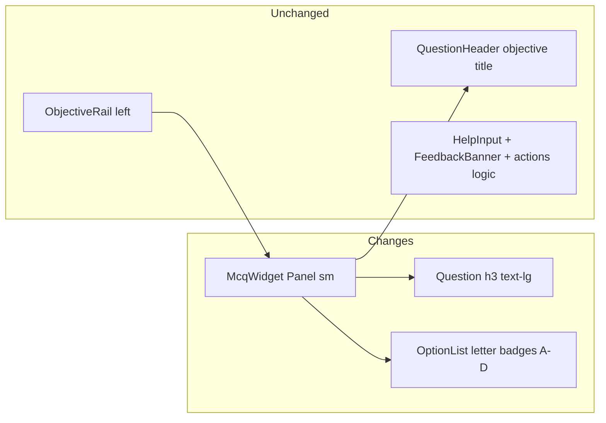

# Quiz Panel Compact UI

## Analysis (what feels too large today)

The left **Learning Path** rail is already compact (`Panel size="sm"`, `sticky top-6`). The right panel reads oversized because of a size mismatch and redundant option chrome:

| Area | Current | Why it feels big |
|------|---------|------------------|
| Panel wrapper | [`McqWidget.tsx`](apps/edpath-web/components/mcq/McqWidget.tsx) uses default `Panel` **md** (`gap-4 p-5`) | Left rail uses **sm** (`gap-3 p-4`) — quiz panel is looser |
| Objective title | `text-3xl` in [`QuestionHeader.tsx`](apps/edpath-web/components/mcq/QuestionHeader.tsx) | Appropriate hierarchy — **keep unchanged** per your note |
| Question prompt | `text-xl` on `<h3>` | One step below the objective; can come down without losing importance |
| Option cards | `p-4`, `space-y-3`, `font-medium` body + **second line** `Choice N` | Each option is effectively two lines + heavy padding |
| Option labels | Hardcoded `Choice ${index + 1}` in [`OptionList.tsx`](apps/edpath-web/components/mcq/OptionList.tsx) | Generic and adds vertical bulk |

Green/red feedback states on options must stay as-is — they are functional grading UI, not decoration.



---

## 1. Tighten panel + question block (right column only)

**File:** [`apps/edpath-web/components/mcq/McqWidget.tsx`](apps/edpath-web/components/mcq/McqWidget.tsx)

- Switch outer wrapper to `Panel size="sm"` (matches left rail density: `gap-3 p-4`)
- Question block tweaks only:
  - Container: `space-y-3` → `space-y-2`
  - Question `<h3>`: `text-xl` → `text-lg font-semibold leading-snug text-ink`
- **Do not change** `QuestionHeader`, separators, help section, or action wiring

Optional readability cap (recommended): add `className="w-full max-w-2xl"` on the Panel so long option text does not stretch across the full `1fr` column on wide screens — reduces perceived “bigness” without shrinking the objective heading.

---

## 2. Redesign option pills with A–D letter badges

**File:** [`apps/edpath-web/components/mcq/OptionList.tsx`](apps/edpath-web/components/mcq/OptionList.tsx)

Replace the current layout:

```
[radio]  option text          [icon]
         Choice 1
```

With your preferred **badge-left** pattern:

```
[A]  option text               [icon]
```

### Label change
- Add `const OPTION_LETTERS = ["A", "B", "C", "D"] as const`
- Remove `Choice ${index + 1}` subtitle entirely
- **Already tried** state: show a small muted inline tag (`text-xs text-ink-muted`) beside the letter badge or under the option text — not a second full subtitle row

### Letter badge (new visual element)
- `size-8 shrink-0 rounded-md border flex items-center justify-center text-sm font-semibold`
- States mirror option card semantics:
  - Default: `border-border bg-surface text-ink-muted`
  - Selected (pre-feedback): `border-primary bg-primary-soft text-primary`
  - Correct / incorrect: inherit success/error border + soft bg + matching text
  - Previously tried: muted opacity on badge + card

### Card compaction
- Card padding: `p-4` → `px-3 py-2.5`
- Stack gap: `space-y-3` → `space-y-2`
- Option body: `text-sm leading-snug text-ink` (drop separate subtitle line)
- Keep `RadioGroupItem` for accessibility — visually de-emphasize with `mt-0.5 size-4 shrink-0` or `sr-only` inside the label (label click still toggles selection)
- Preserve all existing feedback classes (`border-success bg-success-soft`, etc.) and disabled/tried logic — **no grading behavior changes**

### Feedback icons
- Reduce slightly: `size-5` → `size-4` to match tighter cards

---

## 3. Minor action button scale (optional polish)

**File:** [`apps/edpath-web/components/mcq/WidgetActions.tsx`](apps/edpath-web/components/mcq/WidgetActions.tsx)

- Submit / Retry / Next buttons: `size="lg"` → `size="default"` so the footer matches the tighter panel without changing behavior

---

## Out of scope

- [`ObjectiveRail.tsx`](apps/edpath-web/components/shell/ObjectiveRail.tsx) — left section unchanged
- [`QuestionHeader.tsx`](apps/edpath-web/components/mcq/QuestionHeader.tsx) — objective title stays `text-3xl`
- [`HelpInput.tsx`](apps/edpath-web/components/mcq/HelpInput.tsx), [`FeedbackBanner.tsx`](apps/edpath-web/components/mcq/FeedbackBanner.tsx) — content/layout unchanged
- Backend, schemas, grading, assist firewall — no changes

---

## Verification

1. Open a lesson quiz (`/lesson/[threadId]`, phase `awaiting_input`)
2. Left rail unchanged; right panel feels denser but objective title still dominant
3. Each option shows **A / B / C / D** badge on the left — no “Choice 1–4”
4. Select, submit, correct/incorrect/exhausted feedback colors still work on cards + badges
5. Previously tried options show muted styling + “Already tried” without extra vertical bloat
6. Mobile: options stack cleanly; no horizontal overflow
7. `npm run check-types` in `apps/edpath-web` passes
