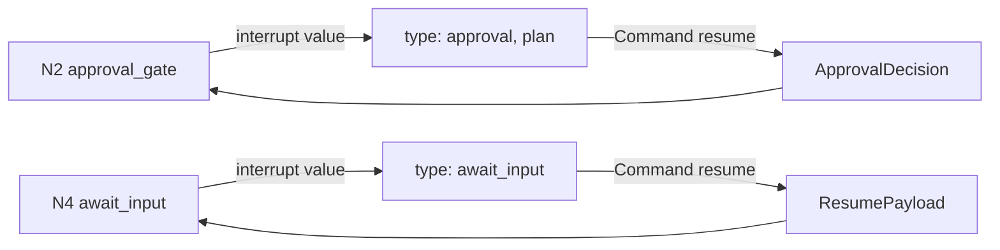
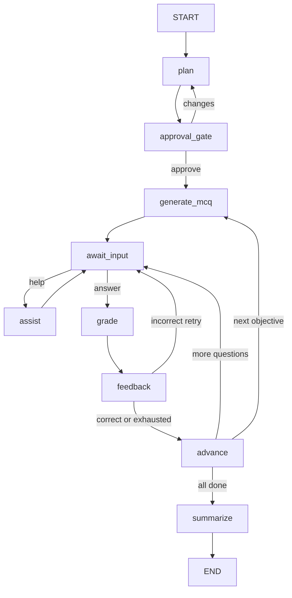

# EdPath Real LangGraph Agent — Implementation Plan

## Scope & constraints (this session)

- **In scope:** Agent graph, nodes, local deferred types (`gradeAnswer` I/O, `AssistInput`, message shape), reliability spine, firewall mapper, Vitest + langgraph dev verification.
- **Out of scope:** Frontend changes, combined upload→start endpoint, Postgres checkpointer wiring (keep `MemorySaver` for dev/tests; Postgres is a later infra step per [db-schema.md](docs/reference/db-schema.md)).
- **Design authority:** [agent-architecture.md](docs/reference/agent-architecture.md) §5, [design-decisions.md](docs/reference/design-decisions.md), [feature-flow.md](docs/reference/feature-flow.md). No re-architecture.

## Key gap vs. stub (must fix)

The stub in [walking-skeleton.ts](apps/edpath-backend/src/agent/walking-skeleton.ts) checkpoints **`CoAgentState`** (redacted mirror) and skips N3–N9. The real agent must:

1. Checkpoint **`EdPathState`** (includes `pdfText`, full `MCQ[]`, `messages[]`) — see [state.ts](packages/types/src/state.ts).
2. Emit only **`CoAgentState`** at the CopilotKit boundary via an explicit mapper.
3. Replace the graph body while keeping [langgraph.json](langgraph.json) → dev-server path working.

---

## Proposed file layout

```
apps/edpath-backend/src/agent/
  graph.ts                      # createEdPathGraph(), export graph
  state/
    annotation.ts               # EdPathStateAnnotation (LangGraph)
    constants.ts                # MCQS_PER_OBJECTIVE=3, MAX_ATTEMPTS, MAX_HELP, MAX_REPAIR, etc.
    to-co-agent-state.ts        # firewall: EdPathState → CoAgentState
    derive-score.ts             # results[] → Score projection
  nodes/                        # N1–N9 one file each
  lib/
    grade-answer.ts             # deterministic grader + GradingError
    assist-input.ts             # AssistInput builder (firewalled context)
    source-anchor.ts            # D4 normalization + substring check
    structured-generate.ts      # LLM call + Zod validate + bounded repair
    llm/client.ts               # Claude client (sonnet default; opus escape for N1)
  prompts/                      # plan, mcq, assist, summarize system prompts
  types/                        # grade-answer.types.ts, assist.types.ts, interrupt.types.ts
  __fixtures__/                 # short pdfText snippets for tests
  edpath-graph.test.ts          # integration + firewall tests
```

Update [langgraph.json](langgraph.json):

```json
"graphs": {
  "edpath-agent": "./apps/edpath-backend/src/agent/graph.ts:graph"
}
```

Keep `edpath-walking-skeleton` entry temporarily or swap `EDPATH_LANGGRAPH_GRAPH_ID` default in a follow-up env change (backend-only session can test against `edpath-agent` directly).

Initial state seed: reuse [build-initial-state.ts](apps/edpath-backend/src/features/upload/build-initial-state.ts) (`phase: "planning"`, empty `questions[]`).

---

## 1. Node-by-node map

| Node | Name | LLM? | Reads (state) | Does | Writes (state) | Schema validated |
|------|------|------|---------------|------|----------------|------------------|
| **N1** | `plan` | Yes | `pdfText`, `approval?.note` (re-plan), `pdfMeta` | Calls Claude with grounding prompt; produces ordered objectives | `plan`, `phase→awaiting_approval`, clears `lastError` on success | `LessonPlanSchema` |
| **N2** | `approval_gate` | No (interrupt) | `plan` | **`interrupt({ type:"approval", plan })`**; awaits resume | `approval`, `phase` | `ApprovalDecisionSchema` on resume |
| **N3** | `generate_mcq` | Yes | `pdfText`, `plan.objectives[currentObjectiveIndex]` | Batch-generates **N=3** MCQs for current objective; source-anchor check each | `questions[]` (replace for objective), `phase→awaiting_input`, reset per-question counters | `z.array(MCQSchema).length(3)` per MCQ |
| **N4** | `await_input` | No (interrupt) | `questions[currentQuestionIndex]`, `feedback`, `phase` | **`interrupt({ type:"await_input" })`**; resume discriminates answer vs help | `selectedIndex` (answer path), routes via conditional edge (not state) | `ResumePayloadSchema` on resume |
| **N5** | `assist` | Yes | `AssistInput` only (question + options + user text + pdfText slice) | Single bounded help reply; append to `messages[]`; `helpTurnsUsed++` | `messages`, `helpTurnsUsed`, `phase→awaiting_input` | Plain string (no Zod artifact) |
| **N6** | `grade` | No | `selectedIndex`, `questions[currentQuestionIndex]`, `attempts` | **`gradeAnswer()`** — index compare only | `attempts`, append to `results[]` on resolution, `score` derived | Local `GradeAnswerOutput` |
| **N7** | `feedback` | No | MCQ + grade output | Assembles `Feedback` from validated MCQ fields (not LLM) | `feedback`, `phase→awaiting_input` (retry) or pass-through to N8 | `FeedbackSchema` |
| **N8** | `advance` | No | indices, `plan`, `questions`, `results` | Move inner/outer loop pointers; reset per-question counters | `currentQuestionIndex` / `currentObjectiveIndex`, clear `questions` on outer advance, null `feedback`/`selectedIndex` | — |
| **N9** | `summarize` | Yes | `results[]`, `score`, `plan`, weak objectives, `pdfText` | Terminal summary + study tips | `summary`, `phase→complete` | `SummarySchema` |

### Interrupt points



| Interrupt | Surfaces | Resume payload | Injected as |
|-----------|----------|----------------|-------------|
| **N2** `approval_gate` | `{ type: "approval", plan: LessonPlan }` (matches proven stub) | `{ decision: "approve" \| "changes", note? }` | `state.approval` via node return |
| **N4** `await_input` | `{ type: "await_input" }` (UI renders MCQ from mirrored state) | `{ kind: "answer", selectedIndex }` **or** `{ kind: "help", text }` | Branching only — answer sets `selectedIndex`, help routes to N5 |

Resume mechanism: same as stub — `graph.stream(new Command({ resume: payload }), { configurable: { thread_id } })`.

### Conditional edges (deterministic, no LLM routing)

```
START → N1 plan → N2 approval_gate
N2 ─[approval.decision === "changes"]─→ N1 plan
N2 ─[approval.decision === "approve"]─→ N3 generate_mcq → N4 await_input
N4 ─[resume.kind === "help" && helpTurnsUsed < MAX_HELP]─→ N5 assist → N4
N4 ─[resume.kind === "help" && helpTurnsUsed >= MAX_HELP]─→ N5 assist (decline template) → N4
N4 ─[resume.kind === "answer"]─→ N6 grade → N7 feedback
N7 ─[verdict correct OR exhausted]─→ N8 advance
N7 ─[verdict incorrect && attempts < MAX_ATTEMPTS]─→ N4 await_input
N8 ─[more questions in objective]─→ N4
N8 ─[objective done, more objectives]─→ N3
N8 ─[all objectives done]─→ N9 summarize → END
```

**Note on N6/N7 split for exhausted (D13):** `gradeAnswer` returns `verdict: "incorrect"` when wrong; N7 checks `attempts >= MAX_ATTEMPTS` (after increment) to build **`exhausted`** feedback (explanation, no `correctIndex`) and route to N8 instead of N4.

---

## 2. State + control flow

### EdPathState fields (§5.1)

All fields from [state.ts](packages/types/src/state.ts) are read/written per the node map above. Locked notes:

- **`questions[]`:** Replaced per objective at N3; **never regenerated on resume** (D5).
- **`score`:** Always derived from `results[]` via `deriveScore()` — never incremented ad hoc (D5/D10).
- **`phase`:** D5 mapping — `planning` (N1) → `awaiting_approval` (N2) → `quizzing` (N3 transient) → `awaiting_input` (N4 + post-feedback retry) → `complete` (N9).

### Loop semantics (bounded, no infinite loops)

| Loop | Bound | Advance condition |
|------|-------|-------------------|
| Inner (questions) | `MCQS_PER_OBJECTIVE = 3` (B1) | N8 increments `currentQuestionIndex` after correct or exhausted |
| Retry | `MAX_ATTEMPTS = 3` (B2) | Incorrect + attempts < 3 → N4; else exhausted → N8 |
| Help | `MAX_HELP = 3` (B3) | Always returns to N4; at cap N5 uses fixed decline prompt |
| Objectives | `plan.objectives.length`, max 8 (B4) | N8 increments `currentObjectiveIndex`, clears `questions`, N3 regenerates |
| Repair | `MAX_REPAIR = 2` (B5) | Generative nodes retry; else `lastError`, no advance |

### `Command(resume=...)` re-entry

- **After N2:** Graph continues from `approval_gate` node; return value sets `approval`, conditional edge fires.
- **After N4:** Graph continues from `await_input`; node inspects resume payload **kind** before returning; conditional edge routes to N5, N6, or stays at cap behavior.

### Result recording (canonical `results[]`)

Record **one `ObjectiveResult` per question resolution** (at N6 when advancing is imminent, or at N6 before N7):

```typescript
// Local gradeAnswer I/O (agent-only, composed from shared types)
interface GradeAnswerInput {
  selectedIndex: number;
  mcq: MCQ;
  priorAttempts: number;
}
interface GradeAnswerOutput {
  verdict: "correct" | "incorrect";
  firstTryCorrect: boolean;  // correct && priorAttempts === 0
  attempts: number;          // priorAttempts + 1
}
```

On **correct:** `correct: true`, `firstTryCorrect: attempts === 1`. On **exhausted:** `correct: false`, `attempts: MAX_ATTEMPTS`. Retries before correct do **not** reduce score (D10).

---

## 3. Generative nodes (grounding + prompts)

### Shared pattern (`structured-generate.ts`)

1. Build messages: system prompt (role + guardrails + JSON shape instruction) + user content.
2. Include full **`pdfText`** in user context for N1/N3/N9; N5 gets pdfText + objective context but **never** answer fields.
3. Call **`claude-sonnet-4-6`** (B8); N1 may escalate to **`claude-opus-4-8`** after 2 failed repair attempts (escape hatch only).
4. Parse JSON → **`schema.safeParse()`** → on failure, repair nudge (include Zod errors) → retry ≤ **`MAX_REPAIR = 2`** (B5).
5. On exhaustion: set `lastError: { node, kind: "schema_drift", detail }`, **`phase` unchanged**, no downstream advance.

### N1 `plan`

- **Prompt:** "Generate a lesson plan ONLY from the provided PDF text. Do not use outside knowledge. Return JSON matching LessonPlan schema. Max 8 objectives, target 4–6."
- **Re-plan (D7):** When `approval.decision === "changes"`, include `approval.note` in user message; full re-plan, not diff.
- **Output:** `LessonPlanSchema` validated objectives with stable `objectiveId` (e.g. `obj-1`, `obj-2`).

### N3 `generate_mcq`

- **Prompt:** Current objective `{ title, description, difficulty }` + full `pdfText`; "Generate exactly 3 MCQs. Each must include `sourceQuote` copied verbatim from the PDF. 4 unique options. Return JSON array."
- **Post-LLM ladder (D4/D16):**
  1. Zod `MCQSchema` × 3
  2. Structural checks (already in schema: 4 options, unique, `correctIndex` in range)
  3. **`source-anchor.ts`:** normalize whitespace/punctuation on `sourceQuote` and `pdfText`; require substring match
  4. On ungrounded: repair retry; else `lastError.kind = "ungrounded"`
- **IDs:** Assign `questionId` deterministically (`${objectiveId}-q1..q3`) if model omits.

### N9 `summarize`

- **Input slice:** `results[]`, `plan`, aggregated weak objectives (lowest first-try rates).
- **Prompt:** Ground study tips in PDF + weak areas; return `SummarySchema`.
- **Fallback:** If LLM fails after repairs, derive deterministic summary from `results[]` (stats only, generic tips) — **flag:** only if this doesn't violate "grounded study tips" (AC9); prefer hard error over ungrounded tips.

---

## 4. Deterministic grader + feedback

### `gradeAnswer()` — pure code ([lib/grade-answer.ts](apps/edpath-backend/src/agent/lib/grade-answer.ts))

```typescript
function gradeAnswer(input: GradeAnswerInput): GradeAnswerOutput {
  if (input.selectedIndex < 0 || input.selectedIndex >= input.mcq.options.length) {
    throw new GradingError("selectedIndex out of range");
  }
  const attempts = input.priorAttempts + 1;
  const correct = input.selectedIndex === input.mcq.correctIndex;
  return {
    verdict: correct ? "correct" : "incorrect",
    firstTryCorrect: correct && input.priorAttempts === 0,
    attempts,
  };
}
```

**GradingError (N6):** Catch → set `lastError: { node: "grade", kind: "grading", detail }`, re-route to N4 with **no** `results`/`score`/`attempts` mutation.

### N7 `feedback` — three branches (assembled from MCQ, not LLM)

| Branch | Condition | Feedback shape | UI firewall |
|--------|-----------|----------------|-------------|
| **correct** | `verdict === "correct"` | `{ verdict:"correct", highlightIndex, correctIndex, explanation, canRetry:false }` | Reveals answer only on success |
| **incorrect** | wrong && `attempts < MAX_ATTEMPTS` | `{ verdict:"incorrect", highlightIndex, hint, canRetry:true }` | No `correctIndex` |
| **exhausted** | wrong && `attempts >= MAX_ATTEMPTS` | `{ verdict:"exhausted", highlightIndex, explanation, canRetry:false }` | Explanation but **no** `correctIndex` (per [feedback.ts](packages/schemas/src/feedback.ts)) |

---

## 5. Assist / "need a nudge" (N5)

### Local `AssistInput` (agent-only)

```typescript
interface AssistInput {
  question: string;
  options: string[];       // PublicMCQ fields only
  userMessage: string;
  pdfText: string;           // grounding
  objectiveTitle: string;
  helpTurnsUsed: number;
  maxHelp: number;
}
```

Built by **`buildAssistInput(state, helpText)`** — explicitly omits `correctIndex`, `explanation`, `hint`, `sourceQuote` (D4/D20).

### Behavior

- **Prompt guardrails (D11):** Conceptual nudges only; never name/eliminate/imply correct option; steer back to active question.
- **At cap (`helpTurnsUsed >= MAX_HELP`):** Skip LLM; append fixed assistant message declining further help.
- **Output:** Append `{ role: "user", content: text }` and `{ role: "assistant", content: reply }` to `messages[]`.
- **Exit:** Always edge back to N4; never advances loop or grades.

---

## 6. Reliability spine (Gate 6)

| Failure | Where | Handling |
|---------|-------|----------|
| Empty `pdfText` | Pre-graph (upload) | Graph never started; out of scope this session |
| Schema drift | N1, N3, N9 | Zod catch → repair ≤2 → `lastError(schema_drift)`, no advance |
| Ungrounded MCQ | N3 | Source-anchor fail → repair → `lastError(ungrounded)` |
| Grading error | N6 | `GradingError` → same question, no mutation |
| Token ceiling | Any LLM call | Track aggregate tokens per thread (~1.5M B7); trip → `lastError(token_ceiling)`, halt |
| Interrupt desync | N2, N4 | Checkpointer authoritative; tests verify resume from same node |

**No unbounded loops:** All loops gated by constants in [constants.ts](apps/edpath-backend/src/agent/state/constants.ts). Generative repair uses explicit for-loop counter.

**LangSmith:** Wrap LLM calls with trace metadata (`thread_id`, node name) — wire env var in stage 7 if not already present.

---

## 7. Firewall preservation

### Where redaction happens

```
EdPathState (checkpoint) ──► toCoAgentState() ──► CoAgentState (CopilotKit / browser)
     │ pdfText                      │ omit pdfText, messages
     │ MCQ[] full                   │ PublicMCQ[] (omit 4 fields)
     │ messages[]                   │
```

Implement in [to-co-agent-state.ts](apps/edpath-backend/src/agent/state/to-co-agent-state.ts):

```typescript
function toPublicMcq(mcq: MCQ): PublicMCQ {
  const { questionId, objectiveId, question, options } = mcq;
  return { questionId, objectiveId, question, options };
}

function toCoAgentState(state: EdPathState): CoAgentState {
  // omit pdfText, messages; map questions; pass feedback through (schema already firewalled)
}
```

### CopilotKit boundary (minimal touch)

- Graph checkpoints **full `EdPathState`**.
- **Assumption to verify:** CopilotKit `LangGraphAgent` may sync the entire graph state object to the client. Mitigations:
  1. **Preferred:** Add a `coAgentSnapshot: CoAgentState` channel updated on every node return; configure runtime to treat snapshot as the mirrored state (verify against CopilotKit 1.61 docs in stage 7).
  2. **Fallback:** If superset sync is unavoidable, `pdfText` remains server-side in Postgres checkpoints only; client TypeScript won't read it, but add a **network-level test** asserting serialized mirror JSON excludes `pdfText`, `correctIndex`, `sourceQuote`.

### Re-verification checklist (stage 7)

- Unit: `toCoAgentState()` on real generated MCQs → `JSON.stringify` excludes firewalled keys.
- Unit: `AssistInput` builder never receives firewalled fields.
- Contract: extend [walking-skeleton.test.ts](apps/edpath-backend/src/agent/walking-skeleton.test.ts) pattern for real graph stream chunks at N4 interrupt.
- Type: existing [feedback-state.contract-test.ts](packages/types/src/feedback-state.contract-test.ts) continues to pass.

---

## 8. Run + verify (backend only, langgraph dev)

### Dev server

- `npm run langgraph:dev` serves `edpath-agent` graph export.
- Env: add `ANTHROPIC_API_KEY` to [`.env.example`](apps/edpath-backend/.env.example) (required for generative nodes in stages 2+).

### Vitest integration (primary proof this session)

| Test | Proves |
|------|--------|
| Graph compiles + streams N1→N2 interrupt with valid `LessonPlan` | Planning + approval path |
| `Command({ resume: { decision: "approve" } })` → N3→N4 | Post-approval flow |
| Mock LLM fixtures → MCQ generation + source-anchor | N3 grounding |
| Submit wrong twice → hint retry; third wrong → exhausted → advance | Grader + feedback branches |
| Submit correct → explanation + advance | Correct path |
| Full 2-objective fixture (short pdfText) → N9 summary | End-to-end |
| `toCoAgentState` on checkpoint after N3 | Firewall |

Use [VALID_TEXT_PDF](apps/edpath-backend/src/features/upload/test-fixtures.ts) extraction output or inline fixture text about photosynthesis for grounding tests.

### Manual dev-server smoke (optional)

LangGraph Studio / CLI invoke with seeded `buildInitialEdPathState({ pdfText, pdfMeta })` input — no frontend required.

---

## Assumptions & flags (no locked-decision changes planned)

| Item | Status |
|------|--------|
| CopilotKit full-state sync vs. subset | **Verify in stage 7** — may need `coAgentSnapshot` channel |
| Anthropic SDK not yet in backend deps | **Add** `@langchain/anthropic` + env validation |
| Postgres checkpointer | **Deferred** — MemorySaver for dev/tests; prod wiring later |
| Combined start endpoint | **Out of scope** — tests seed state directly |
| N9 deterministic fallback on LLM failure | **Flag** — prefer hard error unless you approve degraded summary |
| `messages` type | Define minimal local `{ role: "user"\|"assistant"; content: string }` or `@langchain/core` `BaseMessage` in agent only |
| Graph ID rename | New `edpath-agent` ID; stub kept until cutover confirmed |

**No locked decisions require changing** for this plan. If CopilotKit cannot support dual-state emission without exposing `pdfText` on the wire, **STOP and flag** before stage 7.

---

## Implementation stages (stop after each for review)

### Stage 1 — Graph skeleton + real state
- Create `EdPathStateAnnotation`, constants, `toCoAgentState()`, `deriveScore()`.
- Wire all N1–N9 nodes as **schema-valid stubs** (hardcoded LessonPlan/MCQ/Feedback/Summary placeholders).
- Conditional edges + both interrupts (N2 real, N4 stub interrupt).
- Replace walking-skeleton as default export in `graph.ts`; update `langgraph.json`.
- Tests: graph compiles, N2 interrupt/resume approve, firewall unit tests.

### Stage 2 — N1 plan + N2 approval (real)
- LLM client + `structured-generate` wrapper.
- Real N1 prompt + `LessonPlanSchema` validation + repair.
- N2 conditional `[changes]→N1` with note-driven re-plan.
- Tests: plan validates, re-plan loop bounded.

### Stage 3 — N3 MCQ generation (grounded)
- Batched 3-MCQ generation + source-anchor check.
- Phase transitions `quizzing→awaiting_input`.
- Tests: MCQs validate, ungrounded quote rejected, `sourceQuote` ∉ CoAgent mirror.

### Stage 4 — N6 grade + N7 feedback (all branches)
- `gradeAnswer()`, `GradingError` handling.
- Correct / incorrect / exhausted feedback assembly + routing.
- Score/results derivation.
- Tests: all three feedback branches, retry without penalty.

### Stage 5 — N5 assist + N8 advance + reliability
- `AssistInput` builder + capped help.
- N8 inner/outer loop + counter resets.
- `lastError` paths, repair caps, token tracker stub.
- Tests: help cap, loop termination, max attempts advance.

### Stage 6 — N9 summarize
- Summary generation from `results[]` + grounded study tips.
- `phase→complete`.
- Tests: summary validates against `SummarySchema`.

### Stage 7 — End-to-end + firewall re-verify
- Full-graph integration test (plan → approve → 3 MCQs → grade paths → summary).
- Firewall assertions on real MCQ payloads.
- LangGraph dev smoke + document env vars.
- CopilotKit sync behavior verification.

---

## Control-flow diagram (target)


