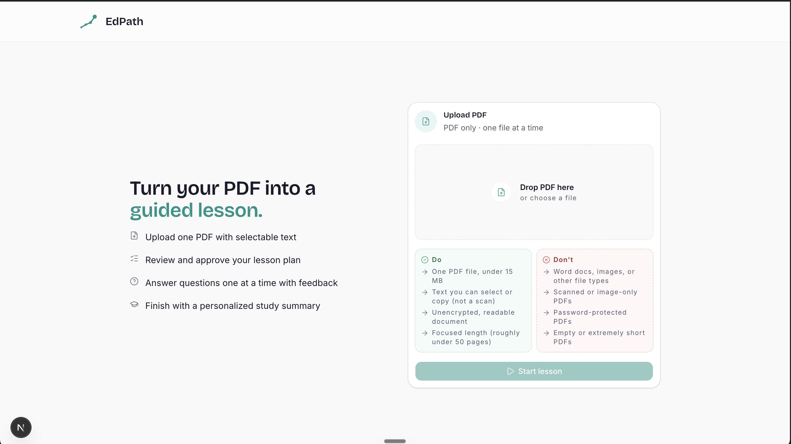
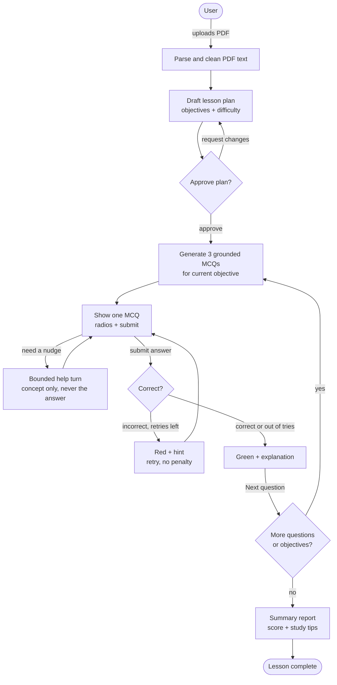
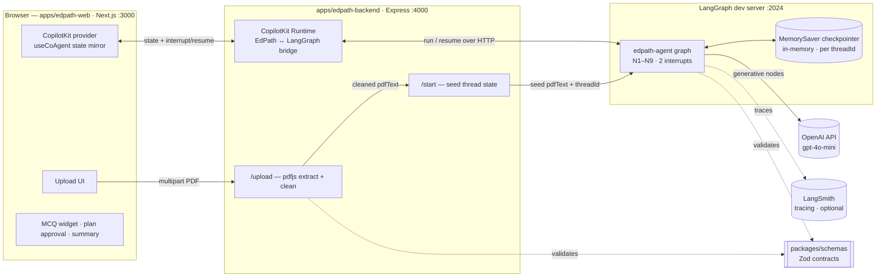
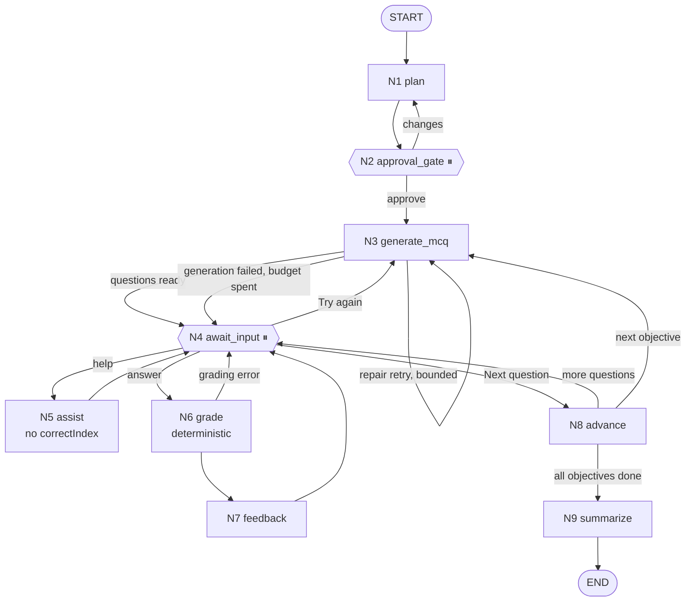

# EdPath

AI learning agent that turns a PDF into an interactive, HITL-approved MCQ lesson.



**Stack:** TypeScript (strict) · LangGraph · CopilotKit CoAgents · Next.js · Express · LangSmith (tracing). Persistence is the LangGraph checkpointer — **in-memory for this take-home** (no Postgres or Redis to run); Postgres is the production swap at the same boundary (see [Persistence](#persistence)).

## What it does

Upload a PDF, the agent drafts a lesson plan (objectives and difficulty), you approve it, then it quizzes you objective by objective with MCQs in a custom widget. Correct answers get an explanation, wrong answers get a hint and a retry. Ends with a progress report and study tips.

## Tech stack

What runs in this assignment, and why each piece is here:

| Area | Technology | Why it's used |
|---|---|---|
| Language | **TypeScript (strict)** | One type-safe codebase across web + backend; shared contracts via `packages/`. |
| Agent runtime | **LangGraph (JS)** | The deterministic teaching workflow — nodes, conditional edges, two `interrupt` gates, and the checkpointer. Engineering owns control flow; the LLM only fills content. |
| Agent ↔ UI bridge | **CopilotKit CoAgents** | Mirrors LangGraph state into React, renders the generative MCQ/plan UI, and surfaces the `interrupt`/resume for HITL. |
| Graph host | **LangGraph dev server** (`@langchain/langgraph-cli`) | Runs the compiled graph over HTTP on `:2024`; the CopilotKit Runtime drives it (it can't host a compiled graph in-process). |
| Web | **Next.js (App Router)** | Upload screen, plan approval, one-at-a-time MCQ widget, "help me" side-channel, summary. |
| Backend | **Express** | Hosts `/upload`, `/start`, and the **CopilotKit Runtime** endpoint; Zod-validates every artifact at the boundary. |
| LLM | **OpenAI `gpt-4o-mini`** (`gpt-4o` plan escape) | Generative nodes only: plan, MCQ, assist, summary. Grounded in `pdfText`, never general knowledge. |
| Contracts | **Zod** (`packages/schemas`) | Single source of truth for `LessonPlan` / `MCQ` / `Feedback` / `Summary`; validated before anything reaches state or the widget. |
| Persistence | **LangGraph checkpointer** (`MemorySaver`) | Checkpointed graph state keyed by `threadId` is the single source of truth; powers HITL pause + refresh-resume. In-memory here; Postgres in production (see [Persistence](#persistence)). |
| PDF ingestion | **pdfjs-dist** | Extracts and cleans the PDF text layer; rejects empty/scanned/oversized PDFs before the graph starts. |
| Observability | **LangSmith** | Optional tracing of every graph run (omit the env vars to disable). |
| Styling / UI | **Tailwind CSS v4** + shared `packages/ui` & `packages/tokens` | Design system, components, and design tokens shared across the app. |
| Monorepo | **Turborepo + npm workspaces** | `apps/*` + shared `packages/*` (`schemas`, `types`, `ui`, `tokens`, configs). |
| Testing & evals | **Vitest** | Unit + integration tests and the Gate 6 eval suite (see [Evals](#evals)). |

## Architecture

Three views — the product flow, the running system, and the agent graph. (Diagrams render natively on GitHub.)

### 1. Product flow

The fixed pedagogical arc the learner moves through: **Plan → Approve (HITL) → Quiz loop → Summarize.**



### 2. System architecture (as it runs today)

How the processes and services fit together at runtime. Lesson logic lives entirely in the graph; the web app only mirrors state.



### 3. Agent architecture (the LangGraph graph)

The deterministic graph. Every branch is a code-level decision over state — the LLM never picks the next step. `⏸` marks a checkpointer-backed `interrupt` (survives refresh).



- **Incorrect answer** stays at `await_input` (red + hint) → the user retries with a fresh `answer` (no penalty).
- **Correct / out-of-tries** holds the feedback at `await_input`; the user clicks **Next question** → `advance`.
- **Help** is the one bounded dynamic pocket: a single guarded call that can only return to `await_input` (max 3 per question), and never sees `correctIndex`.
- **Generation failure** pauses at `await_input` with a **Try again** affordance instead of dead-ending.

## Prerequisites

- **Node.js 18+** (20+ recommended) and **npm 10+**.
- **An OpenAI API key** — required for real PDF-grounded plans, MCQs, hints, and summaries. Without it the backend falls back to non-grounded stub content (useful for a dry run, but not a real lesson).
- **No database to install.** The LangGraph checkpointer runs in memory — Postgres and Redis are **not** required to run EdPath locally (see [Persistence](#persistence)).

## Setup

```bash
npm install

# Backend env — then add your OPENAI_API_KEY
cp apps/edpath-backend/.env.example apps/edpath-backend/.env

# Web env (defaults already point at the local backend)
cp apps/edpath-web/.env.example apps/edpath-web/.env.local
```

## Run locally

EdPath runs as **three processes**. Start them in this order, each in its own terminal from the repo root:

```bash
# 1. LangGraph dev server — hosts the graph "edpath-agent" on :2024
npm run langgraph:dev

# 2. Express backend + CopilotKit runtime — on :4000 (bridges to the graph)
npm run dev --workspace=edpath-backend

# 3. Next.js web app — on :3000 (talks to the backend)
npm run dev --workspace=edpath-web
```

Then open **http://localhost:3000**.

> Order matters: the backend bridges to the LangGraph server, and the web app talks to the backend. The CopilotKit runtime runs the graph via the LangGraph server over HTTP (it can't host a compiled graph in-process) — which is why the LangGraph dev server is a separate process.

### Environment variables

**Backend** (`apps/edpath-backend/.env`):

| Variable | Required | Purpose |
|---|---|---|
| `OPENAI_API_KEY` | **Yes** (for real grounding) | LLM calls for plan/MCQ/hint/summary nodes. Omit → non-grounded stub content. |
| `EDPATH_LANGGRAPH_DEPLOYMENT_URL` | No (default `http://localhost:2024`) | URL of the LangGraph dev server. |
| `EDPATH_LANGGRAPH_GRAPH_ID` | No (default `edpath-agent`) | Graph id from `langgraph.json`. |
| `LANGSMITH_*` | No | Optional tracing — omit entirely to disable. |

**Web** (`apps/edpath-web/.env.local`):

| Variable | Required | Purpose |
|---|---|---|
| `NEXT_PUBLIC_EDPATH_API_URL` | Yes (default `http://localhost:4000`) | Express backend base URL. |
| `NEXT_PUBLIC_EDPATH_COPILOT_RUNTIME_URL` | Yes (default `http://localhost:4000/copilotkit`) | CopilotKit runtime endpoint. |

### Smoke test

1. Open http://localhost:3000 and **upload a small text-layer PDF**.
2. Wait for the **plan**, then **Approve** (or request changes to re-plan).
3. The first objective's **MCQs** generate; answer one **wrong** → red highlight, hint, no-penalty **Retry**.
4. Answer **correctly** → green highlight, explanation, **Next question**.
5. Work through the objectives → **summary** with score + study tips.
6. **Refresh mid-quiz** → the lesson resumes on the same question (checkpointed state).

Run the test suite anytime with `npm test` (or `npm test --workspace=edpath-backend`).

## Documentation

The full design lives in [`docs/reference/`](./docs/reference/). Read the one that fits your task (see the doc map in [`AGENTS.md`](./AGENTS.md)):

- [`assignment.md`](./docs/reference/assignment.md) — the contract / acceptance criteria
- [`architecture.md`](./docs/reference/architecture.md) — system architecture, components, data flow
- [`agent-architecture.md`](./docs/reference/agent-architecture.md) — the LangGraph agent: nodes, interrupts, state, schemas
- [`design-decisions.md`](./docs/reference/design-decisions.md) — locked product/design decisions
- [`db-schema.md`](./docs/reference/db-schema.md) — persistence (checkpointer-only; why there are no app tables)
- [`feature-flow.md`](./docs/reference/feature-flow.md) — user flow, feature breakdown, AC → feature mapping
- [`challenges.md`](./docs/reference/challenges.md) — the genuinely hard parts / risk register

Working notes that fill in during the build: [`docs/handoff/`](./docs/handoff/) · [`docs/bugs/`](./docs/bugs/) · [`docs/decisions/`](./docs/decisions/) · [`docs/architecture/`](./docs/architecture/).

## Persistence

**The LangGraph checkpointer is the entire persistence layer — there are no custom tables, no ORM, and no bespoke persistence schema.** Graph state is checkpointed against a **client-held `threadId`**; that checkpointed state is the single source of truth for a lesson. Resuming a lesson means replaying from its checkpoint by `threadId` — the same mechanism the HITL gates rely on, where the graph suspends at an interrupt and resumes from the persisted checkpoint when the user acts.

**For this take-home, the checkpointer uses the in-memory backend (`MemorySaver`).** This is a deliberate scope decision, not an omission. It exercises the _complete_ graded flow within a session — upload → plan → approval gate → MCQ → submit → feedback → no-penalty retry → progression → summary, with the interrupt gates suspending and resuming correctly (covered by the test suite). Durable cross-restart persistence is **not** part of the assignment's acceptance criteria, so engineering effort went into the pedagogical workflow and the correctness of the grading/firewall/interrupt logic instead. **State is held in memory for the duration of the server process and does not survive a process restart — it is not durable storage.**

**The production path is a configuration/deployment change, not an application rewrite.** Because the checkpointer is accessed purely through LangGraph's checkpointer interface, durability is swapped at the boundary: deploy the graph behind a LangGraph server backed by Postgres, and the identical `threadId`-keyed state becomes durable across restarts. The graph nodes, interrupt gates, schemas, and CopilotKit bridge are unchanged. No custom tables or ORM are introduced in either mode — the checkpointer remains the whole persistence layer; only its backend changes.

> **Why not just set `PostgresSaver` in the graph?** The CopilotKit ↔ LangGraph JS integration runs the graph via a LangGraph server over HTTP (it cannot host a compiled graph in-process). On that path the **server** owns persistence, so a `PostgresSaver` compiled into the graph would be ignored — production durability is achieved by giving that server a Postgres backend, not by changing the application code.

## Evals

Gate 6 eval scenarios live in `apps/edpath-backend/src/evals/`. They assert end-state quality across four dimensions (plan grounding, MCQ grounding, feedback/no-leakage, loop completion) mapped to the assignment acceptance criteria.

| Tier | Command | LLM | When |
|---|---|---|---|
| **Tier 1 (CI)** | `npm test --workspace=edpath-backend -- src/evals/evals.test.ts` | No (stub plan/MCQs) | Every CI run |
| **Tier 2 (manual)** | `EVAL_LLM=1 npm run eval --workspace=edpath-backend` | Yes | Pre-demo / pre-release |
| **LangSmith sync** | `npm run eval:sync-dataset --workspace=edpath-backend` | — | Optional dataset upload |

**Pass criteria:** all asserted dimensions green per case; Tier 1 stub cases must pass in CI; Tier 2 target ≥ 95% suite pass with LLM judges enabled (`EVAL_LLM=1` + `OPENAI_API_KEY`). Filter subsets with `EVAL_FILTER=HP-*` or `ADV-*`.