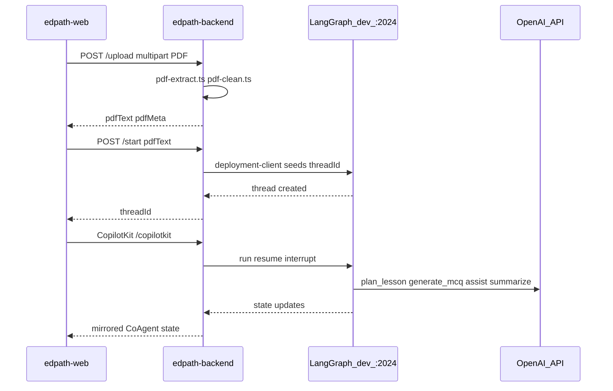

# Repo Map

Living **code-level map** of the EdPath monorepo — where things actually live. For system design (components, data flow, boundaries), read the canonical docs first:

- [`docs/reference/architecture.md`](../reference/architecture.md)
- [`docs/reference/agent-architecture.md`](../reference/agent-architecture.md)

**How to use this file:** Start with [End-to-end flow](#end-to-end-flow), then drill into [Backend](#appsedpath-backend), [Web](#appsedpath-web), [Graph nodes](#graph-node-ids), [Packages](#packages), [Run locally](#run-locally), or the [Quick lookup](#quick-lookup) index.

## Table of Contents

- [Monorepo at a glance](#monorepo-at-a-glance)
- [End-to-end flow](#end-to-end-flow)
- [apps/edpath-backend](#appsedpath-backend)
- [Graph node IDs](#graph-node-ids)
- [apps/edpath-web](#appsedpath-web)
- [packages/](#packages)
- [Root config and scripts](#root-config-and-scripts)
- [Environment variables](#environment-variables)
- [Tests and evals](#tests-and-evals)
- [Not in this repo](#not-in-this-repo)
- [Quick lookup](#quick-lookup)
- [Run locally](#run-locally)

---

## Monorepo at a glance

```mermaid
flowchart TB
  root[edpath monorepo]
  root --> apps[apps/]
  root --> packages[packages/]
  root --> docs[docs/]
  root --> scripts[scripts/verify.sh placeholder]
  root --> lgConfig[langgraph.json]
  apps --> web[edpath-web Next.js :3000]
  apps --> be[edpath-backend Express :4000]
  packages --> schemas[@repo/schemas]
  packages --> types[@repo/types]
  packages --> tokens[@repo/tokens]
  packages --> tsconfig[@repo/typescript-config]
  lgConfig --> graphFile[agent/graph.ts]
  be --> agent[src/agent/]
  be --> copilot[src/copilot/]
  be --> upload[src/features/upload/]
  be --> start[src/features/start/]
  be --> evals[src/evals/]
```

| Path | What |
|---|---|
| [`apps/edpath-web/`](../../apps/edpath-web/) | Next.js 16 App Router UI |
| [`apps/edpath-backend/`](../../apps/edpath-backend/) | Express API, CopilotKit runtime, LangGraph agent code |
| [`packages/schemas/`](../../packages/schemas/) | Zod contracts (`@repo/schemas`) |
| [`packages/types/`](../../packages/types/) | Shared TS types (`@repo/types`) |
| [`packages/tokens/`](../../packages/tokens/) | Design tokens CSS (`@repo/tokens`) |
| [`packages/typescript-config/`](../../packages/typescript-config/) | Shared `tsconfig` JSON extends |
| [`langgraph.json`](../../langgraph.json) | Registers graph `edpath-agent` for `npm run langgraph:dev` |
| [`docs/reference/`](../../docs/reference/) | Locked design docs (not duplicated here) |
| [`docs/architecture/`](./) | Living code maps (this file) |

**Local dev runs three processes** (each in its own terminal from repo root):

| Process | Command | Port |
|---|---|---|
| LangGraph dev server | `npm run langgraph:dev` | `:2024` |
| Express + CopilotKit | `npm run dev --workspace=apps/edpath-backend` | `:4000` |
| Next.js web | `npm run dev --workspace=apps/edpath-web` | `:3000` |

---

## End-to-end flow

The spine for tracing a lesson from upload to summary. Every path below exists in the repo today.



### Step-by-step file touchpoints

| Step | User action | Web | Backend | Graph |
|---|---|---|---|---|
| 1 | Upload PDF on `/` | [`UploadCard.tsx`](../../apps/edpath-web/components/landing/UploadCard.tsx) → [`api/upload-api.ts`](../../apps/edpath-web/api/upload-api.ts) | [`upload.route.ts`](../../apps/edpath-backend/src/features/upload/upload.route.ts) → [`upload.service.ts`](../../apps/edpath-backend/src/features/upload/upload.service.ts) → [`pdf-extract.ts`](../../apps/edpath-backend/src/features/upload/pdf-extract.ts) + [`pdf-clean.ts`](../../apps/edpath-backend/src/features/upload/pdf-clean.ts) | — |
| 2 | Start lesson | [`api/start-api.ts`](../../apps/edpath-web/api/start-api.ts) | [`start.route.ts`](../../apps/edpath-backend/src/features/start/start.route.ts) → [`start.service.ts`](../../apps/edpath-backend/src/features/start/start.service.ts) → [`deployment-client.ts`](../../apps/edpath-backend/src/lib/langgraph/deployment-client.ts) | Graph seeded with `pdfText` on new `threadId` |
| 3 | Open `/lesson/[threadId]` | [`app/lesson/[threadId]/page.tsx`](../../apps/edpath-web/app/lesson/[threadId]/page.tsx) wraps [`EdPathCopilotProvider.tsx`](../../apps/edpath-web/components/copilot/EdPathCopilotProvider.tsx) | [`copilot/runtime.ts`](../../apps/edpath-backend/src/copilot/runtime.ts) at `/copilotkit` | LangGraph dev server runs [`graph.ts`](../../apps/edpath-backend/src/agent/graph.ts) |
| 4 | Plan + HITL approval | [`LessonRunner.tsx`](../../apps/edpath-web/components/shell/LessonRunner.tsx) → [`useCoAgentLesson.tsx`](../../apps/edpath-web/components/shell/useCoAgentLesson.tsx) → [`PlanWidget.tsx`](../../apps/edpath-web/components/plan/PlanWidget.tsx) | CopilotKit resume payload | `plan_lesson` → `approval_gate` interrupt (N2) |
| 5 | Quiz loop | [`McqWidget.tsx`](../../apps/edpath-web/components/mcq/McqWidget.tsx) + [`useCoAgentQuiz.tsx`](../../apps/edpath-web/hooks/useCoAgentQuiz.tsx) | CopilotKit resume (answer / help) | `generate_mcq` → `await_input` interrupt → `grade` → `assemble_feedback` → `advance` |
| 6 | Help side-channel | [`HelpInput.tsx`](../../apps/edpath-web/components/mcq/HelpInput.tsx) | — | `assist` → back to `await_input` (bounded by `MAX_HELP`) |
| 7 | Summary | [`SummaryView.tsx`](../../apps/edpath-web/components/summary/SummaryView.tsx) | — | `summarize` → END |

**Phase → UI surface** is resolved in [`lib/phase-ui.ts`](../../apps/edpath-web/lib/phase-ui.ts) and consumed by `LessonRunner`.

---

## apps/edpath-backend

Express app at [`apps/edpath-backend/`](../../apps/edpath-backend/). Entry: [`src/index.ts`](../../apps/edpath-backend/src/index.ts) → [`src/app.ts`](../../apps/edpath-backend/src/app.ts).

### HTTP routes

| Method | Path | Handler |
|---|---|---|
| `GET` | `/health` | Inline in `app.ts` |
| `POST` | `/upload` | [`features/upload/upload.route.ts`](../../apps/edpath-backend/src/features/upload/upload.route.ts) |
| `POST` | `/start` | [`features/start/start.route.ts`](../../apps/edpath-backend/src/features/start/start.route.ts) |
| `*` | `/copilotkit` | [`copilot/runtime.ts`](../../apps/edpath-backend/src/copilot/runtime.ts) |

### Directory map

| Area | Path | Role |
|---|---|---|
| Config | [`src/config/env.ts`](../../apps/edpath-backend/src/config/env.ts) | Zod-validated env; `isOpenAiConfigured()`, `isLangSmithTracingEnabled()` |
| Upload feature | [`src/features/upload/`](../../apps/edpath-backend/src/features/upload/) | PDF extract, clean, validate, reject |
| Start feature | [`src/features/start/`](../../apps/edpath-backend/src/features/start/) | Create LangGraph thread, seed `pdfText` |
| CopilotKit | [`src/copilot/`](../../apps/edpath-backend/src/copilot/) | Runtime endpoint + `EdPathLangGraphAgent` subclass |
| LangGraph SDK | [`src/lib/langgraph/deployment-client.ts`](../../apps/edpath-backend/src/lib/langgraph/deployment-client.ts) | `@langchain/langgraph-sdk` client for `/start` |
| Agent graph | [`src/agent/graph.ts`](../../apps/edpath-backend/src/agent/graph.ts) | Workflow wiring, routing fns, `graph` export |
| Nodes | [`src/agent/nodes/`](../../apps/edpath-backend/src/agent/nodes/) | One file per graph node (9 nodes) |
| State | [`src/agent/state/`](../../apps/edpath-backend/src/agent/state/) | Annotations, score derivation, CoAgent projection |
| Agent lib | [`src/agent/lib/`](../../apps/edpath-backend/src/agent/lib/) | Grading, grounding, structured LLM output, assist input |
| Prompts | [`src/agent/prompts/index.ts`](../../apps/edpath-backend/src/agent/prompts/index.ts) | Node system prompts |
| Types | [`src/agent/types/`](../../apps/edpath-backend/src/agent/types/) | Interrupt, assist, grade, message types |
| Evals | [`src/evals/`](../../apps/edpath-backend/src/evals/) | Gate 6 eval suite + CLI |

### Key agent lib files

| File | Role |
|---|---|
| [`lib/grade-answer.ts`](../../apps/edpath-backend/src/agent/lib/grade-answer.ts) | Deterministic grader (N6) |
| [`lib/source-anchor.ts`](../../apps/edpath-backend/src/agent/lib/source-anchor.ts) | `sourceQuote` must match `pdfText` |
| [`lib/structured-generate.ts`](../../apps/edpath-backend/src/agent/lib/structured-generate.ts) | Zod-validated LLM structured output |
| [`lib/parse-mcq-batch.ts`](../../apps/edpath-backend/src/agent/lib/parse-mcq-batch.ts) | MCQ batch parsing |
| [`lib/assist-input.ts`](../../apps/edpath-backend/src/agent/lib/assist-input.ts) | Assist context (no `correctIndex`) |
| [`lib/llm/client.ts`](../../apps/edpath-backend/src/agent/lib/llm/client.ts) | OpenAI client |

### Checkpointer

[`graph.ts`](../../apps/edpath-backend/src/agent/graph.ts) compiles with `MemorySaver`. The file comment states durable persistence is owned by the **LangGraph deployment layer** (the `:2024` dev server checkpoints threads server-side). There is **no Postgres or Redis client** in this codebase.

---

## Graph node IDs

Code node IDs from [`graph.ts`](../../apps/edpath-backend/src/agent/graph.ts) (use these when reading logs or LangSmith traces):

| Code node ID | File | Design ref |
|---|---|---|
| `plan_lesson` | [`nodes/plan.ts`](../../apps/edpath-backend/src/agent/nodes/plan.ts) | N1 plan |
| `approval_gate` | [`nodes/approval-gate.ts`](../../apps/edpath-backend/src/agent/nodes/approval-gate.ts) | N2 interrupt (HITL) |
| `generate_mcq` | [`nodes/generate-mcq.ts`](../../apps/edpath-backend/src/agent/nodes/generate-mcq.ts) | N3 generate MCQ |
| `await_input` | [`nodes/await-input.ts`](../../apps/edpath-backend/src/agent/nodes/await-input.ts) | N4 interrupt (answer / help) |
| `assist` | [`nodes/assist.ts`](../../apps/edpath-backend/src/agent/nodes/assist.ts) | N5 assist |
| `grade` | [`nodes/grade.ts`](../../apps/edpath-backend/src/agent/nodes/grade.ts) | N6 grade (code) |
| `assemble_feedback` | [`nodes/feedback.ts`](../../apps/edpath-backend/src/agent/nodes/feedback.ts) | N7 feedback (code) |
| `advance` | [`nodes/advance.ts`](../../apps/edpath-backend/src/agent/nodes/advance.ts) | N8 advance (code) |
| `summarize` | [`nodes/summarize.ts`](../../apps/edpath-backend/src/agent/nodes/summarize.ts) | N9 summarize |

Routing functions (`routeAfterApproval`, `routeAfterAwaitInput`, etc.) live in [`graph.ts`](../../apps/edpath-backend/src/agent/graph.ts) — the LLM never chooses branches.

---

## apps/edpath-web

Next.js app at [`apps/edpath-web/`](../../apps/edpath-web/). **No `src/` folder, no `features/` folder, no `app/api/` routes.**

### Routes

| Route | File | What renders |
|---|---|---|
| `/` | [`app/page.tsx`](../../apps/edpath-web/app/page.tsx) | Landing + PDF upload (`AppShell`, `LandingHero`, `UploadCard`) |
| `/lesson/[threadId]` | [`app/lesson/[threadId]/page.tsx`](../../apps/edpath-web/app/lesson/[threadId]/page.tsx) | `EdPathCopilotProvider` + `LessonRunner` |

Root layout: [`app/layout.tsx`](../../apps/edpath-web/app/layout.tsx). Global styles: [`app/globals.css`](../../apps/edpath-web/app/globals.css).

### Directory map

| Area | Path | Role |
|---|---|---|
| REST clients | [`api/upload-api.ts`](../../apps/edpath-web/api/upload-api.ts), [`api/start-api.ts`](../../apps/edpath-web/api/start-api.ts) | `POST /upload`, `POST /start` to Express |
| CopilotKit | [`components/copilot/`](../../apps/edpath-web/components/copilot/) | Provider (agent id `"edpath"`), transport error context |
| Lesson shell | [`components/shell/`](../../apps/edpath-web/components/shell/) | `LessonRunner`, `useCoAgentLesson`, `AppShell`, `ObjectiveRail` |
| Landing | [`components/landing/`](../../apps/edpath-web/components/landing/) | Upload UI |
| Plan widget | [`components/plan/`](../../apps/edpath-web/components/plan/) | HITL plan approval + revise chat |
| MCQ widget | [`components/mcq/`](../../apps/edpath-web/components/mcq/) | Quiz card, feedback, help input |
| Summary | [`components/summary/`](../../apps/edpath-web/components/summary/) | Final report |
| Shared UI | [`components/ui/`](../../apps/edpath-web/components/ui/) | Buttons, cards, inputs, generating states |
| Hooks | [`hooks/`](../../apps/edpath-web/hooks/) | `useCoAgentQuiz`, `usePlanRevision`, `useTypewriter` |
| Lib | [`lib/`](../../apps/edpath-web/lib/) | `phase-ui.ts`, `lesson.ts`, `plan.ts`, `copilot.ts`, etc. |
| Types | [`types/`](../../apps/edpath-web/types/) | Web-local type aliases for lesson, mcq, plan, api |

### CopilotKit wiring

| Item | Location | Detail |
|---|---|---|
| Provider | [`EdPathCopilotProvider.tsx`](../../apps/edpath-web/components/copilot/EdPathCopilotProvider.tsx) | `agent="edpath"`; only on lesson route |
| Agent id constant | [`useCoAgentLesson.tsx`](../../apps/edpath-web/components/shell/useCoAgentLesson.tsx) | `EDPATH_AGENT_ID = "edpath"` |
| State mirror | `useCoAgent`, `useLangGraphInterrupt` in `useCoAgentLesson.tsx` | Drives plan / MCQ / summary from mirrored state |
| Runtime URL | `NEXT_PUBLIC_EDPATH_COPILOT_RUNTIME_URL` | Points at Express `/copilotkit` (default `http://localhost:4000/copilotkit`) |

CopilotKit is **not** on the home page — only `/lesson/[threadId]`.

---

## packages/

Four workspace packages exist under [`packages/`](../../packages/). **`packages/ui` does not exist** — UI components live in `apps/edpath-web/components/`.

### `@repo/schemas` — [`packages/schemas/`](../../packages/schemas/)

Zod validators + inferred types. Imported at the backend boundary and by the web for types.

| File | Contracts |
|---|---|
| [`src/primitives.ts`](../../packages/schemas/src/primitives.ts) | `Difficulty`, `Verdict` |
| [`src/lesson-plan.ts`](../../packages/schemas/src/lesson-plan.ts) | `Objective`, `LessonPlan` |
| [`src/mcq.ts`](../../packages/schemas/src/mcq.ts) | `MCQ`, `McqBatch`, `PublicMCQ` |
| [`src/feedback.ts`](../../packages/schemas/src/feedback.ts) | `Feedback` |
| [`src/summary.ts`](../../packages/schemas/src/summary.ts) | `Summary`, `PerObjectiveStat`, `OverallStat` |
| [`src/resume.ts`](../../packages/schemas/src/resume.ts) | `ApprovalDecision`, `AnswerSubmission`, `HelpMessage`, `ResumePayload` |
| [`src/upload.ts`](../../packages/schemas/src/upload.ts) | `PdfMeta`, `UploadResult`, `UploadRejectReason` |
| [`src/scoring.ts`](../../packages/schemas/src/scoring.ts) | `ObjectiveResult`, `Score` |
| [`src/error.ts`](../../packages/schemas/src/error.ts) | `ErrorNode`, `ErrorKind`, `LastError` |
| [`src/constants.ts`](../../packages/schemas/src/constants.ts) | `MAX_ATTEMPTS`, `MAX_HELP` |
| [`src/index.ts`](../../packages/schemas/src/index.ts) | Re-exports all of the above |

Subpath exports: `"./upload"`, `"./constants"` (see [`package.json`](../../packages/schemas/package.json)).

### `@repo/types` — [`packages/types/`](../../packages/types/)

Compile-time types; re-exports inferred schema types + graph state shapes.

| File | Types |
|---|---|
| [`src/phase.ts`](../../packages/types/src/phase.ts) | `Phase` |
| [`src/ids.ts`](../../packages/types/src/ids.ts) | `ObjectiveId`, `QuestionId` |
| [`src/state.ts`](../../packages/types/src/state.ts) | `EdPathState`, `CoAgentState`, `HelpThreadMessage` |
| [`src/index.ts`](../../packages/types/src/index.ts) | Re-exports schemas types + above |

### `@repo/tokens` — [`packages/tokens/`](../../packages/tokens/)

| File | Role |
|---|---|
| [`tokens.css`](../../packages/tokens/tokens.css) | Shared design tokens (imported by web) |

### `@repo/typescript-config` — [`packages/typescript-config/`](../../packages/typescript-config/)

| File | Role |
|---|---|
| [`base.json`](../../packages/typescript-config/base.json) | Base strict TS config |
| [`nextjs.json`](../../packages/typescript-config/nextjs.json) | Next.js app extends |
| [`react-library.json`](../../packages/typescript-config/react-library.json) | React library extends |

---

## Root config and scripts

| File | Role |
|---|---|
| [`package.json`](../../package.json) | Workspaces: `apps/*`, `packages/*` |
| [`turbo.json`](../../turbo.json) | Pipeline: `build`, `dev`, `lint`, `check-types` |
| [`langgraph.json`](../../langgraph.json) | Graph `edpath-agent` → `./apps/edpath-backend/src/agent/graph.ts:graph`; env → `./apps/edpath-backend/.env` |
| [`scripts/verify.sh`](../../scripts/verify.sh) | Placeholder — prints "no checks defined yet" |

### Root scripts ([`package.json`](../../package.json))

| Script | Command |
|---|---|
| `dev` | `turbo run dev` |
| `build` | `turbo run build` |
| `langgraph:dev` | `npx @langchain/langgraph-cli dev --no-browser` |
| `lint` | `turbo run lint` |
| `check-types` | `turbo run check-types` |
| `format` | `prettier --write "**/*.{ts,tsx,md}"` |

### `apps/edpath-backend` scripts

| Script | Command |
|---|---|
| `dev` | `tsx watch --env-file=.env src/index.ts` |
| `build` | `tsc` |
| `start` | `node dist/index.js` |
| `test` | `vitest run` |
| `eval` | `tsx --env-file=.env src/evals/run.ts` |
| `eval:sync-dataset` | `tsx --env-file=.env src/evals/sync-langsmith-dataset.ts` |
| `check-types` | `tsc --noEmit` |

### `apps/edpath-web` scripts

| Script | Command |
|---|---|
| `dev` | `next dev` |
| `build` | `next build` |
| `start` | `next start` |
| `lint` | `NODE_PATH=./node_modules eslint` |
| `test` | `vitest run` |
| `check-types` | `tsc --noEmit` |

---

## Environment variables

### Backend — [`apps/edpath-backend/.env.example`](../../apps/edpath-backend/.env.example)

Validated in [`src/config/env.ts`](../../apps/edpath-backend/src/config/env.ts):

| Variable | Default / notes |
|---|---|
| `NODE_ENV` | `development` |
| `PORT` | `4000` |
| `EDPATH_LANGGRAPH_DEPLOYMENT_URL` | `http://localhost:2024` |
| `EDPATH_LANGGRAPH_GRAPH_ID` | `edpath-agent` |
| `OPENAI_API_KEY` | Optional — omit or empty disables live LLM (stubs used) |
| `OPENAI_MODEL` | `gpt-4o-mini` |
| `OPENAI_PLAN_ESCAPE_MODEL` | `gpt-4o` |
| `LANGSMITH_TRACING` | `true` / `false` (optional) |
| `LANGSMITH_API_KEY` | Optional |
| `LANGSMITH_PROJECT` | `edpath` |
| `LANGSMITH_ENDPOINT` | Optional (non-US regions) |
| `LANGCHAIN_CALLBACKS_BACKGROUND` | `true` / `false` (optional) |
| `UPLOAD_MAX_BINARY_BYTES` | `15728640` |
| `UPLOAD_MAX_CLEAN_CHARS` | `200000` |
| `UPLOAD_MAX_TOKENS` | `50000` |
| `UPLOAD_MAX_PAGES` | `50` |
| `UPLOAD_MIN_CLEAN_CHARS` | `200` |
| `UPLOAD_MIN_CHARS_PER_PAGE` | `30` |

**Eval-only** (read by [`src/evals/run.ts`](../../apps/edpath-backend/src/evals/run.ts), not in Zod schema; documented in `.env.example` as comments):

| Variable | Purpose |
|---|---|
| `EVAL_LLM` | `1` or `true` enables live-LLM eval tier |
| `EVAL_FILTER` | Filter scenarios (e.g. `happy`, `ADV-*`) |

### Web — [`apps/edpath-web/.env.example`](../../apps/edpath-web/.env.example)

| Variable | Default |
|---|---|
| `NEXT_PUBLIC_EDPATH_API_URL` | `http://localhost:4000` |
| `NEXT_PUBLIC_EDPATH_COPILOT_RUNTIME_URL` | `http://localhost:4000/copilotkit` |

Copy to `apps/edpath-web/.env.local` for local dev (file is gitignored).

---

## Tests and evals

### Backend Vitest — [`apps/edpath-backend/vitest.config.ts`](../../apps/edpath-backend/vitest.config.ts)

| File | Area |
|---|---|
| [`src/agent/edpath-graph.test.ts`](../../apps/edpath-backend/src/agent/edpath-graph.test.ts) | Full graph |
| [`src/agent/graph-routing.test.ts`](../../apps/edpath-backend/src/agent/graph-routing.test.ts) | Routing fns |
| [`src/agent/nodes/generate-mcq.test.ts`](../../apps/edpath-backend/src/agent/nodes/generate-mcq.test.ts) | MCQ node |
| [`src/agent/lib/grade-answer.test.ts`](../../apps/edpath-backend/src/agent/lib/grade-answer.test.ts) | Grading |
| [`src/agent/lib/source-anchor.test.ts`](../../apps/edpath-backend/src/agent/lib/source-anchor.test.ts) | Grounding check |
| [`src/agent/lib/structured-generate.test.ts`](../../apps/edpath-backend/src/agent/lib/structured-generate.test.ts) | Structured LLM |
| [`src/copilot/runtime.test.ts`](../../apps/edpath-backend/src/copilot/runtime.test.ts) | CopilotKit runtime |
| [`src/copilot/edpath-langgraph-agent.test.ts`](../../apps/edpath-backend/src/copilot/edpath-langgraph-agent.test.ts) | LangGraph agent bridge |
| [`src/features/upload/upload.route.test.ts`](../../apps/edpath-backend/src/features/upload/upload.route.test.ts) | Upload route |
| [`src/features/upload/upload.service.test.ts`](../../apps/edpath-backend/src/features/upload/upload.service.test.ts) | Upload service |
| [`src/features/start/start.service.test.ts`](../../apps/edpath-backend/src/features/start/start.service.test.ts) | Start service |
| [`src/evals/evals.test.ts`](../../apps/edpath-backend/src/evals/evals.test.ts) | Eval harness unit |
| [`src/evals/evals.integration.test.ts`](../../apps/edpath-backend/src/evals/evals.integration.test.ts) | Eval integration (live LLM when `EVAL_LLM=1`) |

### Web Vitest — [`apps/edpath-web/vitest.config.mts`](../../apps/edpath-web/vitest.config.mts)

| File | In Vitest include? |
|---|---|
| [`hooks/useCoAgentQuiz.test.tsx`](../../apps/edpath-web/hooks/useCoAgentQuiz.test.tsx) | Yes |
| [`components/shell/coagent-lesson.contract-test.tsx`](../../apps/edpath-web/components/shell/coagent-lesson.contract-test.tsx) | No (`*.contract-test.tsx` excluded) |
| [`components/mcq/quiz-firewall.contract-test.tsx`](../../apps/edpath-web/components/mcq/quiz-firewall.contract-test.tsx) | No |

### Eval suite entrypoints

| Command | Entry |
|---|---|
| `npm run eval --workspace=apps/edpath-backend` | [`src/evals/run.ts`](../../apps/edpath-backend/src/evals/run.ts) |
| `npm run eval:sync-dataset --workspace=apps/edpath-backend` | [`src/evals/sync-langsmith-dataset.ts`](../../apps/edpath-backend/src/evals/sync-langsmith-dataset.ts) |

Scenarios: [`src/evals/scenarios/`](../../apps/edpath-backend/src/evals/scenarios/). Evaluators: [`src/evals/evaluators/`](../../apps/edpath-backend/src/evals/evaluators/).

---

## Not in this repo

Documented here so you do not hunt for files that do not exist:

| Expected by some docs | Actual state |
|---|---|
| `packages/ui` | Does not exist — UI is `apps/edpath-web/components/` |
| `packages/eslint-config` | Does not exist — web uses `eslint-config-next` locally |
| `apps/edpath-web/app/api/*` | No Next.js API routes |
| Postgres / Redis clients | Not wired — checkpointer is `MemorySaver` in code; LangGraph dev server owns deployment checkpoints |
| Root-level test suite | No `vitest.config` at repo root |
| `scripts/verify.sh` | Placeholder only |

---

## Quick lookup

| I need to find… | Go to |
|---|---|
| PDF text extraction | [`apps/edpath-backend/src/features/upload/pdf-extract.ts`](../../apps/edpath-backend/src/features/upload/pdf-extract.ts) |
| Upload validation limits | [`apps/edpath-backend/src/config/env.ts`](../../apps/edpath-backend/src/config/env.ts) + [`packages/schemas/src/upload.ts`](../../packages/schemas/src/upload.ts) |
| Start a new lesson thread | [`apps/edpath-backend/src/features/start/start.service.ts`](../../apps/edpath-backend/src/features/start/start.service.ts) |
| CopilotKit Express endpoint | [`apps/edpath-backend/src/copilot/runtime.ts`](../../apps/edpath-backend/src/copilot/runtime.ts) |
| Graph wiring + branches | [`apps/edpath-backend/src/agent/graph.ts`](../../apps/edpath-backend/src/agent/graph.ts) |
| HITL approval interrupt | [`apps/edpath-backend/src/agent/nodes/approval-gate.ts`](../../apps/edpath-backend/src/agent/nodes/approval-gate.ts) |
| MCQ generation + grounding | [`apps/edpath-backend/src/agent/nodes/generate-mcq.ts`](../../apps/edpath-backend/src/agent/nodes/generate-mcq.ts) + [`lib/source-anchor.ts`](../../apps/edpath-backend/src/agent/lib/source-anchor.ts) |
| Deterministic grading | [`apps/edpath-backend/src/agent/lib/grade-answer.ts`](../../apps/edpath-backend/src/agent/lib/grade-answer.ts) |
| Assist firewall (no answer leak) | [`apps/edpath-backend/src/agent/lib/assist-input.ts`](../../apps/edpath-backend/src/agent/lib/assist-input.ts) |
| Zod MCQ schema | [`packages/schemas/src/mcq.ts`](../../packages/schemas/src/mcq.ts) |
| Full graph state type | [`packages/types/src/state.ts`](../../packages/types/src/state.ts) |
| Phase → which widget | [`apps/edpath-web/lib/phase-ui.ts`](../../apps/edpath-web/lib/phase-ui.ts) |
| Lesson orchestration (web) | [`apps/edpath-web/components/shell/LessonRunner.tsx`](../../apps/edpath-web/components/shell/LessonRunner.tsx) |
| CoAgent hook | [`apps/edpath-web/components/shell/useCoAgentLesson.tsx`](../../apps/edpath-web/components/shell/useCoAgentLesson.tsx) |
| Design tokens CSS | [`packages/tokens/tokens.css`](../../packages/tokens/tokens.css) |
| LangGraph dev registration | [`langgraph.json`](../../langgraph.json) |
| Run eval suite | `npm run eval --workspace=apps/edpath-backend` |

---

## Run locally

From repo root ([`README.md`](../../README.md) has full detail):

```bash
npm install
cp apps/edpath-backend/.env.example apps/edpath-backend/.env   # add OPENAI_API_KEY
cp apps/edpath-web/.env.example apps/edpath-web/.env.local

# Terminal 1
npm run langgraph:dev

# Terminal 2
npm run dev --workspace=apps/edpath-backend

# Terminal 3
npm run dev --workspace=apps/edpath-web
```

Open `http://localhost:3000`, upload a PDF, then follow the lesson flow.
