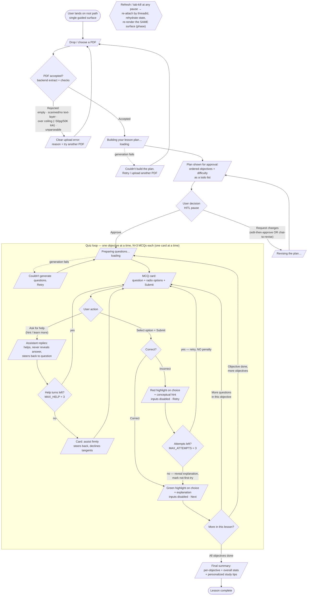

# EdPath — Feature & Flow Document

> Source of truth: [`assignment.md`](./assignment.md), [`architecture.md`](./architecture.md), [`agent-architecture.md`](./agent-architecture.md), the locked [`design-decisions.md`](./design-decisions.md), [`db-schema.md`](./db-schema.md), and the risk register [`challenges.md`](./challenges.md).
>
> This document **consolidates and articulates** what those files already decided. It makes **no new decisions**. Locked-but-tunable defaults are carried and tagged `PROVISIONAL`. If anything here would contradict a committed file, it is flagged rather than changed.

EdPath turns **one uploaded PDF into a guided, interactive lesson**: `Plan → Approve → Quiz loop → Summarize`. It is a **deterministic teaching system powered by an LLM** — a structured LangGraph workflow, not an autonomous agent. Engineering owns the control flow; the LLM fills content at generative nodes only.

This document has three parts:

- **Part A — User Flow:** the end-to-end experience (what the learner sees, clicks, and gets next).
- **Part B — Feature Flows:** every feature and sub-feature, what each is, what happens, how it behaves.
- **Part C — Technical Working:** how it works technically, layer by layer, plus the data contracts to be typed next.

> **Lens note.** Part A is the **user-facing experiential flow**. It is *different* from the internal agent control-flow graph (nodes N1–N9 in `architecture.md §3` / `agent-architecture.md §5.3`), which is mapped behind the experience in **Part C**.

---

## Part A — User Flow

The learner's experiential flow — surfaces seen, actions taken, what comes next. A single guided surface on the root path, not a multi-page app.

### Diagram



### Walkthrough

1. **Landing & upload.** The learner opens the single guided surface at the root path and uploads one PDF. The file goes to the backend, which extracts and cleans the text and runs upload-time checks.

2. **Upload accepted or rejected (first error surface).** If the PDF is empty, scanned/image-only with no text layer, over the ceiling (~50 pages / 50K tokens / 200K cleaned chars — `PROVISIONAL`), or otherwise unparseable, the learner gets a **clear upload error stating the reason** and stays on the upload surface to try another file. Fail-fast prevents an ungrounded lesson (Challenge #3). Good text proceeds.

3. **Plan generation → review (HITL pause).** The learner sees a brief "building your lesson plan" state, then the **plan as a todo list**: ordered objectives, each with a difficulty (`easy`/`medium`/`hard`). This is the mandatory human checkpoint — the graph is genuinely paused here.

4. **Approve or request changes.** The learner can **Approve**, **Edit-then-approve**, or **Chat-to-revise**. Requesting changes re-runs planning with their note and returns to the same review surface (full re-plan, no diff/patch). Approving commits the lesson and enters the quiz loop.

5. **The quiz loop — one card at a time.** Per objective, 3 MCQs (`PROVISIONAL`, tunable 2–4) are generated lazily, then presented **one card at a time**: question, radio options, and an explicit **Submit** button. Nothing auto-submits.

6. **Help side-channel (bounded, no leakage).** At any question the learner can ask for a hint or to learn more. The assistant **helps, never reveals or eliminates the correct option, and steers back** to the question. Help is bounded to **3 turns per question** (`PROVISIONAL`); at the cap it firmly redirects. It never advances or grades — it always returns to the same card.

7. **Submit → green or red.** On submit, inputs disable and the answer is graded deterministically:
   - **Correct →** the chosen option highlights **green** with an **explanation**, then **Next**.
   - **Incorrect →** the chosen option highlights **red** with a **conceptual hint** and **Retry** — the **same question, no penalty**. Retry is bounded to **3 attempts total** (`PROVISIONAL`); at the limit the explanation is revealed, the question is marked not-first-try, and the lesson advances.

8. **Progression.** After a question resolves, the loop moves to the next question in the objective, or to the next objective (regenerating questions), until every objective is done.

9. **Final summary.** When all objectives are complete, the learner sees the **final report**: per-objective stats (correct / total / first-try rate), overall performance, and **personalized study tips** grounded in weak objectives. Lesson complete.

10. **Refresh survival (cross-cutting).** At **every pause** — plan approval and every question — a page reload or tab-kill re-attaches by client-held `threadId`, rehydrates the checkpointed state, and re-renders the **same surface** the learner left (driven by `phase`). No progress is held client-side, so nothing is lost (Challenge #1, #5).

> Green/red are **functional feedback states, not styling** (locked).

---

## Part B — Feature Flows

The complete feature tree. Each entry gives **what it is**, **what happens**, **how it behaves** (states + branches), and the **acceptance criteria** it satisfies. `PROVISIONAL` tags carry locked-but-tunable defaults.

### F1 — PDF Upload & Ingestion
*What it is:* the single entry point — turns one uploaded PDF into the cleaned `pdfText` that grounds the whole lesson.

- **F1.1 Upload surface** — *What:* the root-path control to choose/drop one PDF. *Behaves:* idle → file selected → uploading (multipart POST to backend `/upload`). Single PDF only (D19: one `threadId` = one lesson). **AC1.**
- **F1.2 Text extraction & cleaning** — *What:* backend extracts and cleans the text layer into `pdfText`, captures `pdfMeta {filename, charCount, pageCount}`. *Behaves:* runs **upstream of the graph**, so the graph only ever starts on good text. **AC1.**
- **F1.3 Upload validation / fail-fast (error surface)** — *What:* the gate that rejects inputs that would force hallucination. *Behaves:* rejects empty, scanned/image-only (no text layer), over-ceiling, or unparseable PDFs with a **clear, reasoned error**; learner stays on the upload surface. Ceiling ~50 pages / 50K tokens / 200K cleaned chars `PROVISIONAL`; token/char count is the real gate, page count a soft signal. No OCR in v1. *Branches:* accepted → plan generation; rejected → error → retry upload. **AC1** (Challenge #3).
- **F1.4 Binary discard** — *What:* extract-and-discard; the original file is not stored. *Behaves:* nothing downstream re-reads the binary (db-schema Rejected #1). Supports AC1's "parses relevant content" without a storage surface.

### F2 — Lesson Plan Generation
*What it is:* the LLM drafts a learning path from `pdfText` — the todo list shown before any quizzing.

- **F2.1 Plan drafting** — *What:* N1 produces an ordered `LessonPlan` of objectives, each `{title, description, difficulty}`, grounded in `pdfText`. *Behaves:* transient `planning` state. Hard cap **8 objectives**, soft target 4–6 `PROVISIONAL`. **AC2** (grounding shared with AC4; Challenge #3).
- **F2.2 Difficulty labelling** — *What:* each objective carries `difficulty: easy|medium|hard`, set by N1, shown in the plan. *Behaves:* static label, no runtime difficulty adaptation (D17). **AC2.**
- **F2.3 Plan-generation failure (error surface)** — *What:* recovery when N1 returns invalid/ungrounded output. *Behaves:* Zod + structural checks → bounded **repair retry ≤2** `PROVISIONAL` → else node-level error, **no state advance**, surfaced to the user. **AC2** (Challenge #4).

### F3 — Plan Approval (HITL) & Modification
*What it is:* the mandatory human checkpoint — the learner reviews the plan before the lesson commits.

- **F3.1 Approval pause (true interrupt)** — *What:* a genuine LangGraph `interrupt` that halts the graph with state checkpointed. *Behaves:* `awaiting_approval` phase; nothing downstream runs until resumed; **survives refresh/tab-kill**. **AC3** (Challenge #1 — the most-probed piece).
- **F3.2 Approval widget affordances** — *What:* the controls on the plan surface. *Behaves:* **Approve**, **Edit-then-approve**, **Chat-to-revise** (D6). *Branches:* approve → quiz loop; request changes → re-plan. **AC3.**
- **F3.3 Plan modification (re-plan)** — *What:* applying requested changes. *Behaves:* re-runs N1 with `pdfText` + the user's `approval.note` (full re-plan, no diff/patch — D7), returns to the same review surface. Loop structurally bounded to plan↔approval. **AC3.**

### F4 — MCQ Generation (PDF-grounded)
*What it is:* per-objective generation of the quiz content, strictly grounded in the PDF.

- **F4.1 Lazy per-objective batch** — *What:* N3 generates **N=3** MCQs `PROVISIONAL` (tunable 2–4) for the current objective in one batched call when the objective is entered. *Behaves:* transient `quizzing` state; questions stored in `questions[]` and **never regenerated on resume** (D5). **AC4.**
- **F4.2 Grounding & validation ladder** — *What:* the gates that keep questions faithful and widget-safe. *Behaves:* source-only prompt + mandatory `sourceQuote` → Zod → structural checks (`correctIndex` in range, exactly 4 options, non-empty unique options/question) → **deterministic source-anchor check** (`sourceQuote` must match `pdfText` after normalization) → bounded repair retry ≤2 → else node error, no advance (D4/D16). Inline LLM self-check deferred. **AC4** (Challenge #3, #4).
- **F4.3 MCQ artifact** — *What:* each MCQ carries `{questionId, objectiveId, question, options[], correctIndex, explanation, hint, sourceQuote}`. *Behaves:* `correctIndex`/`explanation`/`hint`/`sourceQuote` stay server-side until needed; `correctIndex` + `sourceQuote` are behind the assist firewall. **AC4** (feeds AC5/AC6/AC7).

### F5 — MCQ Generative-UI Widget
*What it is:* the custom card that renders one question with radios, submit, and feedback — the generative-UI requirement.

- **F5.1 Render from mirrored state** — *What:* the card renders the current MCQ (question + radio options + Submit) from validated, mirrored agent state. *Behaves:* one card at a time (D8). **AC5.**
- **F5.2 Radio selection** — *What:* the learner picks exactly one option. *Behaves:* selection is local until submit (D9 — no auto-submit). **AC5.**
- **F5.3 Explicit submit** — *What:* the Submit button commits the answer. *Behaves:* sends `selectedIndex` as the resume payload. **AC5** (feeds AC6/AC7).
- **F5.4 Disable-after-submit** — *What:* inputs lock once submitted. *Behaves:* prevents re-answering the same attempt; re-enabled only on an allowed retry. **AC5** (supports AC7).
- **F5.5 Visual states** — *What:* the widget's state machine. *Behaves:*
  - `unanswered` — radios active, Submit enabled-on-selection.
  - `selected` — one option chosen, not yet submitted.
  - `submitted-correct` — **green** highlight on chosen option, explanation, inputs disabled, **Next**.
  - `submitted-incorrect` — **red** highlight on chosen option, hint, inputs disabled, **Retry**.
  - `retrying` — re-enabled radios for the same question, attempt counter incremented.
  - `revealed` (at attempt cap) — explanation shown, advance.

  **AC5, AC6, AC7.**
- **F5.6 Help affordance** — *What:* a free-text Help control on the card routed to the assist side-channel (F8). *Behaves:* opens the side-channel without leaving the question. **AC5** (enables Desired-flow §3 / S10).

> Green/red are **functional feedback states, not styling** (locked).

### F6 — Answer Submission & Deterministic Grading
*What it is:* the code path that judges an answer — no LLM involved.

- **F6.1 Deterministic grade** — *What:* N6 `gradeAnswer` compares `selectedIndex` to `correctIndex`. *Behaves:* pure code; returns `{verdict, firstTryCorrect, attempts}`; updates `attempts`/`results`/`score`. **AC6, AC7** (Challenge #5).
- **F6.2 Retry-aware scoring** — *What:* "no penalty" encoded in the score model. *Behaves:* `results[]` is canonical; `score` is **derived** from it; `firstTryCorrect = correct && priorAttempts===0`; retries never reduce score (locked rule). **AC7** (Challenge #5).
- **F6.3 Grading error guard** — *What:* protection against a bad index. *Behaves:* `selectedIndex` out of range → `GradingError` → re-surface the **same question**, no state mutation, no score change. **AC7.**

### F7 — Feedback (correct / incorrect)
*What it is:* the per-answer response assembled from the validated MCQ — not freshly generated.

- **F7.1 Correct feedback** — *What:* N7 surfaces success. *Behaves:* **green** highlight + the MCQ's `explanation`; reveals `correctIndex`; advance enabled. Assembled from the validated artifact (no fresh LLM call → no leakage/cost). **AC6.**
- **F7.2 Incorrect feedback** — *What:* N7 surfaces the miss. *Behaves:* **red** highlight + the MCQ's conceptual `hint`; `canRetry=true`; `correctIndex` withheld. **AC7.**
- **F7.3 No-penalty retry** — *What:* re-attempt the same question. *Behaves:* `incorrect → await_input` edge; same question, `attempts++`, score untouched; bounded by **`MAX_ATTEMPTS=3`** `PROVISIONAL` (initial + 2 retries). *Branch:* at the cap → reveal explanation, mark not-first-try, advance (D13). **AC7.**

### F8 — Help / Assist Side-Channel
*What it is:* the bounded free-text "hint / learn more" turn that coexists with the deterministic loop without becoming an autonomous agent.

- **F8.1 Free-text help turn** — *What:* learner asks for a hint or to learn more mid-question. *Behaves:* N5 single LLM call; replies helpfully. Desired-flow §3 / **S10**.
- **F8.2 Answer firewall (no leakage)** — *What:* the guardrail that prevents reveals. *Behaves:* assist receives the question + options only — **never** `correctIndex`, `explanation`, `hint`, or `sourceQuote` (structural firewall, not prompt-hope). Hints are **conceptual nudges only** — may point at the relevant idea/source area but must not name, eliminate, or imply the correct option (D11). **S10** (Challenge #2).
- **F8.3 Steer-back** — *What:* assist must redirect to the active question. *Behaves:* its only structural exit is back to `await_input`; it cannot advance, grade, re-plan, or end. **S10.**
- **F8.4 Bounded pocket** — *What:* the help cap. *Behaves:* **`MAX_HELP=3`** turns per question `PROVISIONAL`; at the cap assist firmly steers back and declines tangents. Counted via `helpTurnsUsed`. **S10.**

### F9 — Progression Through Objectives to Completion
*What it is:* the bounded loop that walks every objective and question to the end.

- **F9.1 Inner loop (questions in an objective)** — *What:* advance through the 3 MCQs. *Behaves:* N8 moves `currentQuestionIndex`, resets per-question counters; `more questions → await_input`. **AC8.**
- **F9.2 Outer loop (objectives)** — *What:* advance through the plan's objectives. *Behaves:* N8 moves `currentObjectiveIndex`; `objective done, more objectives → generate_mcq`. Linear only — no skip/back in v1 (D24). **AC8.**
- **F9.3 Completion criteria** — *What:* defines "done." *Behaves:* lesson complete when **every planned objective visited once AND N9 summary produced** (D23). *Branch:* `all done → summarize`. **AC8** (feeds AC9).

### F10 — Final Summary & Study Tips
*What it is:* the terminal performance report.

- **F10.1 Summary generation** — *What:* N9 produces `Summary` once, after the last objective (D14). *Behaves:* `complete` phase; built from canonical `results[]`/`score`. **AC9.**
- **F10.2 Report contents** — *What:* what the learner sees. *Behaves:* per-objective `{correct, total, firstTryRate}` (denominator = 3 by default), overall metrics, and **personalized study tips grounded in weak objectives** (D15). **AC9.**
- **F10.3 Summary-generation failure (error surface)** — *What:* recovery if N9 output is invalid. *Behaves:* Zod → bounded repair retry ≤2 → else node error, no advance. **AC9** (Challenge #4).

### F11 — Persistence & Resume (refresh survival)
*What it is:* the cross-cutting guarantee that the full lesson state is durable and resumable — no app tables, checkpointer only.

- **F11.1 Full-state checkpointing** — *What:* the entire graph-state object is snapshotted per super-step and at every interrupt to Postgres. *Behaves:* `results[]` canonical, `score` derived, `questions[]` durable once generated; **no progress held client-side** (D5/C5; db-schema). Underpins **S11** / **AC8** / **AC9** correctness (Challenge #5).
- **F11.2 Client-held threadId** — *What:* the resume key. *Behaves:* client holds `threadId` (URL/localStorage), sends it on every request; no server-side mapping (db-schema Rejected #3). **S3/S11.**
- **F11.3 Refresh / resume** — *What:* re-attach after reload/tab-kill at any pause. *Behaves:* rehydrate state from `threadId`; `phase` re-renders the correct surface (`awaiting_approval` → plan, `awaiting_input` → MCQ card incl. submitted feedback/retry state, `complete` → summary). Resume-from-checkpoint, not restart. **AC3 robustness, S3, S11** (Challenge #1).
- **F11.4 Restart** — *What:* starting over. *Behaves:* a **new `threadId`** (D24); no cross-lesson memory (D19). Supports clean re-runs without a history surface.

### Acceptance-Criteria Coverage Table

| # | Acceptance Criterion | Satisfying feature(s) |
|---|---|---|
| **AC1** | Accepts a PDF upload and parses relevant content | **F1** (F1.1 upload, F1.2 extraction, F1.3 validation/fail-fast, F1.4 discard) |
| **AC2** | Presents a plan (todo list) for generation | **F2** (F2.1 drafting, F2.2 difficulty, F2.3 failure recovery) |
| **AC3** | HITL interrupt allows plan review before proceeding | **F3** (F3.1 true interrupt, F3.2 affordances, F3.3 re-plan); robustness via **F11.3** |
| **AC4** | MCQs generated directly from PDF content | **F4** (F4.1 lazy batch, F4.2 grounding ladder, F4.3 artifact); grounding shared with **F2.1** |
| **AC5** | MCQ genUI widget renders with radio selection | **F5** (F5.1–F5.6 render, radios, submit, disable, visual states, help) |
| **AC6** | On correct answer, an explanation is displayed | **F6.1** grade + **F7.1** correct feedback (green + explanation) |
| **AC7** | On incorrect, a hint is displayed and retry without penalty | **F6.1/F6.2/F6.3** grading + **F7.2/F7.3** (red + hint, no-penalty retry) + **F5.4/F5.5** widget states |
| **AC8** | Proceed through all generated MCQs until completion | **F9** (F9.1 inner loop, F9.2 outer loop, F9.3 completion); durability via **F11.1** |
| **AC9** | Summary of results and study tips at the end | **F10** (F10.1 generation, F10.2 contents, F10.3 failure recovery); accuracy via **F11.1** |

*Cross-cutting (beyond the nine ACs, from Desired-flow §3 and the risk register):* **S10 no-leakage help** → **F8**; **S3/S11 resume integrity** → **F11**.

**Two reading notes (flagged, not contradictions):**

- **AC8 vs. locked completion (D13).** Progression advances on correct **or** at `MAX_ATTEMPTS`; a question may be marked not-first-try and advanced without ever being answered correctly. This still satisfies "proceed through all MCQs until completion" — the learner sees and resolves every generated MCQ.
- **Help side-channel has no numbered AC.** It traces to Desired-flow §3 and success criterion S10, not to one of the nine numbered ACs, so it is listed as cross-cutting.

---

## Part C — Technical Working

How EdPath works technically, layer by layer, end to end. Data contracts are **surfaced, not designed** — enumerated at the end for the next session.

### The layer map

```
┌─ apps/web (Next.js) ───────────────────────────────────────────────┐
│  upload UI · <CopilotKit> provider · CoAgent state mirror          │
│  plan-approval widget · MCQ genUI widget · summary view           │
└───────┬──────────────────────────────────────┬────────────────────┘
        │ (a) PDF multipart → /upload           │ (c) CopilotKit runtime protocol
        ▼                                        ▼
┌─ apps/backend (Express) ───────────────────────────────────────────┐
│  (a) /upload: extract + clean + validate → pdfText                 │
│  (b) starts/owns the LangGraph run (threadId)                      │
│  (c) hosts the CopilotKit Runtime endpoint (the bridge)           │
│  Zod-validates every artifact at this boundary                    │
└───────┬──────────────────────────────────────┬────────────────────┘
        ▼                                        ▼
┌─ LangGraph agent (TS) ──────────┐    ┌─ LLM (OpenAI) ──────────────┐
│  N1–N9, 2 interrupts            │──► │  generative nodes only      │
│  state = single source of truth │◄── │  (N1, N3, N5, N9)           │
└───────┬─────────────────────────┘    └─────────────────────────────┘
        ▼ snapshot per super-step, keyed by threadId
┌─ Postgres (LangGraph checkpointer tables, library-owned) ──────────┐
└────────────────────────────────────────────────────────────────────┘
        … every step traced to LangSmith (day one)
```

### 1. `apps/web` — Next.js (CopilotKit surface + widgets)

- **Single guided surface.** One root-path experience; it renders whichever surface the current `phase` calls for: upload, plan approval, MCQ card, or summary.
- **Upload.** The upload control POSTs the PDF as multipart **directly to the backend `/upload`** — the one path that does *not* go through the agent, because extraction must happen upstream of the graph.
- **CopilotKit provider + CoAgent hook.** A `<CopilotKit>` provider wraps the app; a CoAgent hook (e.g. `useCoAgent`) **mirrors LangGraph state into React**. The UI reads `plan`, `questions[currentQuestionIndex]`, feedback, `summary`, and `phase` from that mirror — it never computes them.
- **No business logic client-side.** The frontend renders and sends **intents** only: approval decision, selected answer index, free-text help. It holds **no progress/score state** (D5). The only thing the client owns durably is the `threadId` (URL / localStorage).

### 2. `apps/backend` — Express (`/upload` + CopilotKit Runtime)

- **`/upload` extraction (outside the graph).** Extracts and cleans the PDF text → `pdfText`, computes `pdfMeta {filename, charCount, pageCount}`, and applies the ingestion gate (empty / scanned / over-ceiling / unparseable → reject with a clear error). The graph only starts on good text (Challenge #3).
- **Owns the run.** On accepted upload, the backend **starts the LangGraph run with a `threadId`**, seeding `pdfText` into initial state.
- **Hosts the CopilotKit Runtime.** The Runtime endpoint runs **inside Express** (locked, vs. a Next.js route handler) and is wired to the LangGraph agent as a CoAgent. It brokers messages, state sync, and interrupt/resume between browser and graph.
- **Validation boundary.** **Every structured artifact is Zod-validated here before it leaves the backend** — before it reaches state or the widget (Challenge #4). This is the single validation chokepoint.

### 3. The LangGraph agent (nodes · two interrupts · state object)

- **State object = single source of truth.** The full field set (`pdfText`, `pdfMeta`, `plan`, `approval`, `currentObjectiveIndex`, `questions[]`, `currentQuestionIndex`, `selectedIndex`, `attempts`, `helpTurnsUsed`, `results[]`, `score`, `summary`, `messages[]`, `phase`, `lastError`) is the agent's memory and the thing checkpointed. `results[]` is canonical; `score` is a derived projection.
- **Nodes.** N1 `plan` (LLM) → N2 `approval_gate` (⏸ interrupt) → N3 `generate_mcq` (LLM) → N4 `await_input` (⏸ interrupt) → N5 `assist` (LLM, firewalled) / N6 `grade` (code) → N7 `feedback` (code) → N8 `advance` (code) → N9 `summarize` (LLM). N6/N7/N8 are **deterministic code, no model** — which is why help-turn leakage can never corrupt scoring, and feedback text stays the validated artifact generated *with* the question.
- **Edges are deterministic conditionals over state.** `approval_gate` reads `approval.decision`; the `await_input` split is a deterministic check on the **resume payload's kind** (widget answer vs. free text), not LLM routing; `feedback` reads the grade verdict; `advance` compares indices against lengths.
- **Bounded loops** (the reliability spine): `MAX_ATTEMPTS=3`, `MAX_HELP=3`, ≤8 objectives, repair retries ≤2, ~1.5M aggregate tokens/thread — all `PROVISIONAL`.

### 4. The LLM (generative nodes only)

- Invoked at **four nodes only**: N1 plan, N3 MCQ, N5 assist, N9 summarize. Default `gpt-4o-mini`; `gpt-4o` is an N1 plan escape hatch (`PROVISIONAL`).
- **It never chooses control flow, never grades, and never sees `correctIndex`** (nor `explanation`/`hint`/`sourceQuote`) in assist. Its action space is essentially "return a valid artifact of shape X." `pdfText` rides in context as the grounding source (no RAG); prompt caching of the stable PDF prefix is a recommended optimization, not an architecture dependency.

### 5. The Postgres checkpointer (persistence)

- **The entire persistence layer.** No app tables, no ORM, no custom schema (db-schema.md). LangGraph provisions and owns its own checkpoint tables; EdPath interacts only through the checkpointer/graph API.
- **Write cadence:** a snapshot per super-step and at every interrupt, keyed by `threadId`. The latest snapshot always reflects the last completed step — which makes "resume from the same checkpoint, not a restart" true.

### Cross-cutting mechanics

- **Frontend ↔ agent via CoAgents.** The browser never talks to LangGraph directly. The CopilotKit Runtime (in Express) is the broker; the CoAgent hook on the frontend is the mirror. Messages, state, and interrupt/resume all flow over the runtime protocol.
- **State → UI mirroring.** Agent state changes propagate to React via the CoAgent hook; the UI re-derives surfaces from the mirror. The genUI **MCQ widget renders from mirrored state** — `questions[currentQuestionIndex]` plus feedback fields — through CopilotKit's generative-UI mechanism, bound to the interrupt payload at the pause.
- **The two interrupts pause.** `approval_gate` (N2) and `await_input` (N4) each call the LangGraph `interrupt`, which **persists state then halts** — nothing downstream runs. The pause is a real graph suspension, not a UI dialog over pre-computed content (Challenge #1).
- **Resume (technical).** The client sends a resume command — `Command(resume = payload)` — for the `threadId`. LangGraph **reloads the checkpoint, injects `payload` as the `interrupt()` return value, and continues from that node** (not a restart). At N2 the payload becomes `approval`; at N4 it becomes either `selectedIndex` (→ grade) or a help message (→ assist), disambiguated by payload kind.
- **Refresh rehydrate.** On reload/tab-kill, the frontend re-attaches by client-held `threadId`; the checkpointer rehydrates state; **`phase` selects the surface** to re-render (`awaiting_approval` → plan, `awaiting_input` → MCQ card incl. submitted feedback/retry state, `complete` → summary). No client-held progress means nothing is lost.
- **Validation locus.** All structured-output validation is at the **backend boundary** (Express, via Zod) before state mutation or render. Generative-node failures → bounded repair retry ≤2 → else node error, **no state advance**.
- **Tracing.** LangSmith from day one — every node, LLM call, and interrupt/resume tied to `threadId`.

### Critical handoff — data contracts to be typed in the next session

These cross the layer boundaries (web ↔ backend ↔ agent ↔ LLM ↔ checkpointer). **They are listed, not designed here.** The next session designs the shared TypeScript types and Zod validators in `packages/schemas` from exactly this list.

**Artifact contracts (LLM/agent → backend → UI):**
1. **`LessonPlan`** — ordered objectives (incl. difficulty) shown for approval.
2. **`MCQ`** — question, options, correct index, explanation, hint, source quote, IDs.
3. **`Feedback`** — verdict, highlight index, conditional explanation/hint, retry flag (assembled in N7, not a fresh LLM artifact).
4. **`Summary`** — per-objective + overall stats and study tips.

**Resume-payload contracts (UI → agent, injected at interrupts):**
5. **Approval decision** — approve vs. request-changes (+ note).
6. **Answer submission** — selected option index.
7. **Help message** — free-text assist turn.

**State & boundary contracts:**
8. **State object** — the full checkpointed graph state (single source of truth).
9. **`pdfMeta` / upload result** — filename, char count, page count (+ accept/reject outcome at the `/upload` boundary).
10. **`gradeAnswer` I/O** — the one genuine function's input/output shape (code, not model).
11. **`lastError`** — node, kind, detail (reliability/recovery surface).

> The assist turn returns a plain chat message, not a structured artifact — intentionally **not** a contract to validate, so it stays a single bounded call that can't drive UI state.

### ⚠️ Must verify against current CopilotKit docs before building (API drifts between versions)

1. **CoAgents interrupt/resume API** — exact mechanism for surfacing a LangGraph `interrupt` and sending `Command(resume=…)`; the precise shape the resume payload must take.
2. **State-mirroring hooks** — exact name/shape of the CoAgent state hook (`useCoAgent` or current equivalent) and how bidirectional state sync is wired.
3. **Generative-UI binding** — how genUI rendering binds to interrupt payloads / mirrored state, and exactly how the pause and its rendered surface **survive a refresh**.
4. **Runtime under Express** — CopilotKit Runtime running cleanly as an Express-hosted endpoint (locked) vs. a Next.js route handler.
